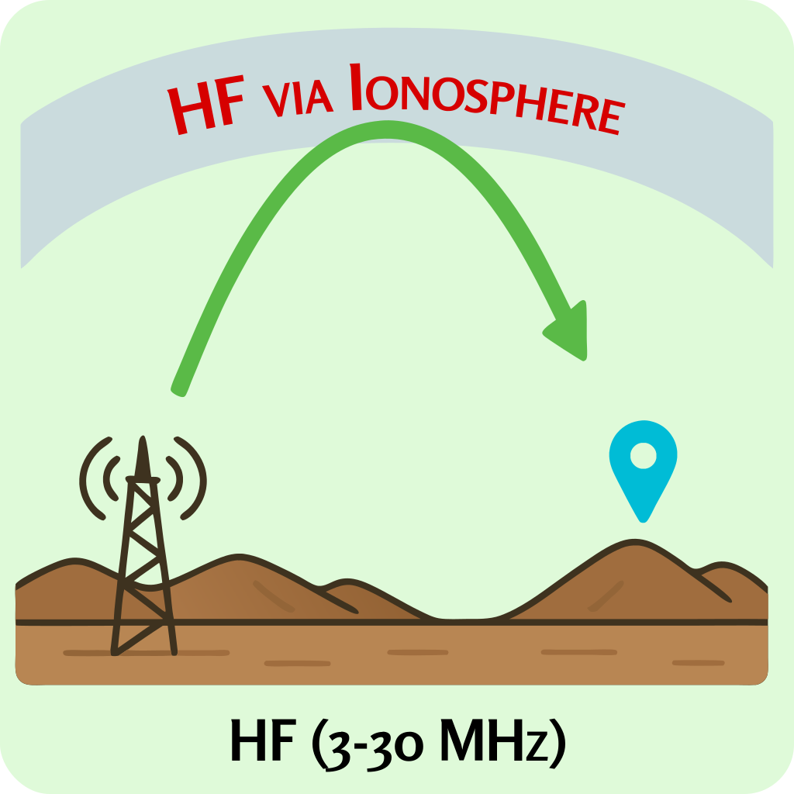
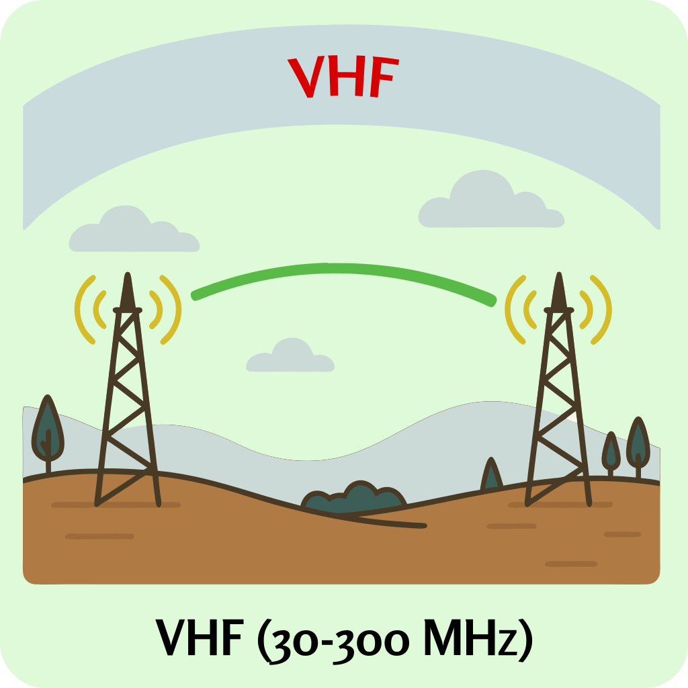
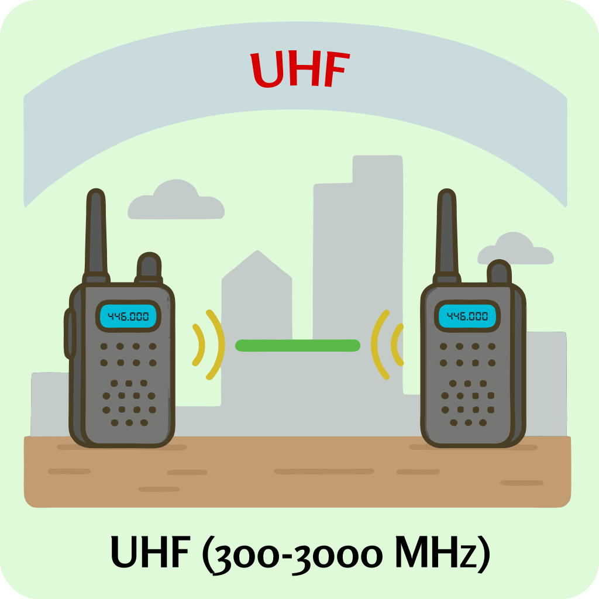

### Section 3.2: The Radio Spectrum and Amateur Bands

Think about how light behaves: a sunset casts long, soft shadows, a flashlight beam moves in a straight line, and a laser pointer is sharp but easily blocked. Radio waves work in a similar way, depending on their wavelength.

As amateur radio operators, we get to use specific sections of the electromagnetic spectrum, each with its own properties. The key ranges you need to know are:

- **HF (High Frequency): 3 to 30 MHz**. 
- **VHF (Very High Frequency): 30 to 300 MHz**. 
- **UHF (Ultra High Frequency): 300 to 3000 MHz**. 

Each of these ranges behaves differently, and the light analogy is a useful way to think about why:

- **HF waves are like sunset light** — they can travel incredible distances by reflecting off the upper atmosphere, reaching places far beyond the horizon.
- **VHF waves are like a flashlight beam** — they move in straight lines and can pass through some obstacles, but they don't bend as much. If something large is in the way (like a hill or building), the signal gets blocked.
- **UHF waves are like a laser pointer** — very short, direct, and easily blocked by dense materials like concrete and metal. They don't bend around obstacles well, but they readily reflect off surfaces like walls and buildings, which can actually help in urban environments.

#### The Bigger Picture

The electromagnetic spectrum includes all types of electromagnetic radiation, from the long waves used in radio to the short bursts of gamma rays. Radio waves are just one slice of it, and waves we encounter in everyday life — microwaves, infrared heat, even visible light — are all fundamentally the same kind of energy. They just differ in frequency and wavelength. The frequencies we use in ham radio live in the lower-frequency end of the spectrum, but they're all part of the same physical phenomenon.

**Beyond the Test**: Other parts of the radio spectrum include lower frequencies (like the "AM broadcast band" below HF) and higher frequencies (microwaves above UHF). Each range has unique properties that make it suitable for different uses.

#### The Amateur Radio Band Plan

Amateur radio frequencies are organized into "bands" based on their wavelengths. For example, the "2-meter band" refers to frequencies in the 144-148 MHz range, where the wavelength is approximately 2 meters. These band designations provide a quick way to reference different frequency ranges and their general characteristics. Amateur radio bands are carefully allocated through international agreements, giving us access to a variety of frequency ranges with different propagation characteristics.

#### HF Bands

{.img-pgcap .float-right}

As a Technician, you'll have limited HF access, primarily on the 10-meter band (28 MHz) — but understanding how these frequencies behave is still important because the ionospheric propagation that makes HF special is a big part of why the hobby is fun. When conditions are right, a modest signal on 10 meters can reach operators thousands of miles away.

Beacon stations are automated transmitters that help operators monitor these conditions. They transmit regularly on known frequencies, letting amateurs around the world determine if a band is "open" for long-distance communications.

> **Key Information:** On HF, automatically controlled amateur propagation beacons can be found on 10 meters, between 28.200 MHz and 28.300 MHz. 

By tuning to that range and listening for distant beacons, you can quickly assess whether conditions are favorable for long-distance 10-meter communications.

#### VHF Bands

{.img-pgcap .float-right}

VHF sits between the globally-reaching HF bands and the strictly local UHF bands. The 6-meter band (50-54 MHz) occasionally experiences enhanced propagation that can provide surprising long-distance contacts, while the popular 2-meter band (144-148 MHz) provides reliable regional communications within roughly 50-100 miles depending on terrain and antenna height.

For most new Technician operators, 2 meters will become your primary band. Its reliable characteristics, abundance of repeaters, and wide availability of affordable equipment make it the perfect entry point for new hams — this band forms the backbone of local amateur radio activity in most areas. We'll cover operating on 2 meters in more detail in Chapter 7.

#### UHF Bands

{.img-pgcap .float-right}

UHF's inability to use ionospheric propagation might look like a disadvantage, but it comes with some upsides — more predictable coverage, less interference from distant stations, stable day-to-day performance, and more available bandwidth. These characteristics make UHF bands excellent for local networks, digital modes, and urban communications where reliability matters more than distance.

Along with 2 meters, the 70-centimeter band (420-450 MHz) will be one of your most frequently used bands as a new Technician. Many modern handheld radios cover both bands, and 70cm offers additional repeater options in congested areas where 2-meter frequencies might be limited. Together, these two bands will likely form the foundation of your early amateur radio experience.

---

Now that we know what bands are available and where each one sits on the spectrum, let's look at how radio signals actually travel through them — and why the same signal might reach a friend across town but fail to reach one a mile farther away.
