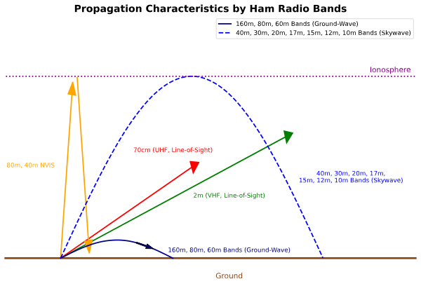

### Section 3.3: How Signals Travel

Now that we understand the different amateur radio bands, let's explore how signals actually travel through them. The way radio waves propagate varies dramatically depending on their frequency and environmental conditions, creating fascinating possibilities for communication.

When you transmit a signal, it doesn't simply travel in a straight line like a laser beam. Radio waves can bend, bounce, scatter, and penetrate obstacles in ways that sometimes seem almost magical. Understanding these propagation mechanisms is key to successful amateur radio communications.

> **Key Information:** Basic Wave Behavior Across Amateur Bands
> - The ionosphere can reflect HF radio waves. 
> - The radio horizon is farther than the visual horizon because the atmosphere refracts radio waves slightly. 
> - Long-distance ionospheric propagation is far more common on HF than on VHF/UHF. 
> - UHF signals are rarely heard beyond their radio horizon because they're usually not propagated by the ionosphere. 

#### Ground Wave Propagation

**Beyond the Test**: Ground wave propagation is when a signal follows the curvature of the Earth along the surface. Lower frequencies (like the AM broadcast band) travel farther as ground wave than amateur HF bands do, which is why AM stations often cover large areas during the day. It's not directly tested, but it's worth knowing the term exists.

#### Line-of-Sight (LOS) Propagation

Line-of-sight is like being able to see someone across a field — if you can see them, you can generally communicate with them. However, several important effects can help or hinder this basic propagation:

> **Key Information — Multipath Effects**:
> - VHF signal strengths can vary greatly when moving just a few feet because multipath propagation cancels or reinforces signals. 
> - **Picket fencing** is the rapid flutter on mobile signals due to multipath propagation. 
> - Multipath propagation can increase error rates in data transmissions. 

When radio signals travel from transmitter to receiver, they often take multiple paths:

- Some signals go directly.
- Others bounce off buildings, mountains, or other objects.
- These different paths can combine at your antenna:
  - When the signals arrive in phase, they strengthen each other.
  - When they arrive out of phase, they can cancel each other.
  - Moving your antenna even slightly can change this relationship.

For digital modes, multipath can be especially troublesome — signals arriving via different paths can interfere with each other and increase error rates, which is why most digital modes include error detection and correction.

> **Key Information — Working Around Obstacles**:
> - When buildings block a repeater signal, you can often find a path that reflects signals to the repeater. 
> - Knife-edge diffraction allows radio signals to travel beyond obstructions. 

Just because you can't see your target doesn't mean you can't reach it:

- **Reflections**: Like bouncing a ball off a wall, your signal can bounce off buildings or other surfaces to reach a repeater.
- **Knife-edge diffraction**: Radio waves can bend slightly around sharp edges — the way a shadow's edge is always a little soft because light bends around whatever's casting it. This lets signals reach a bit into the "shadow zone" behind mountains or tall buildings.

#### Sky Wave Propagation

> **Key Information:**
> - Irregular fading of signals is caused by random combining of signals arriving via different paths. 
> - Best time for 10-meter band F region propagation: from dawn to shortly after sunset during high sunspot activity. 
> - During peak sunspot cycle, 6 and 10 meters can use F region propagation. 

Think of sky wave propagation like bouncing a ball off the ceiling to reach someone across the room. The ionosphere acts as our "ceiling" in the sky, but instead of a hard surface, it's a region of charged particles that bends (or refracts) radio waves back toward Earth. For simplicity, this bending is often called "bouncing" or "reflection," though it's really a gradual refraction through layers of the ionosphere.

- Different layers of the ionosphere affect different frequencies.
- Time of day and solar activity change how well it reflects signals.
- Multiple signal paths can cause fading as they combine in different ways.

##### Auroral Propagation

One special form of sky wave worth knowing about is auroral propagation. When signals reflect off the aurora, they're distorted, with a characteristic raspy sound.  — the aurora is like a shimmering, moving curtain that reflects signals unpredictably.

#### Sporadic E Propagation

> **Key Information:** Sporadic E causes occasional strong signals on the 10-, 6-, and 2-meter bands from beyond the radio horizon. 

Sporadic E happens when random patches of the ionosphere's E layer get temporarily charged up — like a cloud of ionized particles appearing and disappearing in the upper atmosphere. When one forms, it can briefly reflect signals much farther than usual, giving you unexpected long-distance contacts. You can't predict exactly when it'll occur, but it's a regular feature of VHF propagation.

#### Tropospheric Ducting

> **Key Information:**
> - Caused by temperature inversions in the atmosphere. 
> - Allows VHF and UHF communications to ranges of approximately 300 miles regularly. 

Imagine a tunnel in the sky that can carry your signal much farther than usual. Temperature inversions create these "ducts" that can guide VHF and UHF signals far beyond their normal range, making long-distance contacts possible on bands that usually work only for local communication.

#### Meteor Scatter

> **Key Information:** The 6 meter band is best suited for meteor scatter communications. 

When meteors burn up in the atmosphere, they leave brief trails that can reflect radio signals. It's like playing ping-pong with a shooting star — the reflections are brief but can allow contacts over surprising distances. The 6 meter band works particularly well for this type of communication.

#### Environmental Effects

Different environmental factors affect different frequencies in various ways.

> **Key Information:**
> - Precipitation can decrease range at microwave frequencies. 
> - Fog and rain have little effect on signals in the 10-meter and 6-meter bands. 
> - Vegetation absorbs UHF and microwave signals, leading to poor reception of weak signals. 

Understanding these effects helps you choose appropriate frequencies for different weather conditions and position antennas to minimize absorption by trees and buildings.

---

With propagation covered, we know what can happen to a signal on its way from transmitter to receiver. Next, we'll look at how we actually put information *onto* those signals in the first place.
