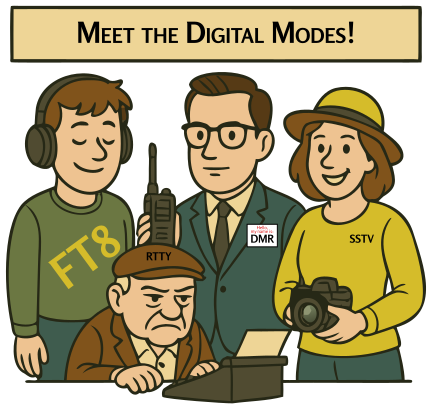

### Section 3.5: Digital and Video Modes

{.img-pgcap .float-right}

If voice modes are like making a phone call, digital modes are like sending text messages or emails through the airwaves. Some modes carry voice as digital data; some send text, position reports, or images; and a few can even send full-motion video. Digital modes have been a growing part of amateur radio for decades, and the number of them can feel overwhelming at first. We'll focus on the ones that show up on the exam and give you a sense of what each is useful for.

One note before we get started: this section covers a lot of ground, and you don't need to memorize all of it. The only things you need to remember for the exam are highlighted in the Key Information blocks. Everything else is here to give you context — a sense of what's out there and how these modes fit together — so that when you encounter them on the air or in conversation, you'll know what people are talking about.

> **Key Information:** Digital communications modes include packet radio, IEEE 802.11, and FT8, among others. 

#### Packet Radio

> **Key Information:** Packet radio transmissions include a checksum that permits error detection, a header that contains the callsign of the station to which the information is being sent, and automatic repeat request in case of error. 

Packet radio is the original digital mode for sending data over amateur radio. The core idea is straightforward: your message gets split into small chunks called packets, each with a destination address and error-checking information, and those packets are sent over the air. The receiving station reassembles them back into the original message.

Packet radio was a big deal in the 1980s and 1990s before the internet became widespread. It's still used today in some applications, especially emergency communications.

#### APRS (Automatic Packet Reporting System)

> **Key Information:**
> - APRS can transmit GPS position data, weather data, and text messages. 
> - APRS provides real-time tactical digital communications in conjunction with a map showing the locations of stations. 

APRS is a specialized form of packet radio built around location-aware messaging. Stations with GPS receivers beacon their positions periodically, and the whole network gets displayed on shared maps that anyone can tune into. It's like Twitter meets Google Maps, but for radio — extremely useful for event communications, public service work, and keeping track of mobile stations.

#### PSK31

> **Key Information:** PSK stands for Phase Shift Keying. 

*PSK* (*Phase Shift Keying*) is ideal for real-time, keyboard-to-keyboard conversations. PSK31 operates at a symbol rate of 31.25 baud, roughly matching typical typing speed. It's so narrow that contacts can be spaced just 100 Hz apart, allowing many signals to fit where a single voice transmission would.

#### RTTY (RadioTeletype)

RTTY is the granddaddy of digital modes, dating back to the 1930s. It's essentially a radio-based typewriter. It's still popular in contests and among some news agencies.

#### PACTOR

PACTOR is a versatile digital mode that automatically switches between speeds and encoding methods based on conditions. There are several versions, with PACTOR III offering robust performance for applications like email over radio.

#### Digital Mobile Radio (DMR)

> **Key Information:**
> - DMR uses time-multiplexing to put two digital voice signals on a single 12.5 kHz repeater channel. 
> - A DMR color code is an access code which must be programmed into a DMR transmitter to access a specific repeater. 
> - A talkgroup is an identifier used by DMR to organize radio traffic so that those who want to hear the group aren't bothered by other radio traffic. 
> - Join a DMR talkgroup by programming your radio with the group's ID or code. 
> - To select a specific group of stations on a DMR radio, enter the group's identification code. 
> - A DMR "code plug" is configuration data loaded onto your radio to access repeaters and talkgroups. 

DMR is a powerful digital voice mode that effectively doubles a repeater's capacity by interleaving two conversations on the same channel — each one gets alternating time slots so fast the listeners don't notice they're sharing.

What makes DMR unique is how it organizes its traffic:
- **Talkgroups**: An identifier used to organize radio traffic so users who want to hear the group aren't bothered by other traffic. Join by programming your radio with the group's ID or code.
- **Color Codes**: An access code that must be programmed into your radio to access a specific repeater.
- **Code Plugs**: Configuration data loaded onto your radio containing access information for repeaters and talkgroups.

DMR networks are widely used for both local and worldwide communication through internet-linked systems.

#### System Fusion and C4FM

System Fusion is Yaesu's digital voice system, using a modulation called C4FM (Continuous Four-Level Frequency Modulation). Its standout feature is seamless switching between digital and analog FM — a Fusion radio can automatically detect whether an incoming signal is digital or analog and switch modes accordingly. Fusion works with Yaesu's WIRES-X internet linking system for worldwide digital communication.

#### D-STAR (Digital Smart Technologies for Amateur Radio)

> **Key Information:** Before transmitting on D-STAR, you must program your callsign into the transceiver. 

D-STAR is a fully digital voice and data system developed by the Japan Amateur Radio League, and in contrast to System Fusion, it doesn't fall back to analog — it's digital all the way. Its distinctive feature is callsign routing: you enter the callsign of another ham, and the D-STAR network figures out which linked repeater to route your signal through to reach them. That's why your own callsign has to be programmed into the radio — every D-STAR transmission carries it as part of the routing information.

#### Digital Mode Hotspots

> **Key Information:** A digital mode hotspot enables communication with a digital voice or data network. 

A hotspot is a small, low-power device that acts like your own personal repeater — it connects via the internet to digital voice or data networks, such as DMR, D-STAR, or System Fusion, so you can reach those networks from home without needing a local repeater in range. That makes hotspots especially useful for operators in areas without good digital repeater coverage, or for accessing talkgroups that aren't available on any nearby repeater.

#### Computer-Radio Interfaces

> **Key Information:**
> - A computer-radio interface for digital modes needs receive audio, transmit audio, and transmitter keying. 
> - The audio input and output of a transceiver operating FT8 are connected to the audio output and input of a computer running FT8 software. 
> - One of the required computer-to-transceiver connections for digital modes is computer "line in" to transceiver speaker connector. 

Most digital modes run on a computer connected to your radio, and the connection handles three jobs at once — audio going each direction and a signal to tell the radio when to transmit. The audio pairs are usually the radio's speaker connector feeding the computer, and the computer's audio output feeding the radio's mic or data input.

#### WSJT-X and FT8

> **Key Information:**
> - FT8 is a digital mode capable of low signal-to-noise operation. 
> - WSJT-X software supports Earth-Moon-Earth, weak signal propagation beacons, and meteor scatter, along with other modes. 

FT8 is one of the most popular amateur digital modes, designed to work in extremely weak-signal conditions — signals far below the noise level that would be unusable for voice. It's part of the WSJT-X software suite, which also supports Earth-Moon-Earth (moonbounce), meteor scatter, and weak-signal beacon modes.

#### Video Modes

> **Key Information:** NTSC refers to an analog fast-scan color TV signal. 

There are two main options for sending images and video:

- **Fast-Scan Television (FSTV)** uses *NTSC*, the same analog format that was used for broadcast TV in the US until the digital switch. FSTV requires significant bandwidth, so it's typically used on UHF and microwave frequencies.
- **Slow-Scan Television (SSTV)** is more like sending a postcard — it transmits one still image over the course of anywhere from a few seconds to a couple of minutes. SSTV works on HF bands with minimal equipment, and hams have even used it to receive images from the International Space Station.

#### Mesh Networks

> **Key Information:** An amateur radio mesh network is an amateur-radio data network using commercial Wi-Fi equipment with modified firmware. 

Amateur mesh networks take commercial Wi-Fi hardware, load it with modified firmware, and use it to operate within amateur radio bands rather than the standard Wi-Fi ones. Mesh networks route around failures automatically — if one node goes down, traffic finds a different path — which makes them popular for emergency communications and community-built networks.

#### ARQ (Automatic Repeat reQuest)

> **Key Information:** ARQ is an error correction method in which the receiving station detects errors and sends a request for retransmission. 

You've already seen ARQ in action — it's the mechanism that makes packet radio reliable. The idea shows up across many digital modes: a transmission goes out, the receiver checks it for errors, and if something's broken, the receiver automatically asks for a retry.

---

Digital modes will keep evolving — what's current today will look old-fashioned in ten years, and there'll be modes nobody's invented yet. For the exam, focus on the key terms and concepts above. For the hobby, try a few modes and see which ones you like.
