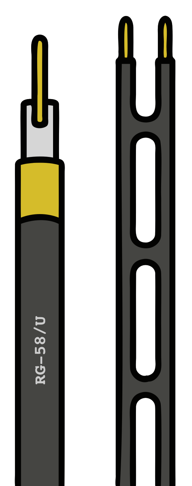

### Section 4.3: Feed Lines

Ever wondered how the radio waves actually get from your transceiver to your antenna? That's where *feed lines* come in. Think of them as the highways for your radio signals, carrying power from your radio to your antenna as efficiently as possible. Some feed lines are smooth, fast expressways. Others are bumpy backroads that waste your signal before it ever gets to where it needs to go.

#### Coaxial Cable: The Ham Radio Standard

> **Key Information:** Coaxial cable is the most common feed line for amateur radio because it is easy to use and requires few special installation considerations. 

Coaxial cable — or just *coax* — consists of a center conductor, insulation (the dielectric), a shielding layer, and a protective jacket. It's the go-to feed line for hams because it doesn't require a lot of special handling and does a great job of getting your signal where it needs to go, at least if you choose the right kind.

##### Impedance: Why It Matters

> **Key Information:** The most common impedance of coaxial cable used in amateur radio is 50 ohms. 

If you've ever looked behind your TV, you might have seen 75-ohm coax for cable or satellite. Can you use it for ham radio? Technically, yes. Should you? Not really. Ham gear is designed around 50-ohm coax, so that's what you want to use to keep your setup running smoothly.

##### Types of Coaxial Cable

> **Key Information:** The electrical difference between RG-58 and RG-213 coaxial cable is that RG-213 cable has less loss at a given frequency. 

Thicker coax usually means lower loss. Here are some common types you'll encounter:

- **RG-58** — Thin and flexible. Great for short runs or portable use, but it has higher loss over distance.
- **RG-8X** — A little better than RG-58, still flexible but with less signal loss.
- **RG-8 / RG-213 / LMR-400** — Thicker, low-loss coax that's great for longer runs and higher frequencies.
- **RG-59 / RG-6** — The 75-ohm TV stuff. It *technically* works, but it's not a great choice for ham radio.
- **Hardline / Heliax** — Heavy-duty, extremely low-loss coax used for repeaters and commercial installations where every bit of signal matters.

##### Coax Dielectric Types

> **Key Information:** Foam-dielectric coaxial cable has less loss per foot than solid-dielectric cable. 

The insulation between the center conductor and shield is called the *dielectric*. Different dielectric materials affect how well the cable performs.

- **Solid dielectric** — Uses solid plastic (usually polyethylene) as insulation. Durable and handles moisture well, but has more signal loss.
- **Foam dielectric** — Uses foam plastic with tiny air pockets. The air reduces loss, making it more efficient, though it can be slightly more susceptible to moisture if damaged.
- **Air-insulated hardline** — Takes this concept further by using mostly air with plastic spacers to hold the center conductor in place. This is why hardline has such low loss (more on this below), but it requires special techniques to keep moisture out — sometimes even pressurizing the line with dry air or nitrogen.

#### Understanding Loss in Feed Lines

> **Key Information:**
> - Of common feed line types, air-insulated hardline has the lowest loss. 
> - As the frequency of a signal in coaxial cable is increased, the loss increases. 
> - Power lost in a feed line is converted into heat. 

No coax is perfect — some of your power is always lost as heat before it even makes it to the antenna. A 3 dB loss means you're losing half your power before it reaches the antenna. The higher the frequency, the worse the loss gets — which is why satellite dishes often put the transmitter *right at the antenna* instead of running a long coax cable.

#### Potential Problems with Feed Lines

> **Key Information:**
> - Moisture contamination causes failure of coaxial cables. 
> - Sources of loss in coaxial feed line include water intrusion into coaxial connectors, high SWR, and multiple connectors in the line. 
> - The outer jacket of coaxial cable should be resistant to ultraviolet light because ultraviolet light can damage the jacket and allow water to enter the cable. 

The common thread running through those facts is water: it causes failure, it causes loss, and it's what the UV-resistant jacket is protecting against. Water is by far the biggest enemy of coax, so always weatherproof outdoor connections and replace cable with a cracked or damaged jacket before moisture finds its way in.

In addition to water-related problems, a few other things are worth watching out for:

- **Poor connections** — Loose or corroded connectors are like potholes in your signal's highway. Keep them clean and tight!
- **High SWR** — We'll talk more about SWR in Section 4.5, but if your SWR is too high, power that should be radiating from the antenna is instead lost in the feed line.
- **Too many connectors** — Every extra adapter or connection means more loss. Keep it simple!

#### Alternative Feed Lines: Ladder Line

{.img-xsmall .float-right}

Ladder line is like the sports car of feed lines — super efficient, but kind of picky. It has *way* lower loss than coax, especially at HF, but it has one big catch: you have to keep it away from metal or it starts picking up noise and acting weird. It's a fantastic choice if you're using a balanced antenna and have room to route it properly.

#### Choosing the Right Feed Line

Consider these factors when choosing coax:

- **How long is the run?** Longer runs = more loss. Use thicker, low-loss coax.
- **What frequency are you using?** Higher frequencies suffer more loss.
- **How much power are you running?** Some coax handles heat and power better than others.
- **Will it be outside?** If so, use UV-resistant, weatherproof coax or protect it properly.

---

Feed lines aren't much good until they provide a connection between two points, of course — and that means we need to discuss connectors!
