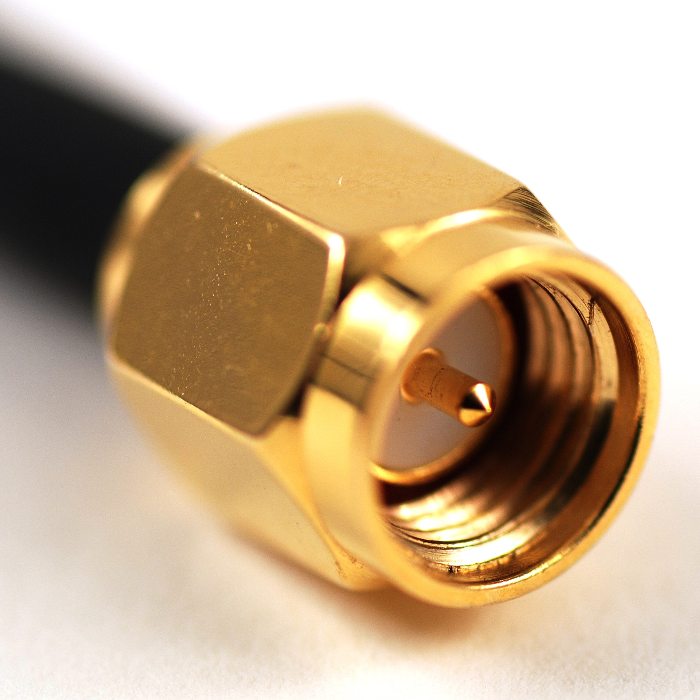
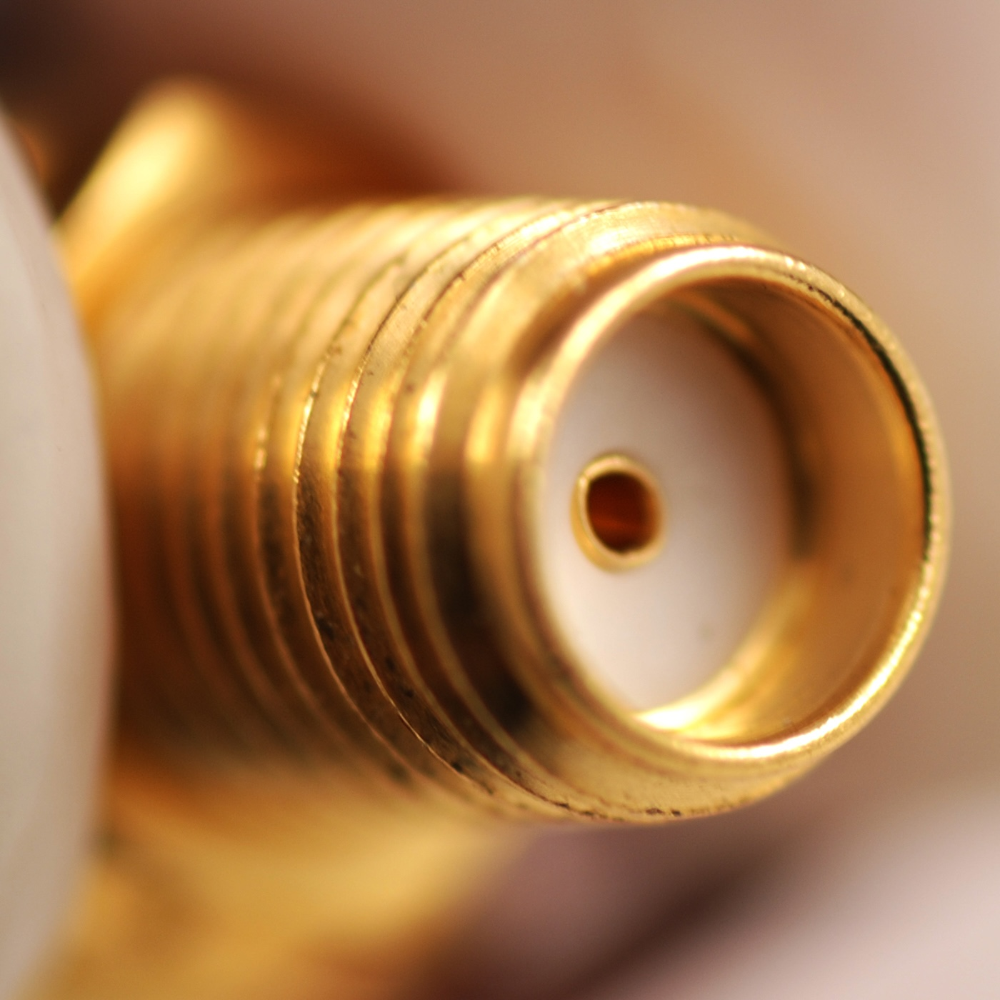
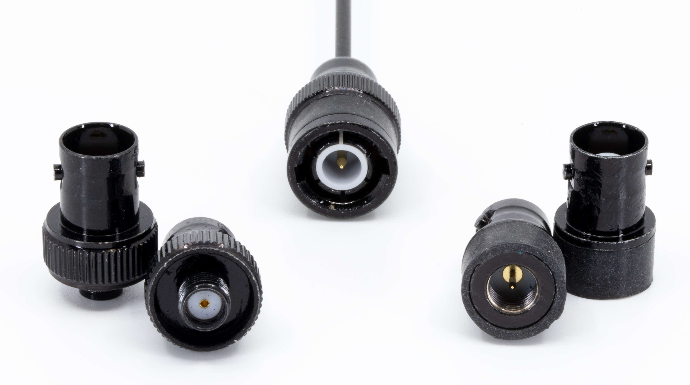
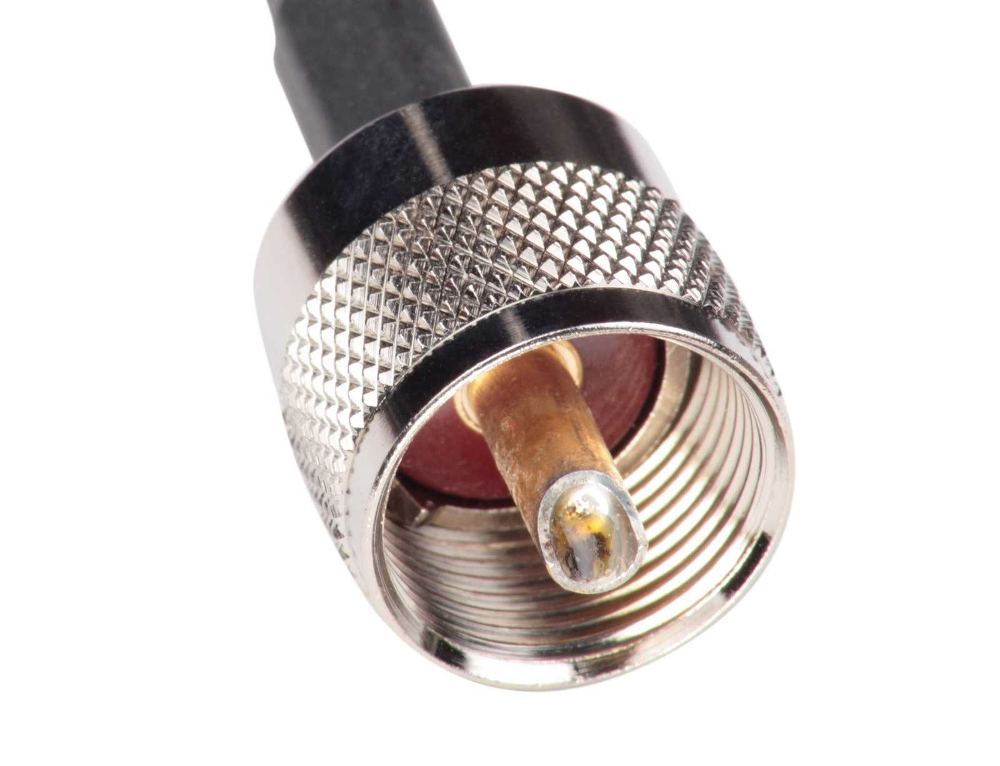
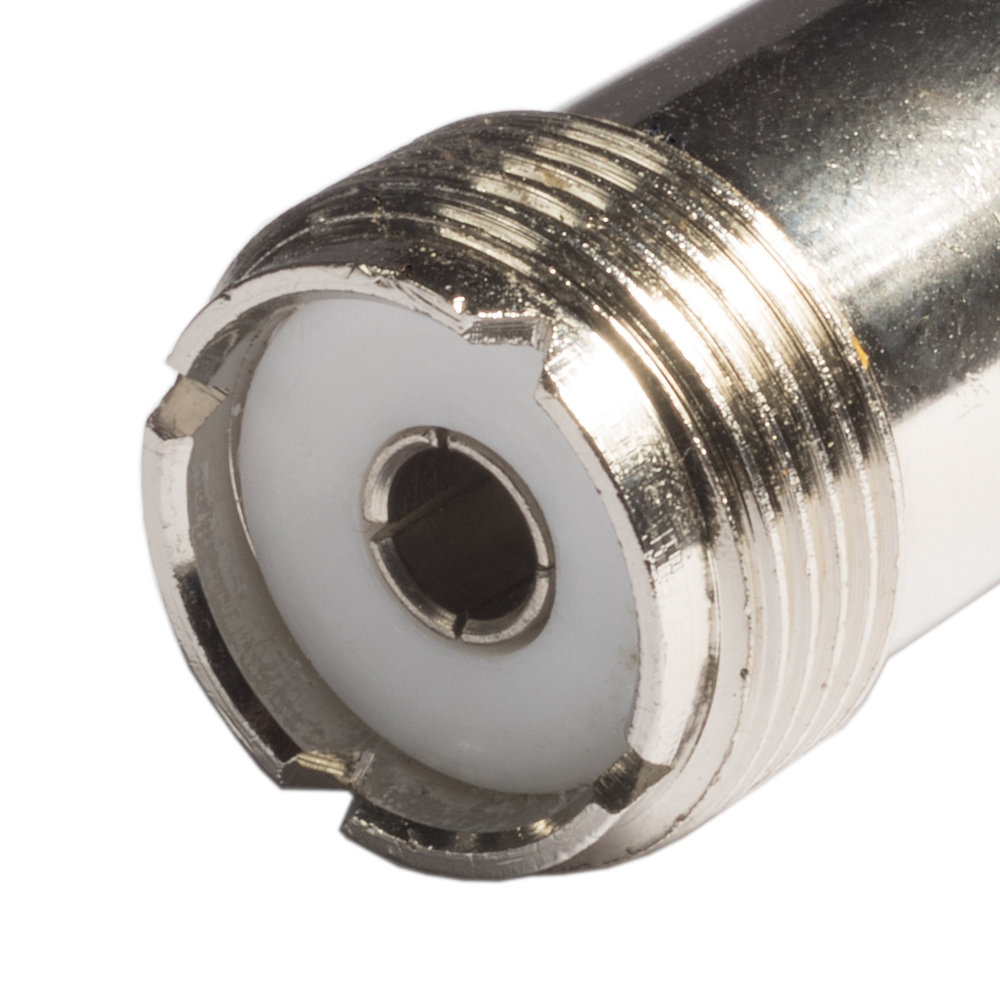
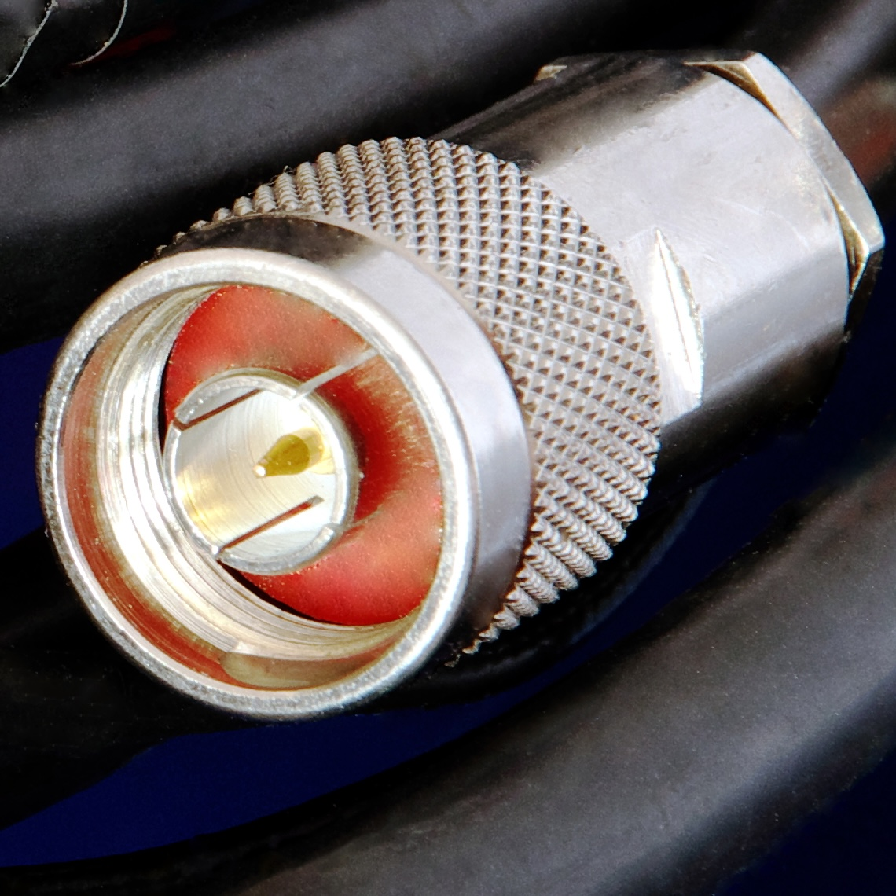

### Section 4.4: Connectors

Ever tried to plug your phone charger into a USB-C port, only to realize it's micro-USB? That's the world of connectors in a nutshell. In ham radio, getting the right connection is crucial — it's the handshake between your radio and antenna.

Before we look at the specific connectors you'll encounter, it's worth getting a few universal rules straight. Connector gender is one of the topics that most reliably trips up not only new hams but experienced ones as well — especially anyone planning to use a handheld radio for local communications. A little extra time now can save a lot of confusion later.

#### Understanding Connector Gender

The rules for figuring out which connector is which gender are simple, but they're genuinely counterintuitive. Three rules cover almost every situation.

##### Rule 1: The Center Conductor Determines Gender

| Center **pin** = **male** | Center **socket** = **female** |
|:---------:|:-----:|

Forget about threads. Forget about which piece fits "inside" the other. The only thing that matters for determining gender is the center conductor:

- A connector with a **center pin** is **male**.
- A connector with a **center socket** (a hole the pin goes into) is **female**.

This rule matters because some connector types — we'll see SMA in a moment — have threading that *looks* like it should determine gender, but doesn't. The center pin-vs-socket rule is always what counts.

##### Rule 2: "SMA-M Antenna" Means "Has SMA-M On It"

When someone says "SMA-M antenna," they mean the antenna has an SMA-M connector *on it* — not that it connects to something with an SMA-M. The gender in the name is always what's physically on the device, not what it mates with.

This matters for buying decisions. If you see a listing for an "SMA-F antenna," that antenna has a female connector on its base, which means you need a radio (or adapter) with a male SMA connector for it to plug into.

##### Rule 3: Mating Connectors Are Always Opposite Genders

Two connectors that join together are always one male and one female. You can't plug a male into a male, or a female into a female — they physically won't fit. This sounds obvious, but it has an important consequence for adapters: when you're buying an adapter to bridge two things, each end of the adapter needs to be the **opposite** gender of what it's plugging into.

With those rules out of the way, let's look at the most common types of connectors used by modern transceivers.

#### Common Connector Types

##### SMA (SubMiniature version A)

This little connector is like the smartphone of radio connectors — small, sleek, and everywhere these days. Most modern handheld radios use them.

SMA is also the connector type that most aggressively breaks people's intuition about gender. An **SMA-M (male) connector** has **internal threads** (threads inside a collar) and a **center pin**. An **SMA-F (female) connector** has **external threads** (threads on the outside) and a **center socket**. At first glance, the one with external threads *looks* male — but remember Rule 1: pin = male, socket = female.

| SMA Male (center pin) | SMA Female (center socket) |
|:---------:|:-----:|
|  |  |
{.connector-table}

Which gender ends up on which side depends on the specific model of radio, but there are some general patterns:

- Major brands like **Icom, Yaesu, and Kenwood** typically put an **SMA-F** connector on the radio, so you need an **SMA-M** antenna.
- Many newer brands, especially **Baofeng and other Chinese brands**, often do the opposite — **SMA-M** on the radio, so you need an **SMA-F** antenna.

Whatever connector is on your radio, you need the *opposite* on your antenna.

##### BNC (Bayonet Neill-Concelman)

{.img-large .float-right}

Think of BNC as the quick-change artist of connectors. Instead of screwing on like SMA, it has a **twist-and-lock** mechanism that makes connecting and disconnecting antennas a breeze. You'll see these on some handheld radios, a lot of test equipment, and even some HF accessories.

In recent years there's been a significant shift in the handheld radio community toward using BNC connectors. While most handhelds still come with SMA connectors, a growing number of operators — especially those who regularly swap antennas — are now adding BNC adapters to their radios.

**Why are so many hams making this switch?**

- **Quick antenna changes** — twist-and-lock instead of multiple rotations with SMA threads.
- **Reduced wear on radio connectors** — the adapter takes the strain instead of your radio's built-in connector.
- **Flexibility for different situations** — swap between rubber duck, whip, and mobile antennas in seconds.
- **Less risk of cross-threading** — a common issue with SMA connectors.

However, adapters aren't for everyone. They add bulk and a tiny amount of signal loss. If you don't switch antennas often, sticking with what fits your radio directly is totally fine.

##### PL-259/SO-239 (UHF Connector)

> **Key Information:** PL-259 connectors are commonly used at HF and VHF frequencies. 

Despite its name, the "UHF connector" is a bit of a misnomer. It's widely used for HF and VHF radios, but it's not the best choice for UHF. The name originates from a time when the UHF spectrum was defined as a different (lower) range of frequencies but the connector name stuck.

You'll find these connectors on a lot of mobile and base station gear. They're rugged, easy to solder, and can handle high power levels.

- The **PL-259** is the male **PL**ug.
- The **SO-239** is the female **SO**cket.

| PL-259 (UHF Male) | SO-239 (UHF Female) |
|:---------:|:-----:|
|  |  |
{.connector-table}

These connectors work well up to about 150 MHz, but if you're working above that, you might want to use Type N connectors instead.

##### Type N

> **Key Information:** Type N connectors are the most suitable connector type for frequencies above 400 MHz due to their low loss and excellent shielding. 

{.img-med .float-right}

Meet the heavyweight champion of RF connectors. Type N connectors are like the armored tanks of the radio world — strong, well-shielded, and built for high frequencies.

They're designed for UHF and microwave bands, which means they work great for repeaters, satellite communications, and serious VHF/UHF setups. While they're bigger than SMA or BNC connectors, they make up for it with low signal loss and excellent shielding.

If you're working at frequencies above 400 MHz, Type N is your best bet for maximum performance.

#### Weatherproofing Outdoor Connections

> **Key Information:** Outdoor RF connectors (PL-259, BNC, Type N, and others) should be carefully taped for weather protection. 

No connector is immune to weather. Moisture that gets into an outdoor connection corrodes the metal, degrades the signal, and can eventually work its way down the coax jacket — the same water-intrusion problem we talked about in the feed-line section. The fix is straightforward: wrap outdoor connections in weatherproofing tape (coax-sealing putty, self-amalgamating rubber tape, or a combination of the two are common choices).

#### Pro Tips for Using Connectors

1. **Keep connectors clean and dry** — They're crucial connection points for your signal, so treat them well.
2. **Tighten, but don't over-tighten** — Hand-tight is usually just right for handhelds.
3. **Be gentle with SMA connectors** — They're tough, but not indestructible.
4. **Minimize adapter chains** — Every adapter adds loss and a potential failure point. Use them when you need to, but don't pile them up.

#### Putting It Together: Adapter Examples

Now that you know the gender rules and the common connectors, let's work through a few real situations. The trick is Rule 3 in action: each end of the adapter has to be the opposite gender of what it's mating with. A notation that helps: write out the full connection chain and check that each junction has opposite genders touching.

##### Example 1: BNC-M antenna on a Baofeng HT

Your Baofeng has an SMA-M port on the radio, and you want to use a BNC-M antenna. What adapter do you need?

Work it out step by step:

- Radio side: radio has SMA-M, so the adapter's radio side needs **SMA-F** (opposite of male).
- Antenna side: antenna has BNC-M, so the adapter's antenna side needs **BNC-F** (opposite of male).

The full chain: **(radio) SMA-M → SMA-F to BNC-F adapter → BNC-M (antenna)**

Notice how every junction in that chain has a male meeting a female. That's what you're checking for.

##### Example 2: SMA-F antenna on an Icom HT

Your Icom has an SMA-F port on the radio. You picked up an antenna that turns out to be SMA-F too — same connector type, same gender on both. They won't mate directly. What do you need?

- Radio side: SMA-F on the radio → adapter needs **SMA-M**.
- Antenna side: SMA-F on the antenna → adapter needs **SMA-M**.

Both sides need to be SMA-M. An SMA-M-to-SMA-M adapter (sometimes called a **gender changer** or **barrel**) is the answer:

**(radio) SMA-F → SMA-M to SMA-M adapter → SMA-F (antenna)**

##### Example 3: PL-259 mobile antenna on a Yaesu HT

You're at a public service event and want to plug a mobile antenna with a PL-259 on the coax into your Yaesu HT, which has an SMA-F port. You'll need to cross between connector *types* (SMA ↔ PL-259) and handle the genders.

- Radio side: SMA-F on the radio → adapter needs **SMA-M**.
- Antenna side: PL-259 is male → adapter needs **SO-239** (the female version of the UHF connector).

**(radio) SMA-F → SMA-M to SO-239 adapter → PL-259 (antenna)**

In practice, PL-259 and Type N connectors are bulky enough that hanging one directly off an HT's connector puts a lot of stress on the radio and screwing it on and off can be annoying to deal with. For a short-term setup like a mobile antenna on an HT, a **pigtail** — a short length of coax with the right connectors on each end — is usually more practical than a rigid adapter. An even more common approach is to put an SMA-to-BNC adapter on the radio side (since BNC twists on and off quickly) and terminate the pigtail with a BNC-M, making it easy to swap antennas as needed.

If you follow the chain and make sure opposite genders meet at every junction, you won't end up with a drawer of wrong adapters.

---

With antennas, polarization, feed lines, and connectors covered, there's one more piece of the antenna-system puzzle worth understanding: how well everything is actually working together. That's what SWR tells you.
