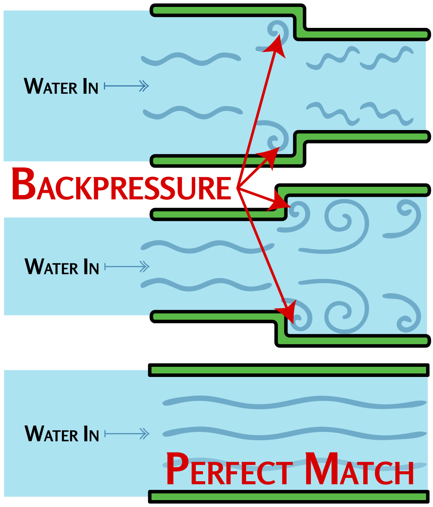

### Section 4.5: Standing Wave Ratio (SWR)

Standing Wave Ratio, or SWR, is a critical concept in ensuring your antenna system is working efficiently. Let's break it down into manageable chunks:

#### What is SWR?

> **Key Information:**
> - SWR is a *measure of how well a load is matched to a transmission line*. 
> - A *1:1* reading on an SWR meter indicates a *perfect impedance match* between the antenna and feed line. 
> - An SWR reading of 4:1 indicates an *impedance mismatch*. 

SWR is essentially a report card for the impedance match in your antenna system. It tells you how well the impedance of your transmitter matches the impedance of your feed line and antenna combined. When these impedances match (typically at 50 ohms in amateur radio), maximum power transfers from your transmitter to your antenna system.

{.img-pgcap .float-right}

Think of your radio system like water flowing through pipes. Your transmitter pushes the signal (water) through your feed line (pipe) to your antenna. When the pipes are the right size (good impedance match), water flows smoothly. But if there's a mismatch, some water gets pushed back, creating backpressure — just like RF energy being reflected back to your transmitter. That reflected energy is what SWR is really telling you about: it's the practical consequence of impedance mismatch.

SWR is measured as a ratio — here's what different readings mean in practice:

- **1:1 SWR**: Perfect match. All power is being accepted by your feed line and antenna.
- **Up to 1.5:1 SWR**: Great. Most of your power is getting through.
- **2:1 SWR**: Acceptable but not ideal. Some power is being reflected.
- **3:1 or higher SWR**: A significant amount of power is being reflected.
- **4:1 SWR**: A clear impedance mismatch — worth investigating before continuing to transmit.

Keep in mind these thresholds are rough guidelines rather than strict rules.

#### Why Does SWR Matter?

Why should you care about SWR? It's all about efficiency and equipment safety. The lower your SWR, the more of your radio's power actually makes it to your antenna and out into the world. High SWR means some of that power is bouncing back to your radio instead of being transmitted.

This reflected power creates two significant problems:

1. **Wasted Energy**: Power reflected back to your transmitter doesn't contribute to your signal, reducing your effective communication range.

2. **Equipment Damage**: More seriously, reflected power can overheat and damage your transmitter's RF output amplifier transistors. The higher the power output and the longer the transmissions the greater the danger.

> **Key Information:** Most solid-state transmitters reduce output power as SWR increases to *protect the RF output amplifier transistors*. This means *high SWR* is a common cause of *low RF power output* from a solid-state transceiver.  

Modern radios have protection circuits that detect high SWR and reduce power or shut down if necessary, but it's best not to rely on them — especially with cheaper transmitters. Keeping your SWR low ensures your radio stays efficient and safe for years to come.

#### Common Causes of High SWR

> **Key Information:** A *loose connection in the antenna or feed line* can cause erratic changes in SWR. 

What causes high SWR? Here are some common culprits:

1. **Antenna Length**: Your antenna isn't the right length for the frequency you're using.
2. **Feed Line Issues**: There's a problem with your feed line — maybe it's damaged or water has gotten in.
3. **Nearby Metal Objects**: Your antenna is too close to metal objects. Remember, antennas don't like to be crowded!
4. **Loose or Corroded Connections**: A little oxidation can cause big problems, and a loose connection in particular can produce SWR readings that jump around erratically.

If you're seeing high SWR, start with the easy stuff: check every connector is clean and tight, verify your antenna is the right length for your frequency, and make sure nothing metal has moved too close to the antenna. If all else fails, an antenna tuner can help by matching impedances (though it doesn't fix the underlying problem — it just hides it from your transmitter).

#### Measuring SWR

> **Key Information:**
> - An *antenna analyzer* can be used to determine if an antenna is resonant at the desired operating frequency. 
> - A *directional wattmeter* can be used to determine SWR. 

How do you check your SWR? Many modern radios have built-in SWR meters. If yours doesn't, you can get an external SWR meter or an antenna analyzer. These tools are great to have in your ham radio toolbox. Another option is a directional wattmeter — measure how much power is leaving your radio (forward power) and how much is coming back from the antenna (reflected power), and you can calculate your SWR.

#### SWR and Handheld Radios

It's worth noting that checking SWR on a monopole (such as most antennas on a Handheld Transceiver) can be tricky. The antenna on an HT uses your body as part of the ground plane, so when you connect any measuring equipment, you fundamentally change the antenna system itself! This often leads to inaccurate readings and confusion.

For HTs and similar portable setups, it's usually more practical to evaluate antenna performance through actual signal tests rather than relying solely on SWR measurements. If you do want to check SWR there are various ways to do it, but none of them are perfect.

The good news is that high SWR is usually less risky on an HT than on a higher-power base station. Manufacturers know HTs get used with their antennas right next to hands, bodies, and whatever else happens to be nearby — all of which affect the antenna system — so they're designed with more tolerance for mismatched loads than a typical desktop rig. And because *most* HTs have relatively low power output (5–8 W is typical, though some put out 25 W or more), even with significant reflected power, the total energy going into the final amplifier usually stays well below what would cause damage in a 100-watt radio.

#### Final Thoughts on SWR

A low SWR by itself doesn't prove your antenna is radiating well — it just proves your system is accepting power. A dummy load is a resistor that absorbs all RF fed to it as heat. It shows a perfect 1:1 SWR, yet you won't make a single contact with one because none of the power radiates. Far too many hams fall into the trap of thinking SWR is all that matters.

SWR simply tells you that power is being transferred efficiently from your transmitter to your antenna system — what happens after that depends on the antenna design, height, surroundings, and many other factors. A good antenna with good SWR ensures your power gets to the antenna and then radiates effectively into space.

So next time you're setting up your station, take a moment to check your SWR. It's like making sure the pipe from your water tank isn't leaking before worrying about where the sprinklers are aimed.

---

That wraps up Part 1. You've now seen how electricity, components, radio waves, and antennas fit together to make amateur radio work. Knowing how the physics behaves is one half of being a ham; the other half is knowing how to apply it safely and effectively. That's what Part 2 is about — starting with safety.
