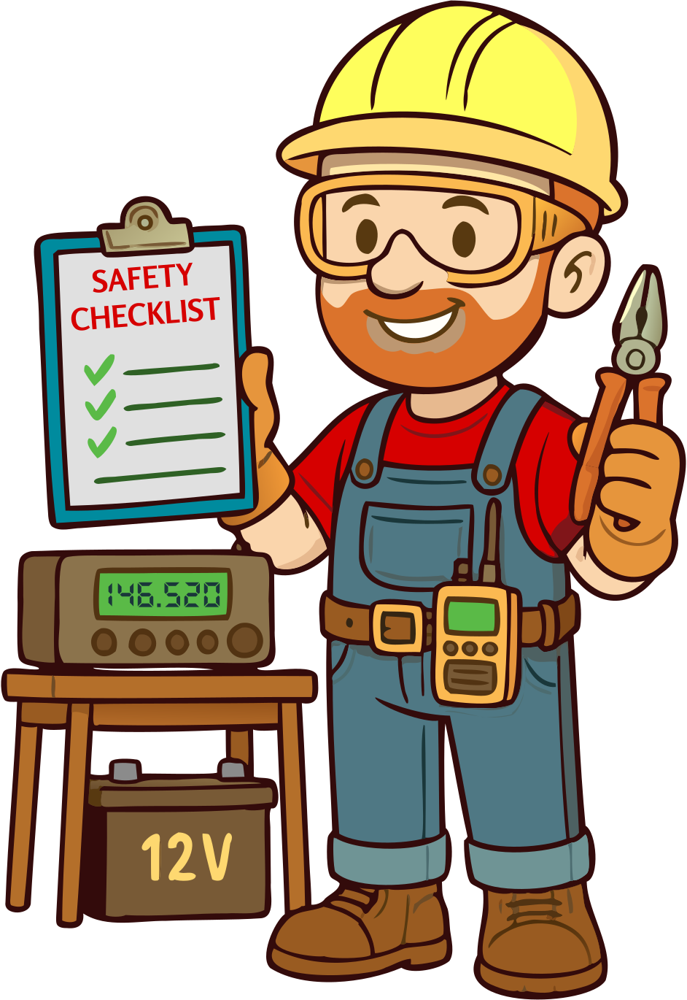

## Chapter 5: Safety

Welcome to one of the most important chapters in your journey to becoming a responsible amateur radio operator: **safety**. Making contacts across the globe is thrilling, but it’s just as vital to ensure that your radio adventures don’t put you—or anyone else—at risk.

{.img-small .float-right}

In this chapter, we’ll explore key safety topics every ham should understand. We’ll begin with **electrical safety**, including how to handle AC power responsibly and recognize potential hazards in your shack. You'll learn the importance of proper grounding and how to protect yourself from electric shock.

Next, we’ll dive into **RF safety**, where we’ll discuss the potential risks of radio frequency exposure and how to minimize them. You'll gain insight into safe power levels and smart antenna placement to protect yourself, your household, and your neighbors.

We’ll also cover **battery safety**, which is especially important for those interested in portable or emergency operations. And we’ll walk through best practices for **antenna installation**, including how to avoid the very real danger of nearby power lines.

Remember, safety isn’t just about following checklists—it’s about developing a mindset that puts well-being first in every part of the hobby. By the end of this chapter, you’ll have the knowledge and awareness to create a safe environment for your radio activities, ensuring your ham radio experience is not only fun but also secure.

So, let’s put on our safety glasses and hard hats (metaphorically speaking) and get started—because nobody wants a shocking surprise!
