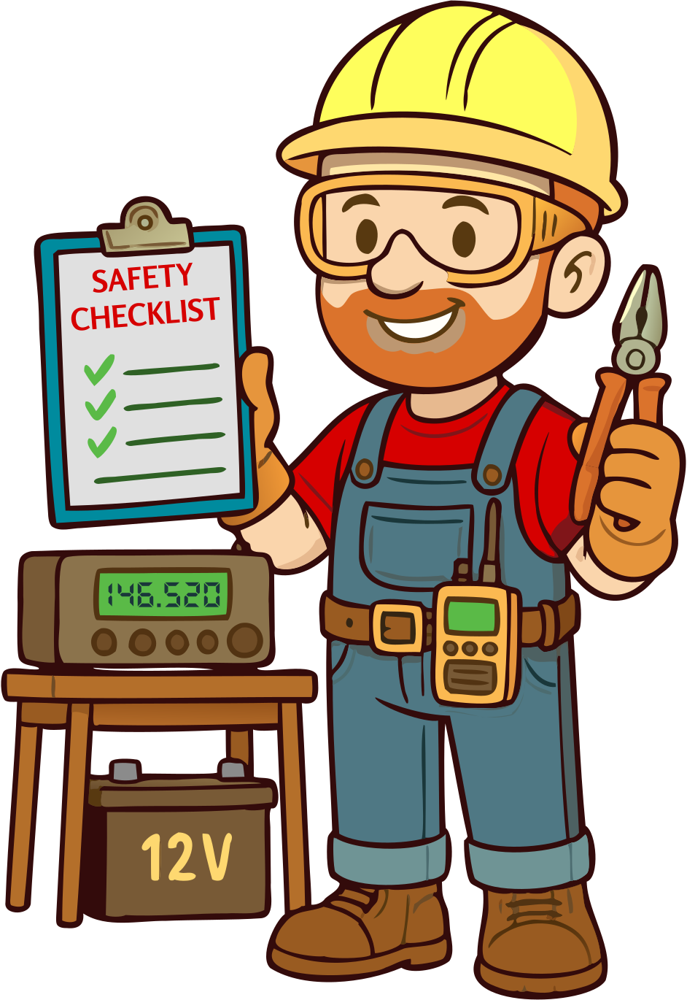

## Chapter 5: Safety

{.img-small .float-right}

Most of this book is material where learning it wrong mostly means failing the exam. This chapter is different. Depending on how far you take the hobby, you might end up working around AC mains wiring, putting up antennas near power lines, transmitting at power levels that make RF fields worth thinking about, or using batteries big enough to cause real trouble if mishandled. None of these things is usually deadly, but any of them *can* be if ignored.

None of this is meant to scare you off — millions of hams operate safely for decades without incident, and the precautions are mostly common sense once you know them. But this is the one chapter where "I'll just wing it" is a genuinely bad plan. Read it, take it seriously, and you'll be ready for the situations where it actually matters.
