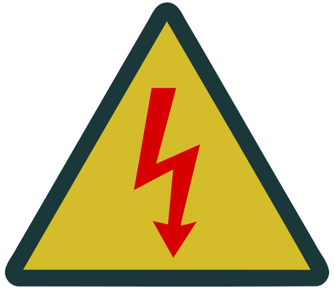

### Section 5.2: Hazardous Voltages

#### What Are Hazardous Voltages?

{.img-pgcap .float-right}

A common rule of thumb in ham radio is to treat anything above 30 volts as potentially hazardous — though OSHA's formal threshold is 50 volts. Either number is a starting point, not a safety guarantee. What actually causes injury is current flowing through you, and how much current a given voltage can push depends on your skin resistance, how wet things are, and how much current the source can supply in the first place.

> 🔥 A real-world reminder from the primary author of this book (KD7BBC): while installing a circuit breaker on a 24V battery bank, his wrench contacted the silver ring on his finger, which touched the metal trailer wall. The wall was bonded to DC ground — so the battery was now shorted through the ring. The current melted the ring enough to partially fuse it to the wrench and caused near third-degree burns. Twenty-four volts isn't classed as "hazardous," yet he still has a circumference scar on that finger. Never assume a voltage is safe just because it isn't officially "hazardous."

#### Where Hazardous Voltages Show Up

Hazardous voltages can show up in several places around a ham station:

- **Power Supplies**: That 13.8V power supply for your radio converts 120V AC to DC internally. One wrong move inside the case and you could be in for a shock.
- **Antenna Systems**: Some antennas develop high voltages at their feed points during transmission, especially at higher power levels. Never touch an antenna while it's transmitting.
- **Older Equipment**: Vintage tube gear can have voltages in the hundreds or even thousands of volts. If you're lucky enough to be working with it, be extra cautious.
- **Capacitors**: Capacitors don't care whether the equipment is unplugged. They can hold dangerous charges for hours or even days after power is removed.
- **Test Leads**: When you're measuring hazardous voltages, the probes are at those voltages too — easy to overlook when focused on taking a reading.

#### Staying Safe Around Hazardous Voltages

- **Remove metal jewelry first**: Rings, watches, and bracelets are excellent conductors. A wedding ring across a high-current source can short a circuit through your finger before you even know what's happening (as the author can attest).
- **Assume everything is "hot"**: Use a voltmeter to verify before you touch anything.
- **One hand rule**: Keep one hand in your pocket when working around high voltages. If you do get shocked, this prevents current from flowing across your chest — and across your heart.
- **Discharge capacitors properly**: Before opening equipment that might have charged capacitors, discharge them through a resistor of appropriate value. Never short them directly.
- **Use properly insulated tools**: Tools with insulated handles rated for the voltage you're working with are marked with voltage ratings (often 1000V). Check that the insulation isn't cracked or damaged before using them.
- **Keep your workspace dry**: Water and electricity don't mix. Make sure your work area is dry and you're not standing on a damp floor or concrete (which can be conductive).
- **Never work alone**: When working on high-voltage equipment, have someone nearby who could help in an emergency.
- **When in doubt, don't touch it**: There's no shame in asking for help or leaving it to the experts.

If you're regularly working around high-voltage equipment, it's worth taking a first aid course that covers electrical shock response. This isn't the place for us to walk you through that procedure — shock first aid has real subtleties that deserve hands-on training.

---

Electrical shock is only one way equipment can hurt you. The next section covers the devices specifically designed to stop things from going wrong in the first place: fuses and circuit breakers.
