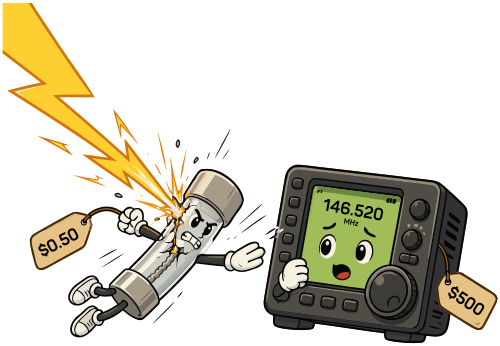

### Section 5.3: Fuses and Circuit Breakers

#### What Are Fuses and Circuit Breakers?

Fuses and circuit breakers are the first line of defense in electrical safety. Their job is to interrupt overloads and short circuits before they can damage equipment — or start a fire.

> **Key Information:** The purpose of a fuse in an electrical circuit is to remove power in case of an overload. 

#### Fuses: The One-Time Heroes

{.img-pgcap .float-right}

A fuse is essentially a sacrificial weak link — a thin wire enclosed in a glass or ceramic tube, designed to melt first so everything downstream of it doesn't. When too much current flows, the wire heats up and breaks, opening the circuit. Once a fuse has blown, it's done its job and has to be replaced.

#### Circuit Breakers: The Reusable Protectors

Circuit breakers accomplish the same goal without destroying themselves. They use either a bi-metallic strip or an electromagnet to detect overcurrent, and when they do, they flip a switch that breaks the circuit. Once the underlying problem is resolved, you can reset the breaker and put it back on duty.

#### Matching Fuses to Circuits

Fuses are rated for specific current levels, and using the right one matters more than most people realize. Imagine you've just set up a mobile rig in your car. You've got a 50W VHF/UHF transceiver that draws about 10A at full power, and you're about to pick a fuse for the power line. The manufacturer recommends a 15A fuse. You have a 30A fuse in the glove compartment. It's tempting to use the 30A — but that's a mistake.

> **Key Information:** A 5-ampere fuse should never be replaced with a 20-ampere fuse because excessive current could cause a fire. 

A fuse rated higher than its circuit was designed for will let through enough current to overheat the wiring long before it trips. The smaller wires behind your dash weren't built to carry 30 amps, and if something goes wrong — a short, a stuck transmit, a pinched cable — the wiring itself becomes the fuse. Melting insulation and smoke in an enclosed vehicle cabin is not the failure mode you want.

**This is important enough to say plainly: never replace a fuse with one of a higher rating than the circuit was designed for, and never bypass a fuse entirely.** If a fuse keeps blowing, the answer is to find out why, not to install a bigger fuse.

#### Where to Install Fuses and Breakers

> **Key Information:** In a 120V AC power circuit, a fuse or circuit breaker should be installed in series with the hot conductor only. 

Placing the fuse in series with the hot conductor ensures that when it trips, it disconnects the circuit from the live voltage source. A fuse in the neutral line would stop current flow, but the hot wire would still be live — so touching an exposed conductor in the supposedly-dead circuit could still shock you.

This principle applies to DC circuits too. For mobile and battery-powered setups, install the fuse in series with the positive lead, as close to the battery as practical. A short circuit anywhere downstream of that fuse will trip it; a short circuit upstream of it won't, and can dump enormous current through unprotected wiring.

#### A Few More Practical Points

- **Investigate persistent blown fuses**: A fuse that blows once is a random event. A fuse that blows twice is trying to tell you something.
- **Know where your breakers are**: In your shack and your home, label breakers so you know what controls what. You'll appreciate this the one time you really need to cut power fast.
- **Use power strips with breakers**: Power strips with built-in circuit breakers give you an extra layer of protection for your shack equipment.
- **Overcurrent is not overvoltage**: Fuses and breakers protect against too much current, not too much voltage. A voltage surge (from a lightning strike, say) can pass through a fuse without tripping it. Surge protectors are a separate thing.

---

Fuses and breakers protect your equipment from electrical faults, but the equipment itself — especially batteries — has its own set of hazards. The next section covers battery safety, including why a lead-acid or lithium-ion battery can be dangerous in ways a wall outlet isn't.
