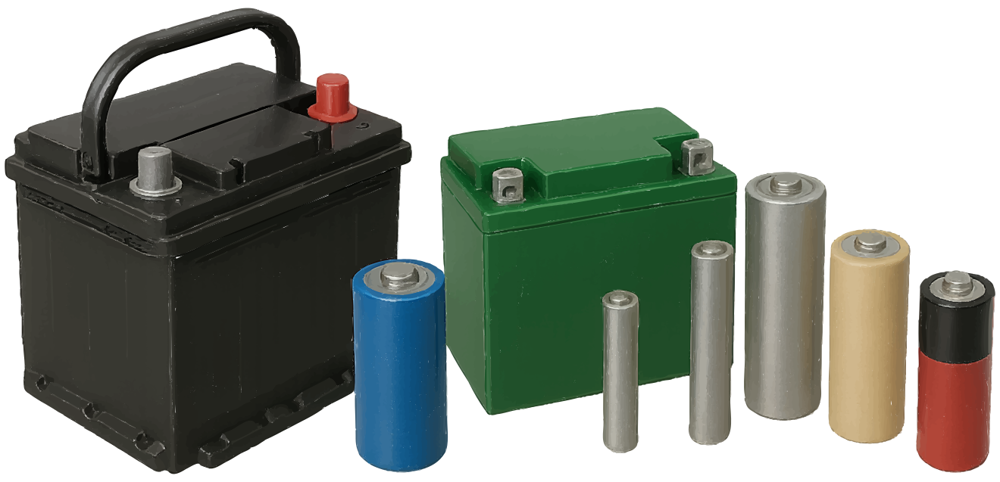
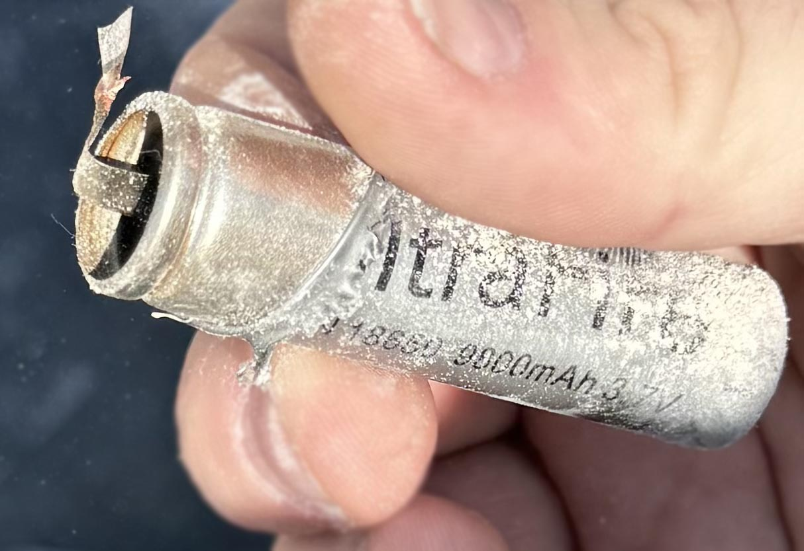

### Section 5.4: Batteries

Batteries are the lifeblood of portable ham radio. Whether you're operating from a mountaintop or running your station during a power outage, they keep you on the air. They also have more potential to cause trouble than most other equipment in your shack, so it's worth understanding what's in your go-bag and how to treat it.

#### Types of Batteries

> **Key Information:**
> - Rechargeable battery chemistries include nickel-metal hydride, lithium-ion, and lead-acid. 
> - Carbon-zinc batteries are not rechargeable. 

{.img-full .img-centered}

A quick tour of what you're likely to encounter:

1. **Lead-Acid**: The old reliable. You'll find these in cars and as backup power for your shack. They're rechargeable and can deliver high currents. Each cell produces about 2.1 volts, so a typical "12-volt" battery measures around 12.6 volts fully charged, with a working range of 12.0–12.8 V.

2. **Lithium-Ion (Li-ion)**: The star of modern handheld radios. They pack a punch in a small package but can be temperamental. Rechargeable, with high energy density. Each cell produces 3.7 volts, so a "12-volt" lithium-ion battery usually uses electronics to regulate the output voltage.

3. **Lithium Iron Phosphate (LiFePO4)**: A newer chemistry that's safer and more stable than standard Li-ion, with an exceptionally long cycle life. Rechargeable. Each cell produces about 3.2 volts, so a "12-volt" pack is actually 12.8 V and charges to around 14.6 V.

4. **Nickel-Metal Hydride (NiMH)**: Often found in AA or AAA sizes. The eco-friendly option, and extremely common before Li-ion took over. Rechargeable, a good alternative to disposables. Each cell produces 1.2 volts.

5. **Nickel-Cadmium (NiCd)**: The classic rechargeable, once the go-to for cordless phones and older handhelds. Each cell is 1.2 volts, just like NiMH. Due to environmental concerns over cadmium (a toxic heavy metal), they've been largely replaced by NiMH — but you'll still see them in older gear.

6. **Alkaline**: The one-hit wonders. Great for emergencies (you can buy them anywhere), but once they're done, they're done. Each cell is 1.5 volts, a bit more than the rechargeable options.

7. **Carbon-Zinc**: Old-school disposables and some of the earliest dry cells. Non-rechargeable, 1.5 volts per cell. Shorter lifespan and lower capacity than alkaline — think of them as the great-grandparent of modern batteries.

Worth noting: batteries of different chemistries may have different voltages per cell even in the same physical size. Always check the specs before wiring things up.

#### Battery Safety

Each chemistry has its own quirks, but a few hazards apply broadly.

> **Key Information:** Shorting the terminals of a 12-volt storage battery that lacks internal protection circuitry can cause burns, fire, or an explosion. 

> **Key Information:** Rapidly charging or discharging an unprotected battery can cause overheating or out-gassing. 

##### Lead-Acid

- These produce hydrogen gas, especially when charging. Always charge in well-ventilated areas — hydrogen is extremely flammable, and a buildup is asking for a fire or explosion.
- They contain sulfuric acid. Treat them like you would a grumpy cat — with respect and protective gear.
- The terminals can dump hundreds of amps into a short circuit. Remove jewelry and use insulated tools (and do not ask the primary author the melting point of sterling silver jewelry — he has no personal reason to know that. None at all).

⚠️ **Warning**: Never create sparks near a charging lead-acid battery. For this reason, many people prefer to keep lead-acid batteries outside of living spaces.

> 🔥 A real-world cautionary tale: while attempting to connect lead-acid batteries in parallel to build a battery bank, an operator reversed the wiring. The result? A smoking cable hot enough to melt rubber. Fortunately the damage was limited — but it's a vivid reminder to double-check your connections and use proper fusing.
>
> Even experienced operators can make mistakes like this — including some who go on to write books on the subject.

##### Lithium-Ion

- Overcharging can lead to overheating or fire. Stick to the charger that came with your radio.
- If they get punctured or damaged, treat them like a ticking time bomb. Dispose of them properly and quickly.
- They don't like extreme temperatures — not too hot, not too cold.

> 🔥 One more cautionary tale: a young (11yo) radio enthusiast was once experimenting with 18650 lithium-ion cells — on his bed, no less — while playing with a motor stripped from a scooter.
>
> 
> {.float-right .img-pgcap}
> The exact details are unclear, but the cells somehow shorted. One moment everything was fine, and the next, the battery casing was across the room, a softball-sized burn had melted through the quilt, and the air was filled with a harsh chemical smell.
>
> Fortunately, no one was hurt and the damage was limited to some bedding, but it's a stark reminder: lithium-ion batteries can and do fail violently when mishandled. Despite common claims that they "don't explode," they can absolutely vent with flame under the right conditions.

##### Lithium Iron Phosphate (LiFePO4)

- The laid-back cousin of Li-ion. Safer, but still needs its own type of charger.
- Doesn't like charging in extreme cold.
- Over- or under-charging a single cell can ruin it — proper balancing matters.

#### How Long Will Your Battery Last?

When you're out in the field or during a power outage, knowing how long your equipment can run on a battery is crucial. This comes down to your battery's ampere-hour (Ah) rating and your equipment's current draw.

> **Key Information:** To determine how long equipment can run from a battery, divide the battery ampere-hour rating by the average current draw of the equipment. 

For example, if you have a 12 Ah battery and your radio draws an average of 2 A:

$$\begin{align*}
\text{Battery Life (hours)} &= \frac{12 \text{Ah}}{2 \text{A}}\\
&= 6 \text{ hours}
\end{align*}$$

This gives you a rough estimate — actual runtime varies with temperature, battery age, and how hard you're pushing the battery (lead-acid in particular delivers significantly less total capacity when drawn at high rates).

#### General Battery Wisdom

In addition to the warnings covered above:

1. Use the right charger for each battery type. It's not a one-size-fits-all situation.
2. Be careful leaving batteries charging unattended — a malfunctioning charger can create a dangerous situation fast.
3. Store batteries in a cool, dry place. They're not wine; they don't get better with age and heat.
4. Keep battery terminals covered when not in use. Accidental shorts are no joke.
5. Don't mix old and new batteries. The new ones can end up overcompensating, which can cause them to overheat or leak.

#### Emergency Preparedness

For emergency preparedness:

- Keep a stash of fresh batteries for your go-kit.
- Regularly test and cycle your rechargeables. If you never use them, you're likely to find they aren't working when you need them.
- Have a plan for charging during extended power outages. Solar chargers can be a ham's best friend.

---

Batteries can power your station anywhere you go — the next set of concerns starts when that station goes outside. Antennas and the towers they live on have their own category of hazards, from climbing falls to nearby power lines.
