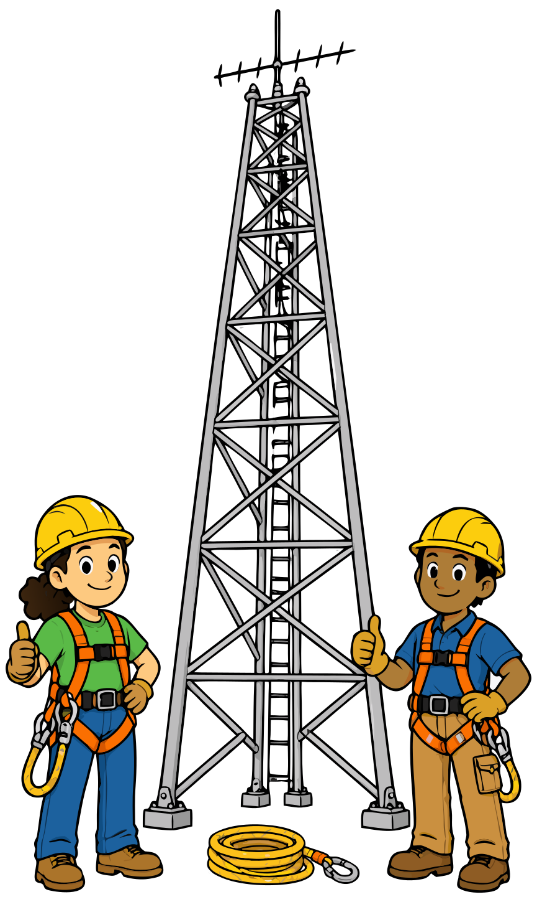

### Section 5.5: Antennas and Tower Safety

Antenna work covers an enormous range. It can be as simple as throwing a rope over a tree branch to hoist a roll-up J-pole, clamping an antenna onto a vehicle, or setting one on top of a camera tripod — or as involved as climbing a tower on a mountaintop to mount a repeater antenna. The hazards scale with the complexity. Even if you never install your own tower, you may find yourself helping someone else with theirs — and knowing the basics keeps you (and the people around you) safe.

#### Tower Safety and Climbing

When it comes to towers, safety isn't just a good idea — it's essential.

{.img-pgcap .float-right}

> **Key Information:**
> - When climbing an antenna tower, you must have sufficient training on safe tower climbing techniques, use appropriate tie-off to the tower at all times, and always wear an approved climbing harness. 
> - It is never safe to climb a tower without a helper or observer. 

Your ground crew isn't just there to hand you tools — they're your safety net. They can call for help in an emergency, guide you through difficult maneuvers, and keep an eye on changing conditions like approaching weather. When climbing, proper equipment isn't optional and the list above isn't a menu to pick from. Tie-off, harness, and training all matter, and missing any one of them is how people get hurt.

> **Key Information:** A crank-up tower must not be climbed unless it is retracted, or mechanical safety locking devices have been installed. 

Crank-up towers are designed to telescope up and down, and the sections can collapse if improperly secured. If you climb one without retracting it or engaging its safety locks, a stuck cable, a failed winch, or even a strong gust of wind could cause the sections to telescope downward — with you on them. The consequences could range from expensive antenna damage at the bottom of the list to catastrophic injury at the top.

#### Overhead Power Lines and Placement

Power lines are the arch-nemesis of antenna safety.

> **Key Information:** An important safety precaution when putting up an antenna tower is to look for and stay clear of any overhead electrical wires. 

> **Key Information:** The minimum safe distance from a power line when installing an antenna is enough so that if the antenna falls, no part of it can come within 10 feet of the power wires. 

So if you're putting up a 20-foot vertical, that means 30 feet minimum from any power lines — enough so that if it falls, it can't come within 10 feet of the wires.

> **Key Information:** You should avoid attaching an antenna to a utility pole because the antenna could contact high-voltage power lines. 

Even if it seems convenient, it's just not worth the risk. Utility poles often carry multiple electrical lines, some carrying thousands of volts. An antenna that touches these lines can energize your entire system, creating a deadly hazard.

#### Guy Wires and Structural Support

Tall towers often need guy wires to keep them standing. The turnbuckles that tension those wires can work themselves loose over time if they aren't secured.

> **Key Information:** The purpose of a safety wire through a turnbuckle used to tension guy lines is to prevent loosening of the turnbuckle from vibration. 

The fix is simple: after adjusting the turnbuckle, thread a thin safety wire through its holes and twist the ends together so it can't spin loose.

#### Grounding Systems and Lightning Protection

Proper grounding is essential for both safety and equipment protection.

> **Key Information:**
> - When installing grounding conductors for lightning protection, connections should be short and direct  and sharp bends must be avoided. 
> - A lightning arrester should be installed on a grounded panel near where feed lines enter the building. 

The reason for short, direct connections with no sharp bends is how lightning behaves: lightning takes the path of least impedance, not just least resistance. Long runs and sharp bends create inductive impedance that the lightning energy would rather avoid — so it looks for an alternative route, which could be through your equipment or through you. Placing the arrester where feed lines enter the building gives lightning a controlled path to ground before it reaches anything inside.

> **Key Information:**
> - All external ground rods or earth connections should be bonded together with heavy wire or conductive strap. 
> - A proper grounding method for a tower is separate eight-foot ground rods for each tower leg, bonded to the tower and each other. 

Multiple ground rods provide multiple low-impedance paths to earth, reducing overall ground resistance and improving lightning protection. Bonding them together ensures that lightning energy doesn't develop a voltage difference between "ground" at one point and "ground" at another — which would be an invitation for it to arc through whatever conducts between them, like your equipment or the building wiring.

> **Key Information:** Flat copper strap is the preferred conductor for bonding at RF. 

Because of the skin effect (where RF currents travel on the surface of conductors), a flat strap provides more surface area and lower impedance than a round wire of the same cross-sectional area.

> **Key Information:** Grounding requirements for an amateur radio tower or antenna are established by local electrical codes. 

These aren't just suggestions — they're legally required standards. Always consult and follow your local electrical code when installing antennas and towers.

---

Keeping antennas up and intact is one concern. What they radiate once they're up — and how that energy affects people nearby — is another. The last section of this chapter covers RF exposure.
