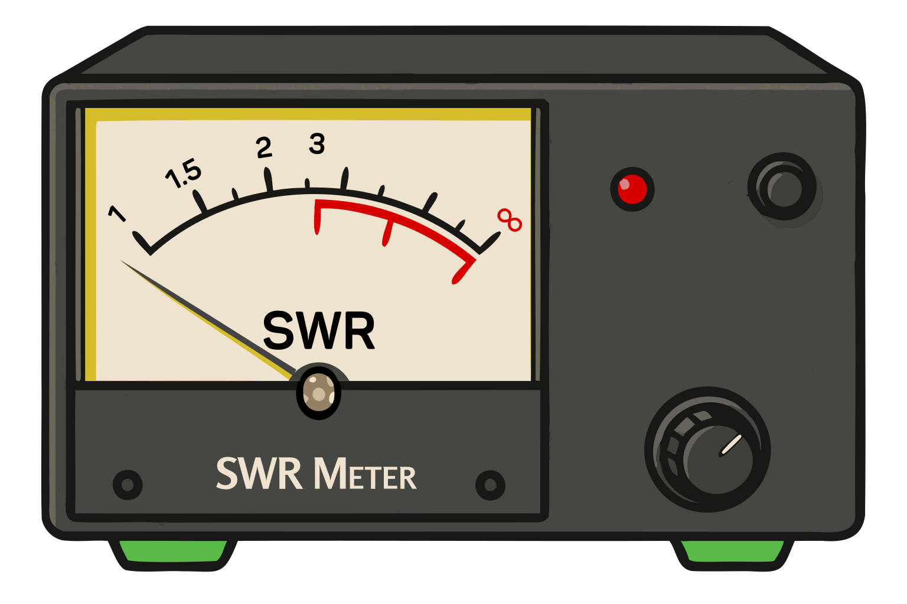

### Section 6.1: Station Accessories

Welcome to the toy store of ham radio! A radio alone is rarely a complete station — you need a way to power it, a way to check how well it's transmitting, and often a few extras to make operating comfortable. This section walks through the common ones. As you grow in the hobby you'll probably accumulate more, but don't feel like you need to buy everything at once: a radio, an antenna, and a power source are really all you need to start making contacts.

#### Power Supplies

Unless you're running on batteries, you'll need a power supply to convert AC from the wall into the DC voltage your radio needs.

> **Key Information:**
> - An appropriate power supply rating for a typical 50-watt output mobile FM transceiver is 13.8 volts at 12 amperes. 
> - A regulator is the type of circuit that controls the amount of voltage from a power supply. 
> - Short, heavy-gauge wires should be used for a transceiver's DC power connection to minimize voltage drop when transmitting. 

13.8 volts is the standard ham-radio supply voltage because that's roughly what a car's electrical system provides with the engine running — and most mobile transceivers were originally designed for automotive use. The 12 amps is more than the radio typically draws on receive but gives you enough headroom for full-power transmit without the supply voltage sagging.

Inside the supply, a voltage regulator is what keeps the output voltage steady regardless of load or wall-voltage fluctuations. Outside the supply, the wires between it and your radio matter too: transmit current is many times higher than receive current, and any resistance in the power leads becomes a voltage drop under that load. Short, heavy-gauge wire keeps that drop small.

You may also want a surge protector between your supply and the wall outlet to guard against power spikes.

#### Digital Interfaces

For digital modes (which we covered in Section 3.6), you'll want a way to connect your radio to your computer. The three main signals you need to connect are *receive audio, transmit audio, and transmitter keying* — everything else is plumbing around those three. Many modern radios include USB ports that handle all three over a single cable; older or simpler setups use separate audio cables with a small interface box that handles the keying.

#### Antenna Analyzers, SWR Meters, and Power Meters

{.img-pgcap .float-right}

These are the tools for seeing what your antenna system is actually doing.

> **Key Information:**
> - When selecting an accessory SWR meter, consider the frequency and power level at which the measurements will be made. 
> - An RF power meter should be installed in the feed line, between the transmitter and antenna. 

An antenna analyzer lets you sweep frequency and watch SWR change across a range, which is how you tune an antenna to resonance. SWR meters and power meters are simpler — they connect inline between your transmitter and antenna (they have to be in the RF path to measure what's on it) and show you how much forward and reflected power is moving through. When picking any of these, check that the meter handles the frequencies and power levels you actually operate at — a meter designed for HF can give nonsense readings at VHF, and one rated for 100 W can be damaged by a 1.5 kW transmitter.

#### Mobile Antennas

For mobile operation, the main choice is how the antenna attaches to the vehicle:

- **Mag mounts**: quick to install, no drilling, less-than-ideal ground plane.
- **Lip mounts**: clamp to the edge of a hood or trunk, semi-permanent, no holes.
- **Drill mounts**: permanent, best performance, but you're putting a hole in your vehicle.
- **Glass mounts**: attach to a window, no metal surface needed, trade-offs in performance.

You can even get mounts that let you use the antenna from your handheld on the vehicle roof — useful for quickly upgrading an HT for a road trip.

#### Mobile and Portable Accessories

A few accessories make portable and mobile operation dramatically more comfortable.

For handheld operation:

- **Speaker-microphones** let you keep the radio on your belt while talking.
- **Earpieces or headsets** are invaluable during public service events or in noisy environments.
- **Tactical PTT buttons** can be attached to handlebars or clothing for easier operation when mobile.
- **Extended battery packs** keep you on the air during long operating sessions.

For mobile installations:

- **External speakers** cut through road and engine noise.
- **Microphone extension cables** give you flexibility in microphone placement.
- **Mounting brackets** keep your radio secure and within reach while driving.
- **Headsets** reduce distraction — though always exercise caution when operating while driving.

These can be the difference between hearing a critical transmission during an emergency net and missing it in the ambient noise.

---

Connecting all of that to the wall is only half the battle — the other half is making sure your signals stay where they belong and don't interfere with anyone else's gear. That's what the next section is about.
