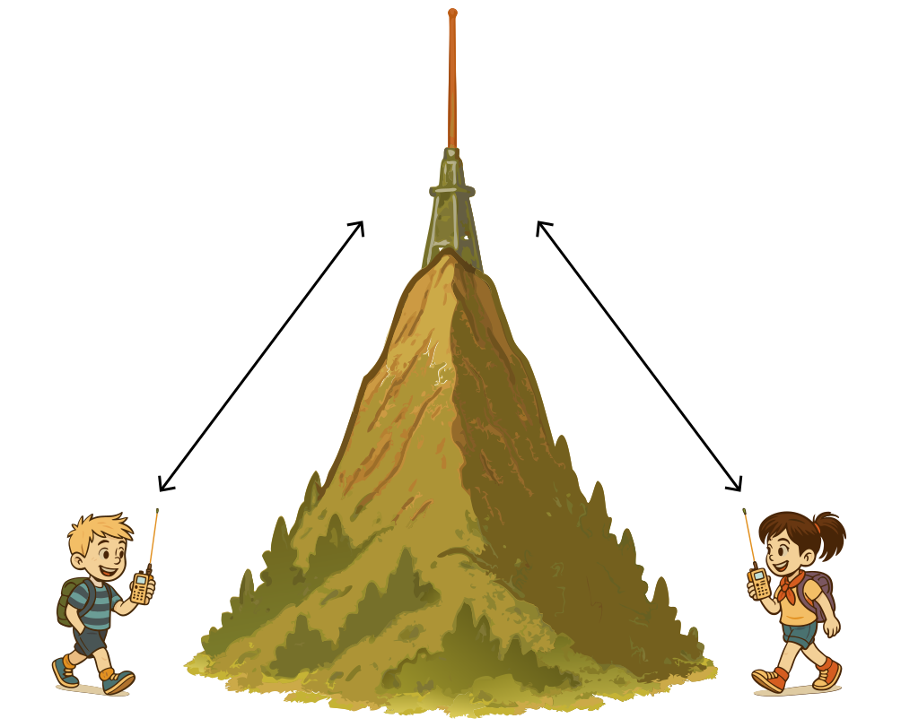

### Section 6.5: Repeater Operation

Alright, let's talk about repeaters - the range-extending marvels of the ham radio world. These helpful devices take your signal and shout it from the rooftops (or mountaintops) for you.

#### What's a Repeater?

> **Key Information:** A repeater station simultaneously retransmits the signal of another amateur station on a different channel (frequency). 

{.img-med .float-right}

Imagine a radio relay station perched high up on a hill or tall building. It listens on one frequency and simultaneously retransmits what it hears on another. This extends your range way beyond what your little handheld or mobile rig could do on its own.

Now, only one signal can usefully exist on a given frequency at once, so the repeater can't talk on the same frequency you are talking on. Instead, when you transmit to a repeater, you're actually sending on one frequency (the input), and listening on another (the output). Don't worry, your radio will handle this automatically if you've set it up correctly.

#### Repeater Offsets

> **Key Information:** *Repeater offset* is the difference between a repeater's *transmit and receive frequencies*. Common offsets are *plus or minus 600 kHz on 2 meters* and *plus or minus 5 MHz on 70 cm*.   

When using repeaters, you need to know about offsets. An *offset is the difference between a repeater's transmit and receive frequencies*. Your radio needs to be set to the correct offset to communicate through a repeater effectively.

Here's a handy table of common repeater offsets for various amateur radio bands:

| Band | Frequency Range | Common Offset |
|:----:|:---------------:|:-------------:|
| 6m   | 50-54 MHz       | -500 kHz or -1 MHz |
| 2m   | 144-148 MHz     | *±600 kHz* |
| 1.25m| 222-225 MHz     | -1.6 MHz |
| 70cm | 420-450 MHz     | *±5 MHz* |
| 33cm | 902-928 MHz     | -12 MHz or -25 MHz |
| 23cm | 1240-1300 MHz   | -12 MHz or -20 MHz |

Remember, these are the most common offsets, but there can be exceptions:

- On 2 meters, repeaters above 147 MHz typically use a positive offset, while those below use a negative offset.
- Some areas might use non-standard offsets due to local frequency coordination.
- Certain repeaters, especially those on less common bands, might use split frequencies that don't follow these standard offsets.

Most modern radios can automatically set the correct offset based on the frequency you input, but it's always good to double-check. When in doubt, consult a local repeater directory or ask a fellow ham in your area.

Pro Tip: You can use a VHF/UHF transceiver's "reverse" function to *listen on a repeater's input frequency*. This helps you determine if you can hear a station directly without going through the repeater—useful for checking signal quality or troubleshooting.

#### Accessing Repeaters

> **Key Information:** Most repeaters use *CTCSS tones or DCS codes* for access. Difficulties accessing a repeater could be caused by *improper offset, wrong CTCSS tone, or wrong DCS code*. CTCSS (Continuous Tone-Coded Squelch System) is a *sub-audible tone* transmitted along with normal voice audio to *open the squelch of a receiver*.  

Most repeaters require either a CTCSS (Continuous Tone-Coded Squelch System) tone, often called a PL (Private Line) tone, or a DCS (Digital Coded Squelch) code to access them. *CTCSS is a sub-audible tone transmitted along with normal voice audio to open the squelch of a receiver*. DCS, on the other hand, is a continuous stream of low-speed digital data. 

Both serve the same purpose: they help prevent interference and unintended activations of the repeater. Your radio must be set to transmit the correct CTCSS tone or DCS code for the repeater to even recognize your signal. Check your local repeater directory or club information to find out which system a particular repeater uses.

You'll also encounter DTMF in repeater operation. As we discussed in Section 6.4, DTMF uses two simultaneous audio tones—the same technology used in touch-tone phones. Unlike CTCSS or DCS, DTMF is not used for basic repeater access but instead for controlling repeater functions, activating links to other systems, or accessing internet-connected systems like IRLP (which we'll discuss later in this section).

If you're having trouble accessing a repeater whose output you can hear, there could be several reasons:
- *You're using the wrong offset*
- *You're using the wrong CTCSS tone*
- *You're using the wrong DCS code*
- You're too far away or in a poor location for your signal to reach the repeater

Always double-check all these settings when programming a new repeater into your radio.

#### How Repeater Conversations Work

> **Key Information:** When calling another station on a repeater, *say the station's call sign, then identify with your call sign*. 

Here's how a typical repeater conversation flows:
1. You transmit on the input frequency (your radio adds the correct offset and tone).
2. The repeater picks up your signal and retransmits it on the output frequency.
3. Other hams in the area hear you on the repeater's output frequency.
4. When they respond, they transmit on the input frequency, and the repeater retransmits their signal on the output frequency, completing the communication cycle.

Calling someone on a repeater is simple: just *say the call sign of the station you want to talk to, then identify with your call sign*. For example: "W1ABC, this is K2XYZ." This is more of a convention than a rule, but it's an appropriate way to get someone's attention on a repeater.

#### Repeater Etiquette

Repeater etiquette is important since these are shared resources:
- Listen before you transmit to avoid interrupting ongoing conversations.
- Keep transmissions reasonably short and leave pauses for others to join.
- Identify yourself using your callsign as required by FCC rules.
- If you want to join an ongoing conversation, wait for a pause and say your callsign.

Like any equipment, the owner of the repeater gets to set the rules for its use (subject to FCC regulations). Keep in mind that each repeater may be a bit different in the conventions that people follow.

#### Calling on a Repeater

> **Key Information:** To indicate you're listening on a repeater and looking for a contact, *use your call sign followed by the word "listening"*. 

Generally speaking we don't actually call "CQ" on a repeater — there isn't any reason we couldn't, but it is generally frowned upon with varying levels of intensity by different members of the community. Instead, to indicate that you're listening on a repeater and looking for a contact, *use your call sign followed by the word "listening"*. For example: "K2XYZ listening."

Here are some other common phrases:
- *"This is KD7BBC, mobile and monitoring"* — indicating both that you are moving around and that you are on the frequency, presumably happy to talk to someone if they want.
- *"K1BEN listening"* — shorter version of the same
- *"This is AC7DM. Anyone around to chat while I drive?"* — more casual, but still fine
- *"This is NV7V, could I get a signal report?"* — indicates that you aren't looking for a QSO, just to confirm how well you are getting into the repeater.

The specifics don't matter, as long as it's easy to understand and not deceptive.

#### Repeater vs. Direct Communication

When communicating through a repeater, you're operating in duplex mode as we discussed earlier - you're using two different frequencies (the repeater's input and output). This is different from direct station-to-station communication (called simplex operation).

> **Key Information:** When using a repeater, you're transmitting and receiving on different frequencies. This contrasts with simplex operation where stations transmit and receive on the same frequency.

Sometimes, designated frequencies are specifically set aside for direct station-to-station communication without using repeaters. This helps keep repeaters available for those who truly need their range-extending capabilities. We'll cover simplex operation and these designated frequencies more thoroughly later in the book.

#### Linked Repeater Systems

> **Key Information:** A linked repeater network is one where *signals received by one repeater are transmitted by all the repeaters in the network*. 

Imagine a network of radio stations set up on different hilltops across a region. In a traditional setup, each repeater would serve only its local area. But in a *linked repeater network, signals received by one repeater are transmitted by all the repeaters in the network*.

It's like having a group text message - when one person sends a message, everyone in the group receives it regardless of their location. Similarly, when you transmit to one repeater in a linked network, your transmission gets relayed through the entire network of connected repeaters, greatly extending your communication range.

Linked repeaters are particularly valuable for:
- Emergency communications across wide areas
- Club nets that span multiple cities or counties
- Special events where coordination is needed across a large region
- Allowing mobile operators to stay connected while traveling long distances

#### Internet-Linked Repeaters and VoIP Systems

> **Key Information:** Voice over Internet Protocol (VoIP) is a *method of delivering voice communications over the internet using digital techniques*. 

Some repeaters aren't just linked through traditional radio connections—they use the internet to connect with other repeaters across vast distances. This is done using Voice Over Internet Protocol (VoIP), which is a *method of delivering voice communications over the internet using digital techniques*.

An amateur radio station that connects other amateur stations to the internet is called *a gateway*.  These gateway stations are the bridges between the radio world and the internet, enabling global communication.

Two popular VoIP systems in amateur radio are IRLP and EchoLink:

**IRLP (Internet Radio Linking Project)**

The Internet Radio Linking Project (IRLP) is *a technique to connect amateur radio systems, such as repeaters, via the internet using Voice Over Internet Protocol (VoIP)*. 

To use IRLP, *over-the-air access to IRLP nodes is accomplished by using DTMF signals* . You'll enter codes using your radio's keypad to connect to various IRLP nodes around the world.

**EchoLink**

EchoLink takes internet connectivity a step further by enabling an *amateur station to transmit through a repeater without using a radio to initiate the transmission*.  You can use software on your computer or smartphone to connect directly to the system.

*Before using the EchoLink system, you must register your call sign and provide proof of license*.  This verification process ensures that only licensed amateurs can access the system.

#### Why Use Repeaters?

Repeaters are excellent for local communications, emergency preparedness, and getting started in ham radio. They're a great way to meet other hams and learn about the local radio community. With internet-linked systems, you can even talk to hams around the world!

So find a local repeater, program it into your radio, and give it a try. Remember, when you key up that mic, you're connecting with fellow radio enthusiasts who share your passion for communication. Enjoy exploring the expanded world that repeaters open up for you! The best way to learn is to do.
