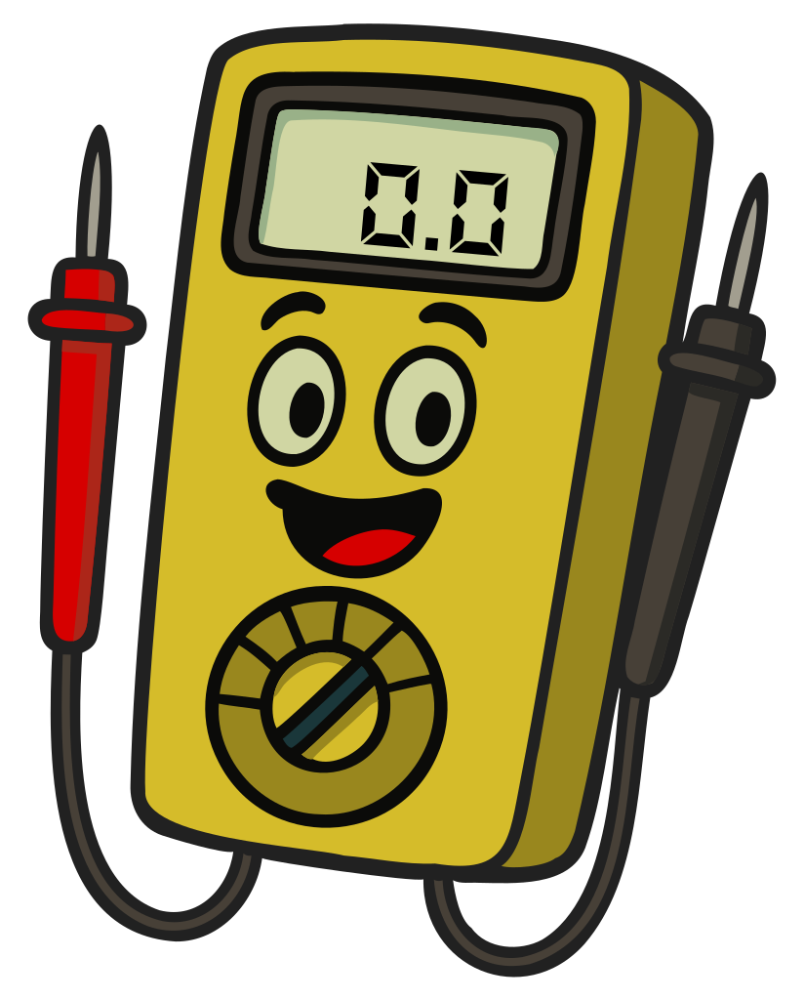

### Section 6.6: Basic Repair and Testing

Keeping a ham shack running smoothly comes down to two practical skills: using test equipment and basic soldering. This section covers both.

#### The Multimeter: Your Ham Shack Swiss Army Knife

{.img-small .float-right}

> **Key Information:**
> - A multimeter measures *voltage and resistance*, and usually current as well. 
> - A *meter* is a device that displays an electrical quantity *as a numeric value*. 
> - A *voltmeter* is used to measure *electric potential* (voltage). 
> - An *ammeter* is used to measure *electric current*. 

A multimeter combines several measurement instruments into one device — typically a voltmeter, an ohmmeter (for resistance), and on most models, an ammeter. When troubleshooting equipment issues, your first step should often be checking power supplies and connections with your multimeter.

##### Using a Multimeter Safely

> **Key Information:**
> - A voltmeter is connected *in parallel* with a component to measure voltage. 
> - When configured to measure current, a multimeter is connected *in series* with a component. 
> - An ohmmeter measures resistance *by applying a small current and measuring the resulting voltage*. 
> - When measuring in-circuit resistance with an ohmmeter, *ensure that the circuit is not powered*. 
> - *Attempting to measure voltage when using the resistance setting* can damage a multimeter. 

When measuring voltage, set your multimeter to the appropriate range (DC or AC) and connect it across the component you're measuring — red probe to the positive point and black to negative or ground.

For current measurements, you have to break the circuit and put the meter in line so the current flows through it.

> ⚠️ **WARNING**: Never connect the probes in parallel with a circuit while the meter is set to measure current. The meter's low internal resistance turns it into a near-short, which can blow the meter's fuse, damage the meter, or create a safety hazard.

#### Working with Capacitors

> **Key Information:**
> - An *increasing resistance reading with time* on an ohmmeter indicates a discharged capacitor that is charging. 
> - The hazard in a power supply immediately after turning it off is *charge stored in filter capacitors*. 

When you measure a capacitor with an ohmmeter, the reading typically starts low and rises over time. That's normal — the ohmmeter applies a small current to make its measurement, and that current charges the capacitor. As the capacitor charges, the current drops, which the meter interprets as rising resistance.

The same charge-storing behavior is what makes capacitors a real hazard inside power supplies. Even after the supply is unplugged, filter capacitors can hold dangerous voltages for a long time. Always discharge capacitors safely before working on equipment that may have charged them.

#### Measuring High Voltages

> **Key Information:** When measuring high voltages with a voltmeter, *ensure that the voltmeter and its leads are rated for use at the voltages being measured*. 

Safety is paramount when measuring high voltages. Using a voltmeter rated for 50 volts to measure 1000 volts could damage the meter, allow the high voltage to arc through the leads, or cause serious injury. Some ham radio equipment — especially tube-based gear — can have dangerously high voltages, and the filter capacitors discussed above can keep that hazard around long after the equipment is unplugged.

#### Other Essential Test Equipment

> **Key Information:**
> - The primary purpose of a dummy load is *to prevent transmitting signals over the air when making tests*. 
> - A typical RF dummy load consists of a *50-ohm non-inductive resistor mounted on a heat sink*. 

A few other instruments earn space in any ham's toolkit:

1. **SWR Meter**: measures the standing wave ratio so you can tell how well your antenna is matched to your transmitter. We covered SWR in detail in Section 4.5.
2. **Wattmeter**: measures your transmitter's power output, which helps you stay within legal limits and confirm proper operation.
3. **Dummy Load**: lets you test transmitters without putting a signal on the air. It looks like a properly-matched antenna to your transmitter, but converts all the RF energy to heat instead of radiating it.
4. **Oscilloscope**: visualizes electrical signals over time. More advanced, but useful for diagnosing modulation or signal-quality issues.

#### The Art of Soldering

> **Key Information:**
> - *Acid-core solder* should not be used for radio and electronic applications. 
> - The characteristic appearance of a cold tin-lead solder joint is *a rough or lumpy surface*. 

Soldering is a skill that pays for itself many times over in repaired cables, fixed connectors, and homebrew projects. The basics:

1. Use a soldering iron with adjustable temperature control (600–700°F / 315–370°C is appropriate for most electronics).
2. "Tin" your soldering iron tip by applying a small amount of solder before making a connection.
3. Heat the joint, not the solder. Touch your iron to the parts you're joining, then apply solder to the heated joint so it flows into the connection.
4. Use rosin-core solder for electronics. Never use *acid-core solder* — its corrosive flux residue will damage your components over time.
5. Work in a well-ventilated area and always use safety glasses.
6. A good solder joint is smooth and shiny with a concave shape. If a joint looks dull, *rough or lumpy*, it's likely a "cold" joint that formed when the parts weren't heated sufficiently. Cold joints can cause intermittent connections and should be reflowed.

---

Even with good equipment and good technique, things sometimes go wrong on the air. The next section covers the kinds of interference and audio problems you're most likely to run into, and what to do about them.
