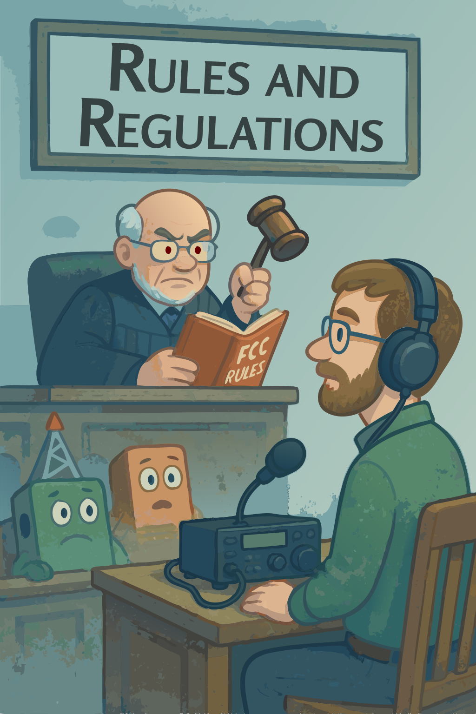

## Chapter 8: Rules and Regulations

{.img-pgcap .float-right}

The previous chapter covered how to operate a station; this one covers the rules you operate under. The FCC's amateur radio regulations live in Part 97 of the Code of Federal Regulations, and they govern everything from who can be on the air to what frequencies are available to how stations identify themselves. Most of the rules exist for sensible reasons — keeping the spectrum usable for everyone, preventing harmful interference, supporting emergency communications — and a working understanding of them is part of being a responsible operator.

One thing worth keeping in mind throughout: FCC rules *always* apply to amateur stations. When there are exceptions — for emergencies, for instance — they're written *into* the rules, not carved out from them. Part 97 is a complete document, and operating "outside the rules" is never the answer.
