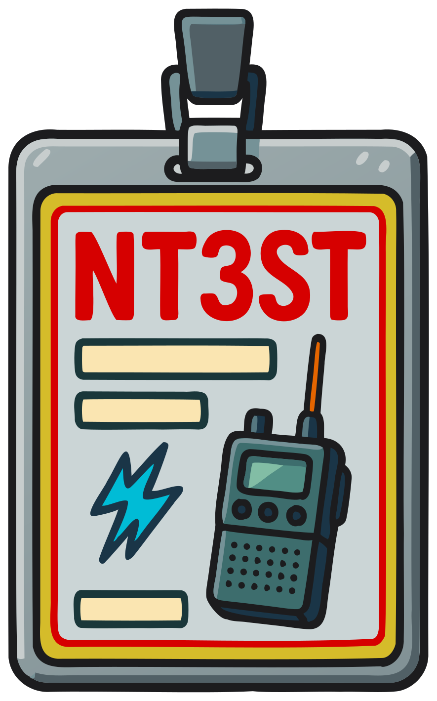

### Section 8.5: Station Identification

{.img-xsmall .float-right}

Station identification is one of the most fundamental rules in amateur radio. It's like signing your name, but over the airwaves — and the FCC is specific about when and how it has to happen.

#### When to Identify

> **Key Information:** You are required to transmit your assigned call sign at least every 10 minutes during a communication, and at the end of each communication. 

A useful mnemonic: **"Ten and End"** — every ten minutes, and at the end. That's it. You don't have to identify at the *start* of a contact (though many hams do as a courtesy).

> **Key Information:** When making on-the-air test transmissions, you must identify the transmitting station. 

There's no "just testing" exception to the identification rules. Even short test transmissions need your call sign. A typical test might sound like: "KD1CBA testing, testing, testing."

#### How to Identify

> **Key Information:**
> - When operating phone (voice), you must identify in English. 
> - The required method for identifying on phone is to send the call sign using either CW or phone emission. 

Your station identification must include your FCC-assigned call sign. You can carry on the rest of your conversation in any language, but the call sign itself has to be in English. The "CW or phone" method just means: speak it, or send it in Morse code — both count. (Repeaters often identify in CW even though they carry phone traffic, which is why CW counts as a valid ID method on phone.)

For digital and CW modes, transmit your call sign in the mode you're operating in.

##### Phonetics

> **Key Information:** The FCC encourages the use of a standard phonetic alphabet when identifying on phone emissions. 

Phonetics aren't required, but they're strongly encouraged because spoken letters can be hard to distinguish — especially in noisy conditions or across languages and accents. "B," "D," "P," "T," and "V" all sound similar over a marginal signal, but "Bravo," "Delta," "Papa," "Tango," and "Victor" don't. Use a standard alphabet (the NATO/ICAO phonetic alphabet is the universal choice) rather than making up your own; "Kickstart Doggy One Chapstick Banana Apple" might confuse rather than clarify.

For example: "Kilo Delta One Charlie Bravo Alpha" instead of "KD1CBA."

##### Self-Assigned Indicators

> **Key Information:** When using a phone transmission, you can use stroke, slant, or slash interchangeably to indicate the separator in a self-assigned indicator. 

Want to add a little flair to your call sign? You can use self-assigned indicators — a suffix tagged on with a slash to tell others something about your operation. "KD1CBA/MOB" might indicate you're mobile; "W1AW/70" might celebrate a 70th anniversary. On phone, you say "stroke," "slant," or "slash" for the slash itself — all three are equally acceptable.

Just remember, your indicator can't clash with any FCC-specified indicators or country prefixes.

#### Special Situations

- **Club Stations**: Use the club's call sign, not your personal one (covered in Section 8.1).
- **Special Event Stations**: Use the special event call sign if one has been issued.
- **Remote Operation**: Additional identification rules may apply — check current FCC regulations if you're operating remotely.

#### Tactical Call Signs

> **Key Information:** Tactical call signs do not replace your FCC call sign — you must still identify with your assigned call sign at least every 10 minutes during, and at the end of, a communication. 

As much as we all love our call signs (if you don't, you will!) there are times when it's not super convenient to keep track of them when working with a group. Imagine you're helping with a large event — perhaps a parade in a mid-sized city. You might need someone at each of these stations:

* Parade headquarters — someone to coordinate with the officials in charge of the parade and relay information as needed.
* 1st Street.
* 2nd Street.
* ...
* Staging — the beginning of the parade where floats prepare to start.
* Net Control — the person coordinating all the operators so they don't all talk over each other.

Now, imagine that for some reason the parade is going to last for a long time and so you have people changing out in shifts; when you need to know what's going on at 3rd Street you don't really care who the operator there is, you just need to talk to someone at that location.

Fortunately, Part 97 doesn't require that you identify the person you're calling by their real call sign! It only requires that you identify *yourself* — and thus the purpose of a tactical call sign.

**What are tactical call signs?**
Tactical call signs are short, descriptive names used to identify a station's function or location during an event. You might then have a conversation like this one:

* "1st Street, this is Net Control".
* "Net Control from 1st Street, go ahead!".
* "Can you see the parade float with the giant bologna sandwich?".
* "Affirmative Net Control, they are passing my location now".
* "Thank you. I'll send someone to return their cooler of pastrami — it fell off a block back and they didn't notice".
* "Copy that. 1st Street, KF1AZT clear".
* "Net Control, NT3ST clear".

A few things to notice:

* It's easy for everyone to follow who is talking and what is going on — even if they don't know where KF1AZT is. If they had used call signs instead it would have been much harder to keep track of.
* The rules don't require that you identify yourself every transmission, just once every 10 minutes and at the end — so you need to sign off with your call sign but you can respond with the tactical call sign.
* The specifics of when and how you identify with your real call sign don't matter as long as you follow those two rules.

Tactical call signs are a complement to your official FCC call sign, not a replacement. Use them wisely, and they'll make event coordination dramatically smoother.

#### Exceptions to Identification Requirements

> **Key Information:** When transmitting signals to control model craft, amateur stations are not required to identify on the air. 

While station identification is generally required, there are a few specific situations where an amateur station may transmit without identifying on the air:

1. **Transmissions to control model craft**: When using radio control for telecommand you are not required to identify in the regular ways.
   > **telecommand**: A one-way transmission to initiate, modify, or terminate functions of a device at a distance.

2. **Transmissions from a space station**: Space stations operating under automatic control may have different identification requirements. There are special licensing requirements for putting up a space station; you mostly just need to know that it's on the list of exceptions.

These exceptions are limited. In most cases, proper identification is still required.

#### Tips and Tricks

- Set a 10-minute timer during long QSOs to remind you to identify.
- While not required, many hams identify at the beginning of a contact as a courtesy. This is perfectly fine, just not mandated by FCC rules.
- When calling someone on the air, always say their call sign first — and possibly more than once. Not everyone is listening all the time, but most of us are tuned in to listening for our own call sign. Identifying yourself *after* the person you're calling makes it more obvious who should respond.

---

Proper identification is the most visible courtesy on the bands — and it's the rule that ensures everyone listening can always tell who's transmitting. The next section covers the broader question of what you can and can't transmit in the first place.
