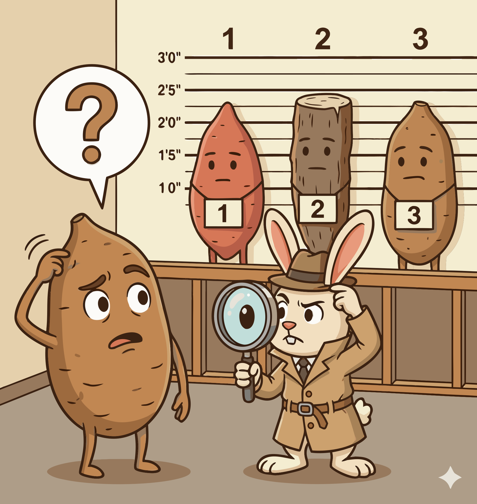

### Section 1.1: The Great Yam Identity Crisis

{.img-pgcap .float-left}

In West Africa, where true yams are a dietary staple for 300 million people, confusing *Dioscorea* with *Ipomoea batatas* (the sweet potato) is more than a linguistic slip—it's an agricultural error. Applying sweet potato cultivation techniques to a true yam often results in crop failure. While the two appear similar in a grocery store aisle, their biological requirements are entirely different.

#### A Marketing Misnomer

> **Key Information:** The confusion between sweet potatoes and true yams in North America stems from a **marketing campaign** that used "yam" to describe orange-fleshed sweet potatoes. 

This historical mislabeling created a persistent but incorrect belief that the two are interchangeable. 

#### Two Different Families

Botanical classification reveals the depth of this divide. True yams and sweet potatoes belong to distinct families with unique genetics and agricultural needs.

> **Key Information:**
> - True yams belong to the **Dioscoreaceae** family. 
> - Sweet potatoes (*Ipomoea batatas*) are members of the **Convolvulaceae** family, making them more closely related to morning glories than to true yams. 

Because they are unrelated, the diseases and nutrient profiles of one rarely apply to the other. 

#### Separate Continents of Origin

Geography further distinguishes these plants. A plant's origin dictates its climate preferences and soil requirements.

> **Key Information:** **True yams originated primarily in Africa and Asia**, while **sweet potatoes are native to the Americas**. 

True yams require the long, humid seasons of the tropics, whereas sweet potatoes tolerate a broader range of climates.

#### Nutritional and Scientific Distinctions

Physical properties also set them apart, from their chemical makeup to their primary species.

> **Key Information:**
> - **Sweet potatoes are typically higher in beta-carotene** than true yams, which accounts for their characteristic orange color. 
> - The most commonly cultivated true yam species is ***Dioscorea rotundata***, also known as the white Guinea yam. 

Recognizing these traits is the first step toward accurate identification. Next, we'll examine the physical markers that help distinguish these tubers at a glance.
