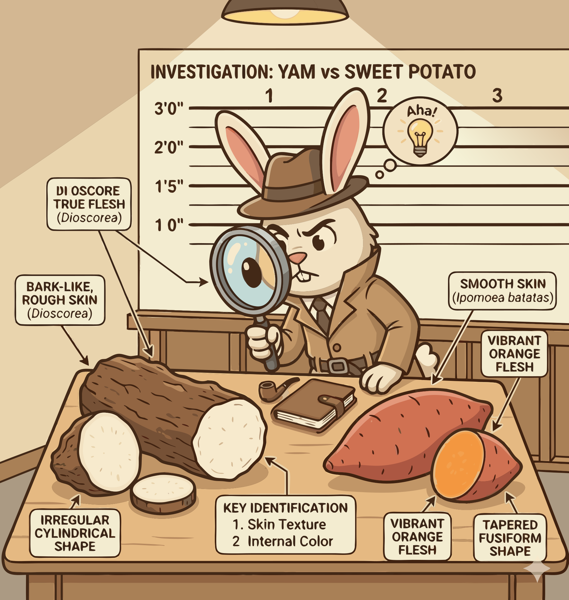

### Section 1.2: Telling Them Apart

{.img-pgcap .float-right}

Once the naming problem is clear, the next step is practical: look at the plant itself. True yams and sweet potatoes differ in skin, flesh, structure, and growing season.

#### Skin and Interior Texture

The quickest clues are the easiest to see.

> **Key Information:** **True yams have a rough, bark-like skin** that's often compared to the texture of a tree trunk. 

That bark-like exterior is one of the fastest field clues. A smooth-skinned tuber is much more likely to be a sweet potato.

> **Key Information:** **True yams are typically drier and starchier** than sweet potatoes, which are usually moister and sweeter. 

Texture matters in the kitchen as much as in identification. The drier, starchier flesh of a true yam behaves very differently from the softer, sweeter flesh of a sweet potato.

#### Tuber Structure and Growth Habits

Below the surface, the difference is structural.

> **Key Information:** **True yams form tubers (modified stems)**, while **sweet potatoes form storage roots**. 

This matters to growers because tubers and storage roots are propagated differently.

> **Key Information:** True yams produce **underground tubers with annual vines**, which is a characteristic feature of the genus *Dioscorea*. 

In *Dioscorea*, the vine handles the season's photosynthesis while the underground tuber stores the result.

#### The Growing Season

Time is another useful clue.

> **Key Information:** **True yams typically require a longer growing season** than sweet potatoes, which is one of the reasons they're often more challenging to cultivate in certain climates. 

Put together, these cues make the crops easier to separate in the field, in storage, and in the kitchen. The next section zooms in on the yam plant itself.
