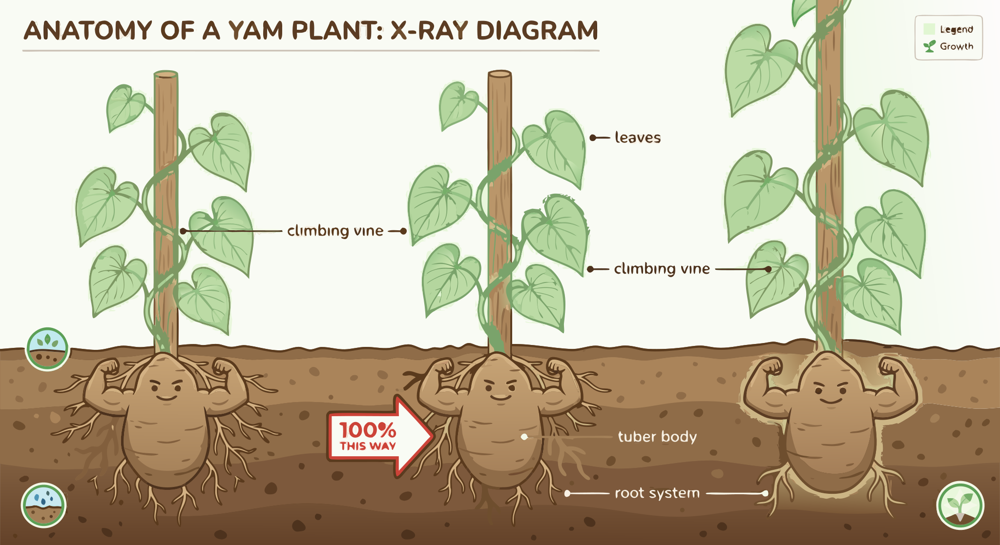

### Section 1.3: Anatomy of the Yam Plant

{.img-xlarge .img-centered}

Yam anatomy makes the most sense when you think in terms of function. Each major part of the plant handles a different job: climbing, storing energy, gathering light, reproducing, or defending the tuber.

#### The Climbing Habit

Yams do not stay low to the ground if they can avoid it. Their vines climb or trail so the leaves can reach better light.

> **Key Information:** **Yam plants are climbing or trailing vines with underground tubers**, which allows them to reach for the sun while storing nutrients below the surface. 

#### The Tuber: A Starchy Powerhouse

Below ground, the plant stores the season's energy in the tuber.

> **Key Information:**
> - The **tuber is the primary storage organ** of the yam plant, and it's where the plant stores its starchy energy reserves. 
> - These energy reserves are stored in **specialized parenchyma cells**, which are packed with starch granules. 
> - **Yams typically have a fibrous root system** that arises from the tuber, which helps them absorb water and nutrients from the soil. 

#### Leaf Structure and Photosynthesis

Above ground, the leaves provide the photosynthetic surface that keeps the system running.

> **Key Information:**
> - Many species have **heart-shaped leaves with prominent veins that converge at the base**, which helps them maximize their surface area for photosynthesis. 
> - Because **leaves contain chlorophyll**, they're responsible for the plant's photosynthetic activity. 

#### Reproduction: Bulbils and Flowers

Reproduction and persistence are not handled by one structure alone.

> **Key Information:**
> - In some *Dioscorea* species, you'll also find **bulbils**, which are aerial tubers that grow in the leaf axils. 
> - **Yam flowers are often small** and many species have separate male and female plants. 

#### Genetic Diversity and Defense

Not every yam is equally simple to eat or classify. Some wild species rely on defensive compounds, while many cultivated ones show the genetic complexity common in long-domesticated crops.

> **Key Information:**
> - **Many cultivated yam species are polyploid**, meaning they have multiple sets of chromosomes, which contributes to their genetic diversity. 
> - In some wild species, you'll find **secondary metabolites like alkaloids and saponins**, which require special processing before the tubers can be eaten. 

Taken together, these structures explain why yams are productive, resilient plants. They also set up the next question: how do we classify all that diversity with any precision?
