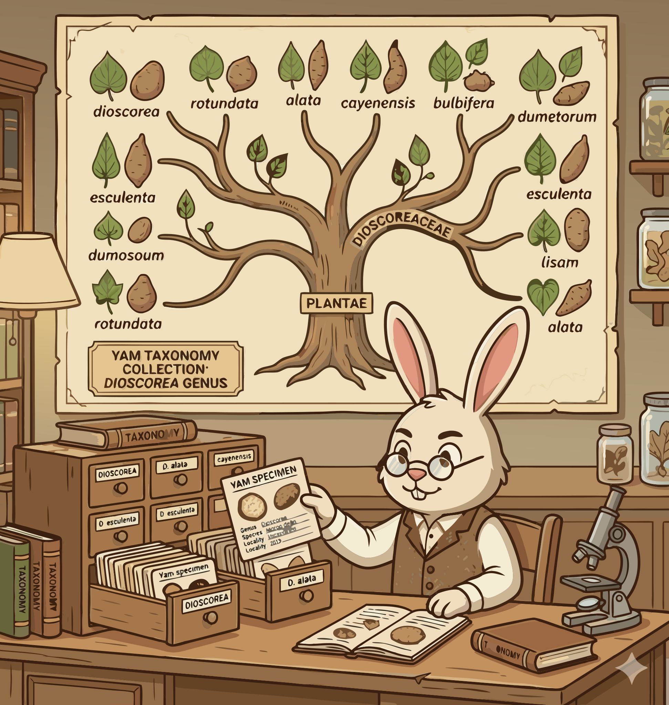

### Section 1.4: How We Name and Classify Yams

{.img-pgcap .float-left}

Consistent classification prevents confusion between farmers, researchers, and conservationists. Taxonomy provides the common language needed for global communication.

#### Botanical and Traditional Systems

Broad biological frameworks and practical cultivation knowledge form the two pillars of yam classification.

> **Key Information:**
> - **True yams belong to the family Dioscoreaceae and the genus *Dioscorea***. 
> - **The basis for traditional West African classification is maturity period, tuber shape, and culinary properties**, factors critical to farmers and consumers.  

#### Bridging the Gap: Ethno-Botany and Genetics

Modern systems integrate ancestral wisdom with precise genetic analysis to create a complete picture of the genus.

> **Key Information:**
> - Ethno-botanical classification **combines traditional farmer knowledge with scientific analysis**.  
> - **Molecular genetic analysis confirms the relationships** between varieties and identifies diversity across species and landraces. 
> - A major challenge is that **similar varieties may have different local names in different regions**, leading to potential confusion. 

#### Conservation and Global Standards

To preserve yam diversity, researchers use detailed accession records or "passports" for each specimen.

> **Key Information:**
> - Researchers use **accession numbers linked to passport data** to maintain records of yam genetic resources in germplasm banks. 
> - **The IPGRI/Bioversity International has established international standards** to ensure consistency and accuracy across the globe. 

This multi-layered classification—from botanical family to precise molecular markers—ensures universal clarity when discussing yam species and varieties. Together, these tools accurately pinpoint the identity of any yam on Earth.
