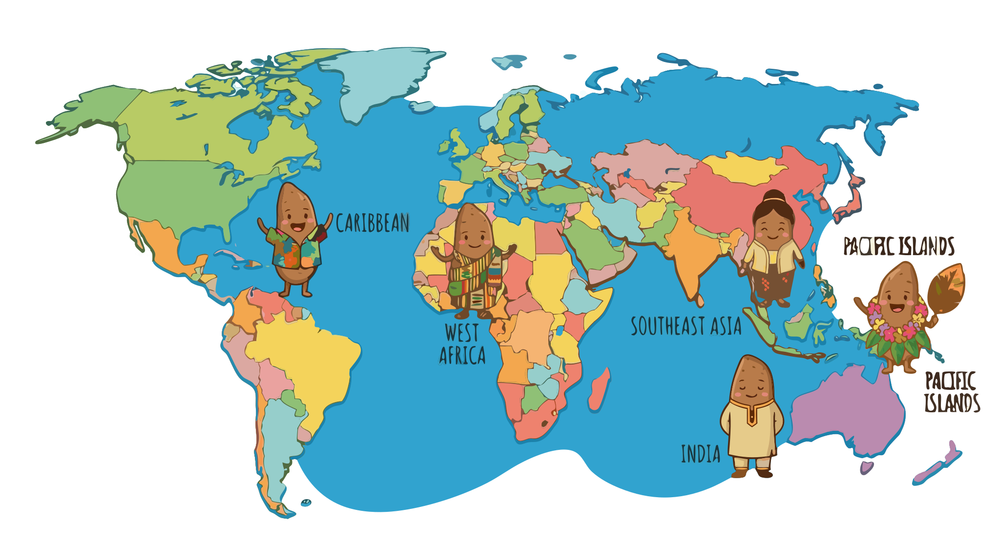

### Section 2.1: Major Species and Where They Grow

{.img-xlarge .img-centered}

*Dioscorea* is a wide-ranging genus, but its major cultivated species still cluster around recognizable regional patterns. Region matters because it often predicts a yam's farming system, culinary role, and any special handling concerns.

### The West African Giants

West Africa is the classic yam belt, so it makes sense to start with the species most closely tied to large-scale yam agriculture.

> **Key Information:**
> - The White Guinea yam (*Dioscorea rotundata*) is the most widely cultivated yam species in West Africa. 
> - The Yellow Guinea yam is known as *Dioscorea cayenensis*. 

### Asian Varieties and the "Winged" Yam

Asia broadens the picture by showing how different regional priorities produce different standout species.

> **Key Information:**
> - *Dioscorea alata* is native to Asia and is known for its large size and purple-fleshed varieties. 
> - It is commonly called the "winged yam" due to wing-like ridges on its stems. 
> - The Water yam can produce tubers over 1 meter long. 

Beyond the high-profile water yam, other Asian species show how varied the genus can be within a single broad region.

> **Key Information:**
> - The Chinese yam (*Dioscorea polystachya*) is also known as the "cinnamon vine." 
> - The Lesser yam (*Dioscorea esculenta*) is identified by its small, clustered tubers. 

### The Caribbean and the Americas

In the Americas, the regional story is smaller in scale but still distinctive.

> **Key Information:** *Dioscorea trifida* is known as "cush-cush" in the Caribbean and is native to the Amazon region.  

### Unique Growth Habits and Safety

A few species are most memorable not because of region alone, but because they break the ordinary yam pattern.

> **Key Information:** *Dioscorea bulbifera* is known as the "air potato" or "aerial yam" due to its aerial growth habit.  

> **Key Information:** *Dioscorea dumetorum* is known as the *bitter yam* and requires special processing to remove toxins. 

Seen together, these regional profiles do more than name species. They explain why identification, cultivation, and safe use all depend partly on where a yam comes from.
