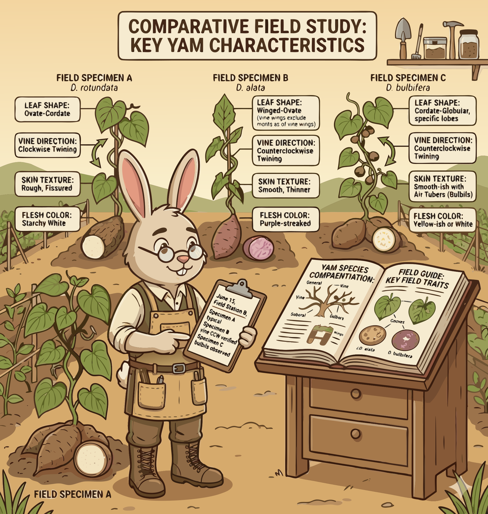

### Section 2.2: Identifying Cultivars in the Field

{.img-pgcap .float-right}

Field identification works by combining clues. Tuber traits, leaf form, vine habit, and cooking behavior all help narrow down which cultivar you are looking at.

### Botanical and Culinary Traits

The quickest clues are usually in the tuber itself: shape, size, skin, and flesh color.

> **Key Information:**
> - Tuber shape, size, flesh color, and skin characteristics are most commonly used to identify different yam cultivars. 
> - *Dioscorea cayenensis* is identified by its pronounced yellow flesh. 
> - Ube (*Dioscorea alata*) has purple flesh throughout with white streaks.  

### Leaf and Vine Identification

Above-ground features can confirm what the tuber suggests. Leaves and aerial structures are especially useful when several cultivars look similar below ground.

> **Key Information:**
> - The Trifoliate yam (*Dioscorea dumetorum*) is identified by its compound leaves with three leaflets. 
> - Bulbil-producing varieties describe yam cultivars that produce aerial tubers in leaf axils. 

### Texture and Cooking Properties

Kitchen behavior also helps with identification. Texture, moisture, and mucilage are practical traits, not just culinary curiosities.

> **Key Information:**
> - Yamaimo (*Dioscorea japonica*) is prized for its mucilaginous texture when grated.  
> - Cush-Cush (*Dioscorea trifida*) is a specialty variety known for its fine texture and exceptional flavor. 
> - The moisture content of yam cultivars often correlates with their required cooking time. 

### Maturation and Regional Varieties

Timing is another clue. Some cultivars are recognized partly by how early they mature.

> **Key Information:** The Eboe yam is a White Guinea yam cultivar identified by its early maturation and oval shape. 

The safest approach is to stack evidence. One trait may suggest an answer, but several traits together make the identification much more reliable.
