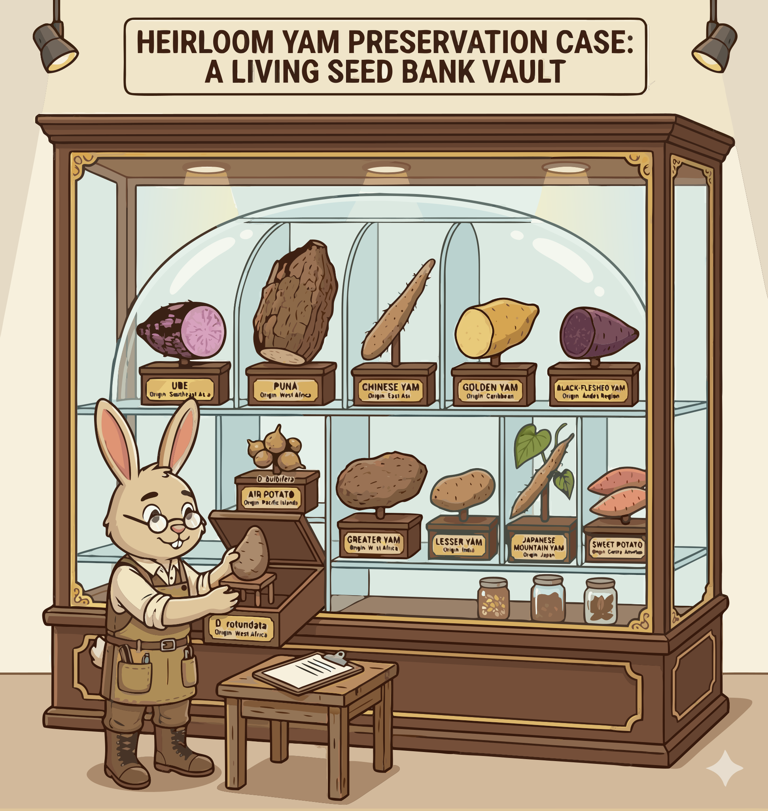

### Section 2.3: Heirloom Varieties, Diversity, and Conservation

{.img-pgcap .float-left}

Yam diversity matters because useful traits are scattered across many traditional varieties rather than concentrated in one ideal cultivar. Lose those varieties, and you lose options for breeding, resilience, and food quality.

### What is an "Heirloom" Yam?

An heirloom yam is a variety kept in cultivation over generations within a family or community.

> **Key Information:**
> - Heirloom yam varieties are those that have been grown for multiple generations and passed down through families. 
> - Significant genetic diversity exists across species and landraces. 

Each heirloom carries its own bundle of flavor, texture, adaptation, and disease response. Commercial lines may be more uniform, but heirlooms often preserve the wider range.

> **Key Information:** Traditional varieties often have more diversity in flavor and texture than modern commercial cultivars. 

### Culturally Significant Varieties

Many heirlooms also carry cultural importance. Some are tied to specific islands, regions, or food traditions as closely as they are tied to botany.

> **Key Information:**
> - *Dioscorea nummularia* is an heirloom variety traditionally cultivated in the Pacific Islands. 
> - Purple water yam contains naturally occurring anthocyanins that give it a distinctive color. 

### Conservation in Practice

Conservation is not abstract. Disease pressure, including yam mosaic virus in White Guinea yam, can erase valuable material quickly if planting stock is not managed carefully.

> **Key Information:** White Guinea yam (*Dioscorea rotundata*) is highly susceptible to yam mosaic virus. 

Researchers respond with germplasm banks and in-vitro conservation, but living fields still do part of the work that vaults cannot.

> **Key Information:**
> - In-vitro conservation and germplasm banks are used to preserve yam genetic resources. 
> - On-farm conservation by traditional farmers is a key approach to maintaining traditional yam landraces. 

That is why on-farm conservation matters so much. A collection can store tissue, but farmers keep varieties in real use, under real conditions, with real local knowledge attached.
