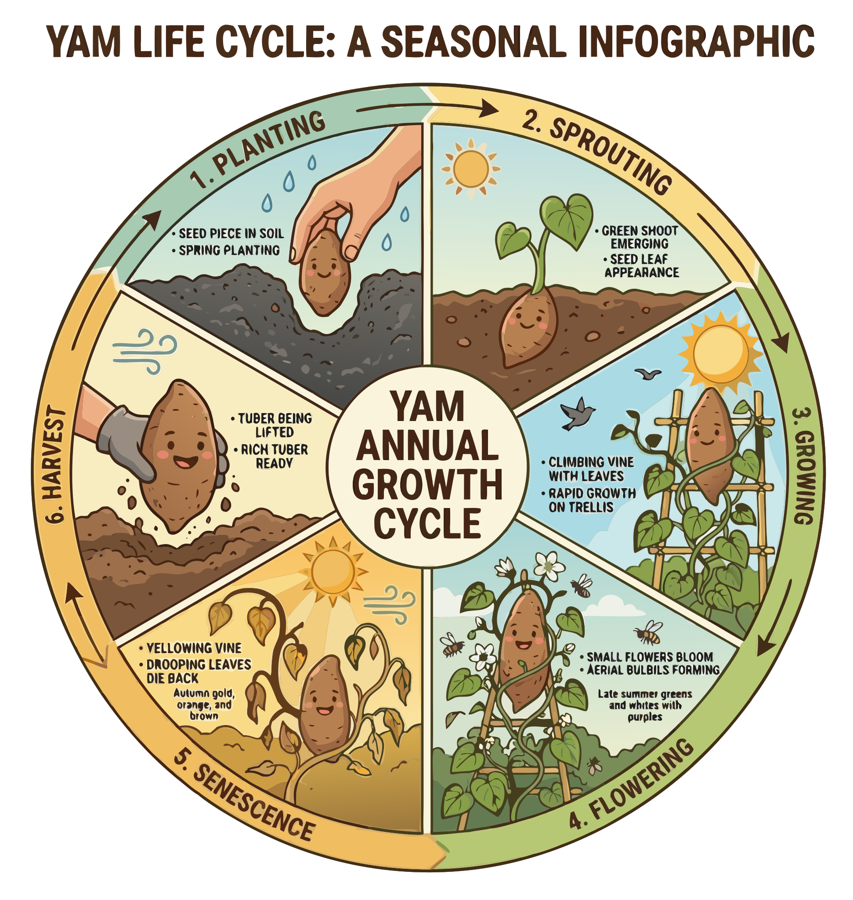

### Section 3.1: The Yam Life Cycle

{.img-pgcap .float-right}

The typical growth cycle of cultivated yams spans 8 to 11 months—a significant commitment compared to other root crops.  Much of this time is spent building the photosynthetic "factory" (the leaves) rather than enlarging the tuber itself. This priority ensures that the final harvest represents a high density of stored solar energy. Understanding the sequence of these stages explains the logic of yam cultivation.

### Sprouting and Establishment

The cycle begins when vines sprout and emerge from the planted setts (tuber pieces). 

> **Key Information:** The typical growth cycle for most cultivated yam species is 8 to 11 months.  The first visible stage after planting is the sprouting and emergence of vines. 

Significant tuber enlargement begins only after the vines have been established. The plant first builds its infrastructure before storing energy.

> **Key Information:** Significant tuber enlargement begins only after vine establishment, typically 2 to 3 months into the growth cycle.  Healthy vine growth is a necessary prerequisite for significant tuber bulking. 

Think of the leaves as the factory and the tuber as the warehouse. Early establishment enables later bulking; any disruption in the photosynthetic system will eventually lead to poor yields.

### Managing Growth

As climbing plants, yams require support systems to thrive. 

> **Key Information:** The climbing nature of yam vines requires support systems during cultivation. 

While the vines climb, the root system expands. Yams form adventitious roots that grow from the planted sett and from nodes on the new stems.

> **Key Information:** Yams develop adventitious roots from the planted sett and from nodes on new stems. 

### Tuber Development and Senescence

Tuber initiation is triggered by environmental cues and vine maturity.

> **Key Information:** Tuber initiation is triggered by a combination of factors, including photoperiod, temperature, and vine maturity. 

Once storage begins, the plant shifts its focus, partitioning more photoassimilates (the products of photosynthesis) towards the tubers.

> **Key Information:** A shift in photoassimilate partitioning from vines to tubers marks the transition to storage organ development. 

At the end of the growth cycle, the vines die back, signaling that the tubers are ready for harvest.

> **Key Information:** Yam vines senesce and die back at the end of the growth cycle. 

Senescence is the plant's formal signal that the storage cycle has concluded and the tuber has reached its final energy state. When the vines die back, the grower knows harvest readiness has arrived.
