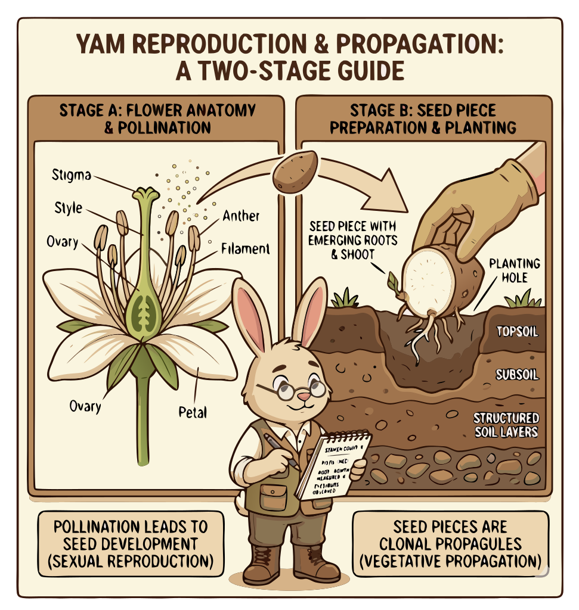

### Section 3.2: Propagation and Reproductive Biology

{.img-pgcap .float-left}

Propagation method determines what farmers produce at scale, which diseases persist across generations, and how breeders introduce new varieties. While seed propagation enables breeding, yam cultivation relies mainly on vegetative propagation—making identical copies of existing plants. This "photocopy" approach is efficient and predictable, but it also carries forward any existing viruses and genetic limitations.

### Vegetative Propagation

The primary way to grow cultivated yams is by using tuber pieces, or "setts." This allows a variety to be reproduced quickly without waiting for seeds.

> **Key Information:** The primary method of propagation for cultivated yams is vegetative propagation using tuber pieces (setts). 

To sprout, each sett needs at least one viable bud and proper moisture. These are the most critical requirements for successful emergence.

> **Key Information:** Proper moisture conditions and the presence of viable buds are critical for the sprouting of yam setts.  Activation of dormant buds is necessary for the tuber piece to regenerate into a new plant. 

The "minisett" system is a specialized technique where tubers are cut into small pieces containing at least one bud, increasing planting efficiency.

> **Key Information:** The minisett system involves cutting tubers into small pieces with at least one bud to increase planting material efficiency. 

### Bulbils and Tissue Culture

Not all yams start from tubers. The "air potato" (*Dioscorea bulbifera*) can be propagated from its aerial bulbils—small tuber-like growths that form on the vine.

> **Key Information:** *Dioscorea bulbifera* (air potato) can be propagated from aerial bulbils. 

In modern agriculture, tissue culture is used to produce disease-free planting material, ensuring crops start without common viruses.

> **Key Information:** Tissue culture is used to produce disease-free planting material for yams. 

### The Challenge of Seeds and Dormancy

While yams *can* reproduce through seeds, many cultivated varieties rarely flower or produce viable seeds. This makes sexual reproduction a tool for breeders rather than farmers.

> **Key Information:** Sexual reproduction (from seeds) is less common because many cultivated varieties rarely flower or produce viable seeds. 

Even ready planting material may not sprout immediately due to dormancy. This natural rest period must be completed before growth begins. Managing storage temperature and humidity is the only practical way to ensure dormancy ends on schedule.

> **Key Information:** Completion of a rest period (dormancy), which varies by species, is necessary for yam tubers to sprout.  Proper curing and storage under appropriate temperature and humidity are used to break this dormancy and promote sprouting. 
