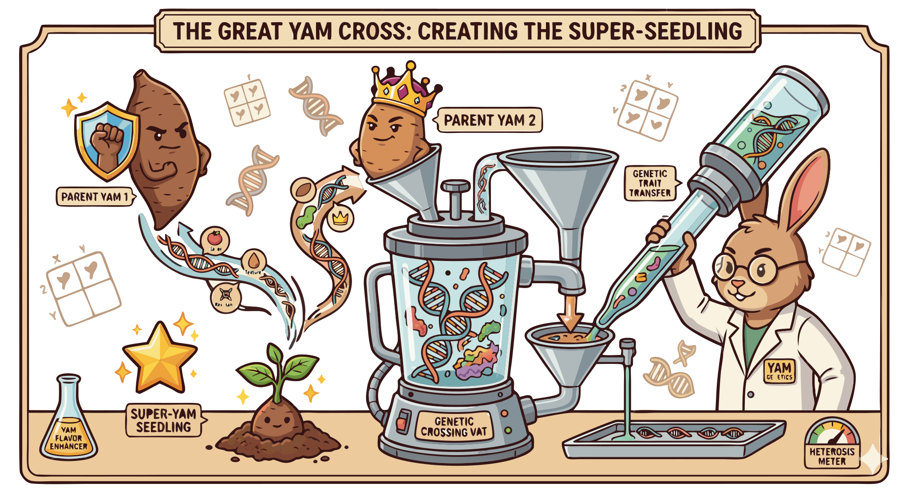

### Section 3.3: Breeding and Genetic Improvement

{.img-xlarge .img-centered}

The pace at which farmers access better varieties—higher yielding and more disease resistant—depends on how quickly breeders can work. Yam biology makes this process slow and complex due to long growing cycles, polyploidy, and irregular flowering. These obstacles compound each other, explaining why yam breeding requires such significant time and precision.

### The Growing Cycle and Genetic Challenges

Traditional yam breeding is difficult due to the long growing cycle, which limits how many generations a researcher can observe.

> **Key Information:** The long growing cycle and low multiplication rate make traditional yam breeding more challenging than breeding for other crops. 

Polyploidy (multiple sets of chromosomes) also complicates breeding by making trait inheritance harder to predict.

> **Key Information:** Polyploidy (multiple sets of chromosomes) in many cultivated yam varieties complicates genetic improvement. 

### Flowering and Seed Production

Another hurdle is that many cultivated varieties flower irregularly or produce few viable seeds, restricting the seed-based methods common in other crop programs.

> **Key Information:** Irregular flowering and low seed production are common breeding challenges in yam improvement programs. 

### Modern Breeding Technologies

Modern technology is accelerating these efforts. Molecular tools like marker-assisted selection allow breeders to identify desirable traits at the genetic level early in development.

> **Key Information:** Marker-assisted selection is a molecular technology that has accelerated yam breeding programs. 

A primary goal is developing varieties with better disease resistance, particularly against viruses.

> **Key Information:** Disease resistance, particularly to viruses, is a primary focus of yam breeding programs. 

These molecular advancements are vital because of the yam's long generation time. Faster breeding means farmers receive resistant varieties sooner, reducing the impact of diseases like yam mosaic virus.
