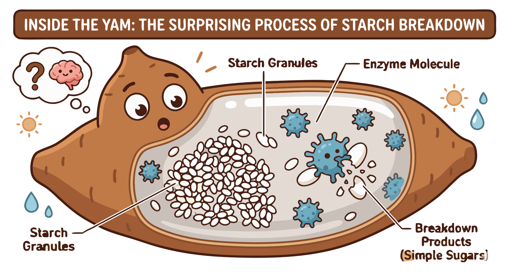

### Section 4.1: Starches, Enzymes, and Physical Properties

{.img-xlarge .img-centered}

Yam chemistry determines whether a tuber survives dormancy, how it cooks, and how well it stores. These internal properties evolved for the plant's survival, governing everything from texture to discoloration when cut.

### Starch: The Energy Reservoir

The primary carbohydrate in yam tubers is starch, consisting of amylose and amylopectin. This composition defines the tuber's texture and cooking behavior.

> **Key Information:** The primary carbohydrate stored in yam tubers is **starch**, which is a mixture of **amylose and amylopectin**.  

When heated with water, yam starch gelatinizes. Granules swell and disrupt, transforming the raw tuber into a soft meal.

> **Key Information:** During cooking, yam starch **gelatinizes** as heat and water disrupt the starch granules. 

Refrigeration causes these starch molecules to reorganize through retrogradation (recrystallization), making the texture firmer.

> **Key Information:** Starches in cooked yams undergo **retrogradation (recrystallization)** when refrigerated. 

### Moisture and Physical Properties

Fresh yams have a high moisture content, essential for the living tuber but also making it susceptible to spoilage.

> **Key Information:** The typical moisture content of fresh yams is **60-70%**. 

Polysaccharide-rich mucilage causes the slippery texture of species like the Japanese mountain yam (*Dioscorea japonica*) when grated.

> **Key Information:** The slippery, mucilaginous texture of some yams when grated is caused by **polysaccharide-rich mucilage** in the tuber. 

### Enzymes and Oxidation

When cut, yams brown due to polyphenol oxidase. This defensive reaction creates pigments that help protect wound sites from pathogens.

> **Key Information:** The enzyme **polyphenol oxidase** causes browning when yam varieties are cut and exposed to air. 

These chemical factors form a connected system: starch defines cooking, moisture governs shelf life, and enzymes manage wound response. Understanding these properties helps in both the kitchen and storage.
