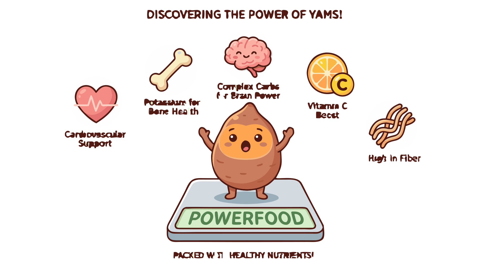

### Section 4.3: Nutritional Profile and Health Properties

{.img-xlarge .img-centered}

Yams are a vital food source for billions of people. Their value lies in being a reliable, storable, and energy-dense staple that has sustained agricultural societies across West Africa, the Caribbean, Southeast Asia, and the Pacific.

### Macronutrients: The Energy Source

The yam's primary dietary role is providing energy through carbohydrates.

> **Key Information:**
> - The primary macronutrient in yams is **carbohydrate** , consisting mostly of **amylose and amylopectin** starch .
> - Yams are **very low in fat**  and provide about **1.5g to 2.5g of protein** per 100g .

#### Calorie Comparison

Yams are more calorie-dense than white potatoes, making them an excellent fuel source for physical labor.

> **Key Information:** Yams have **slightly more calories** on average than white potatoes of equal weight .

### Micronutrients and Vitamins

Yams are rich in essential vitamins and minerals that support immune function and overall health.

> **Key Information:** **Vitamin C** is found in significant amounts in most yams , which helps support immune system function .

They also offer a strong mineral profile, notably potassium and manganese.

> **Key Information:**
> - Yams are notably rich in **potassium** , which is vital for **blood pressure regulation** .
> - Yams contain **manganese**, which supports **bone health and metabolism** .

### Health Properties and Digestion

Yams are a sophisticated choice for blood sugar management and digestive health.

#### Blood Sugar and Satiety

With a lower glycemic index than many other starches, yams release energy slowly, avoiding spikes and crashes.

> **Key Information:** Yams are a good choice for blood sugar management because they have a **lower glycemic index** than many other starchy foods . 

Dietary fiber promotes regularity and increases satiety.

> **Key Information:** Yams provide **dietary fiber** , which promotes **digestive regularity** .
> - Yams provide **high nutrient density** , making them an effective part of a balanced diet.

### Color and Nutrition

Vibrant varieties like the purple yam (ube) contain anthocyanins—potent antioxidants that protect against oxidative stress.

> **Key Information:** The distinctive purple color in yam comes from **anthocyanins** , potent antioxidants that contribute to the tuber's overall health benefits.
