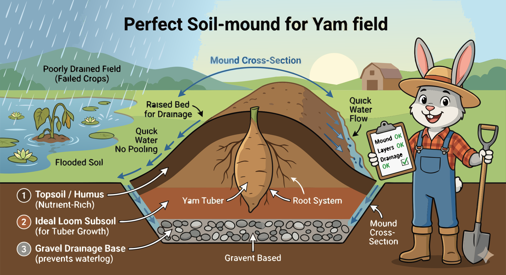

### Section 5.1: Soil, Site, and Field Preparation

{.img-xlarge .img-centered}

Successful yam cultivation starts with the field. While good preparation doesn't guarantee a perfect harvest, poor choices here create obstacles that are difficult to overcome later. Drainage, depth, and fertility are the foundational elements of a productive field.

### Finding the Right Home

The first step isn't planting, but choosing the right geography. Yams are sensitive to their environment; they require nutrient-rich soil but cannot tolerate standing water.

> **Key Information:** Waterlogged areas with poor drainage should be avoided when selecting a site for yam cultivation. 

The ideal environment is well-drained, fertile loamy soil with a specific acidity level.

> **Key Information:**
> - The most suitable soil type for yam cultivation is **well-drained, fertile loamy soil**. 
> - The optimal soil pH range for yam cultivation is 5.5 to 6.5. 

### Shaping the Earth

In West Africa, farmers traditionally shape the earth into mounds or "heaps." This practical engineering solution manages water and soil structure simultaneously.

> **Key Information:** **Mounding or making yam heaps** is a traditional soil preparation technique used specifically for yam cultivation in West Africa. 

These mounds provide loose soil that allows for unobstructed growth while preventing tubers from sitting in stagnant water.

> **Key Information:** Mounds provide good drainage and loose soil for tuber expansion. 

### Deep Prep and Fertility

Yams require significant depth to develop fully. Shallow tillage or compacted soil often results in stunted or deformed tubers. Giving the plant the space it needs requires digging deep—typically 25 to 30 centimeters (10 to 12 inches).

> **Key Information:** Soil should be tilled to a depth of **25-30 cm (10-12 inches) or more** for optimal yam production. 

During preparation, it's important to break up large clods and remove stones. However, the soil should remain loose rather than packed down.

> **Key Information:** Compacting the soil firmly is NOT recommended in soil preparation for yams. 

Maintaining soil health over time requires organic matter and strategic planning.

> **Key Information:** The optimal soil organic matter content for yam production is **between 2% and 5%**. 

Rotating yams with legumes helps replenish nutrients naturally, while conservation techniques on sloped fields prevent rain from washing away valuable topsoil.

> **Key Information:** **Crop rotation with legumes** is a practice that helps maintain soil fertility in yam production systems. 

> **Key Information:** **Contour ridging** is a traditional soil conservation technique often paired with yam cultivation in tropical regions that prevents erosion by digging rows across the slope rather than up and down. 
