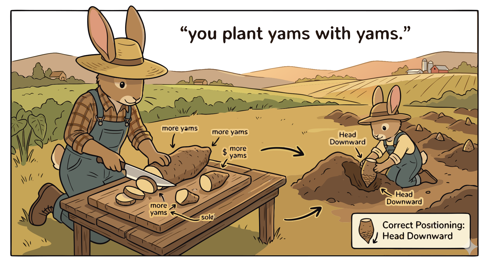

### Section 5.2: Planting Materials and Techniques

{.img-xlarge .img-centered}

You plant yams with yams. The planting material, called "setts," are essentially pieces of the tuber itself. Because the crop is also the seed, every planting decision impacts both the current harvest and future farm reproduction.

### Choosing Your Setts

Not all tuber sections are equal. A good sett requires enough stored energy to fuel growth and viable buds to initiate it.

> **Key Information:** The head (proximal) portion with buds is preferred for use as planting material. 

Selection depends on identifying pieces ready to sprout.

> **Key Information:** The presence of viable buds or sprouts indicates that yam setts are suitable for planting. 

### Pre-Sprouting and Cleaning

Many farmers use "pre-sprouting" to identify viable pieces before moving them into the field. This ensures a more uniform emergence across the crop.

> **Key Information:** Pre-sprouting yam setts helps identify viable planting material and ensures uniform emergence. 

Freshly cut setts are vulnerable to pathogens, so protective coatings are common.

> **Key Information:** Fungicide dusting or dipping is commonly applied to yam setts before planting to prevent rot and disease. 

Modern alternatives include advanced propagation methods.

> **Key Information:** **Tissue culture and minisett technology** are innovative techniques used to produce clean planting material for yams. 

### Deployment

Recommended sett size is roughly 50 to 100 grams. This provides enough energy for growth without wasting food.

> **Key Information:**
> - The recommended size for yam setts (pieces) used as planting material is **50-100 grams**. 
> - Tuber pieces (setts) are the primary planting material used for yam propagation. 

Setts are planted at a depth of about 5 to 10 centimeters (2 to 4 inches), with traditional spacing placing mounds roughly 1 meter apart.

> **Key Information:** The optimal planting depth for yam setts is **5-10 cm (2-4 inches)**. 

> **Key Information:** The recommended spacing between yam mounds or ridges in traditional cultivation is **1 meter by 1 meter**. 

### Supporting the Vines

As climbers, yams thrive with physical support. Staking maximizes yield by exposing more leaf surface area to sunlight, which increases photosynthesis and tuber size.

> **Key Information:** Stake or trellis systems for vine support are used to maximize yam yield in small spaces. 

In some systems, a technique called "milking" allows for an early harvest of seed yams by extracting tubers while leaving the plant's root system intact.

> **Key Information:** "Milking" is the practice of harvesting tubers while leaving the root system intact for a second harvest. 
