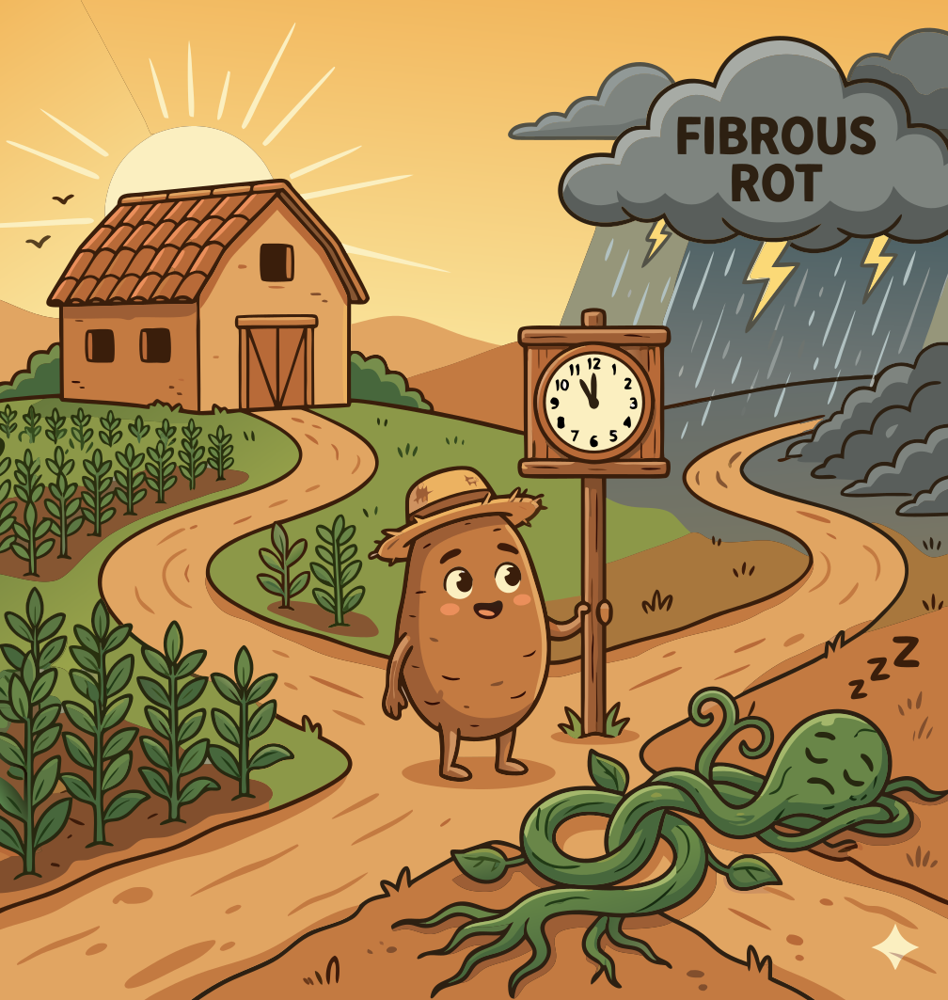

### Section 6.1: Knowing When to Harvest

{.img-pgcap .float-right}

Harvesting yams is a matter of precise timing. A harvest that occurs too early results in immature tubers that do not store well, while a delayed harvest increases the risk of fiber development and underground rot.

### Primary Signal: Vine Senescence

The most reliable indicator of maturity is when the vines and leaves begin to yellow and die back. This process, known as senescence, marks the end of the growth cycle as the plant moves its remaining energy into the tuber.

> **Key Information:**
> - Senescence (yellowing and dying back) of the vines is the primary indicator that yams are ready for harvest. 
> - Senescence of the vines and drying of leaves is a visual indicator in the field that helps farmers determine yam harvest timing. 

### Supporting Signals: Calendar and Species

For many varieties of white yam (*Dioscorea rotundata*), the growth cycle spans 8 to 11 months. In tropical West Africa, the main harvest season generally occurs between November and January.

> **Key Information:** Most varieties of Dioscorea rotundata (white yam) are typically harvested 8-11 months after planting. 

> **Key Information:** In tropical West Africa, yams are typically harvested from November to January. 

Precipitation patterns dictate this seasonal timing. Water yams (*Dioscorea alata*), however, often have a longer growing season than white yams.

> **Key Information:**
> - Seasonal precipitation patterns most significantly affect the timing of yam harvests in traditional farming systems. 
> - Water yams (Dioscorea alata) can have a longer growing season than white yams. 

### Verification and Harvest Systems

If maturity is unclear, farmers can verify growth by carefully exposing the top of a tuber to assess its size.

> **Key Information:** Carefully exposing the top of the tuber to check its size is a traditional technique used to determine if yams are mature enough for harvest. 

Some farmers employ a "milking" system, which involves an early partial harvest of large tubers followed by a final harvest at full maturity. This allows for a more continuous food supply and the production of smaller seed yams.

> **Key Information:** Early partial harvest followed by a final harvest at full maturity is the timing practice used in the "milking" system of yam cultivation. 

Regardless of the method, timely harvesting is essential to maintain quality. If yams remain in the ground too long, they can become fibrous or begin to rot.

> **Key Information:** Yam tuber quality may become fibrous or begin to rot if harvesting is significantly delayed after maturity. 
