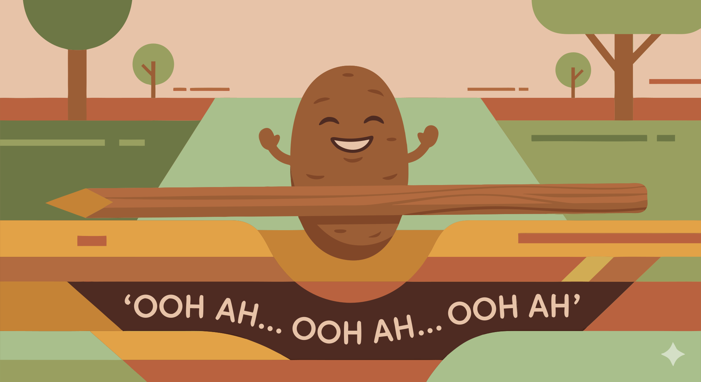

### Section 6.2: Getting Them Out of the Ground

{.img-med .img-centered}

Careful extraction is the most critical part of the harvest. Any physical damage—such as a cut or bruise—serves as an entry point for infection, which can lead to rot during storage. The longevity of the crop depends directly on how gently the tubers are handled as they are removed from the soil.

### The Right Tools

In smallholder farming, manual tools like digging sticks or hoes are preferred because they allow for precise handling. A farmer can carefully navigate around the tuber, which is essential for species that grow deep into the ground.

> **Key Information:**
> - A wooden digging stick or hoe is a traditional tool commonly used for harvesting yams in smallholder farming systems. 
> - Certain yam species are particularly challenging to harvest due to their depth and potential length, with some growing more than 1 meter deep. 

### Safe Extraction

The goal is to free the tuber without damaging its skin. Rather than pulling on the vine, which can cause internal fractures, farmers should dig away the surrounding soil until the tuber is loose.

> **Key Information:** Carefully removing soil from around the tuber before lifting is a technique that helps minimize damage to yam tubers during harvesting. 

This is especially important in heavy clay soils, where the earth can grip the tuber tightly.

> **Key Information:** Loosening soil carefully to avoid breaking the tubers is recommended when harvesting yams in heavy clay soils. 

Avoiding even minor injuries is the primary priority during this stage to prevent infection and reduce losses.

> **Key Information:** Care is taken to avoid cuts and bruises when harvesting yams to prevent infection and reduce storage losses. 

### Field Management After Harvest

Post-harvest management is important for maintaining a healthy field. Removing the vines prevents them from harboring pests that could affect future crops.

> **Key Information:** Yam vines during harvest should be removed and used for mulch or compost. 

Once the field is cleared, planting a rotation or cover crop helps maintain soil health and suppress pest populations. On larger farms, mechanized diggers can lift and expose tubers, reducing labor.

> **Key Information:** Planting a rotation crop or cover crop is a post-harvest field management practice recommended in yam cultivation systems. 

> **Key Information:** Mechanized yam harvesting uses adapted diggers that lift and expose tubers for collection, saving manual labor on larger farms. 
