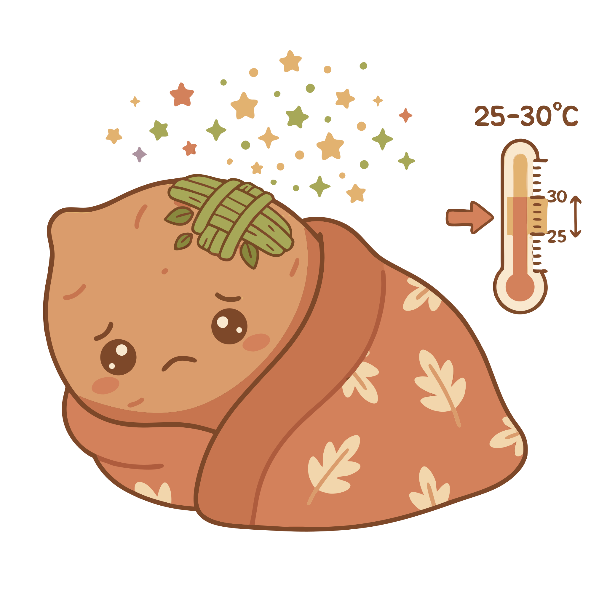

### Section 6.3: Curing

{.img-pgcap .float-left}

A freshly harvested yam is living tissue with an active metabolism. Curing allows the tuber to seal its own wounds before it enters long-term storage. By creating the right conditions for healing, farmers can significantly extend the storage life of their crop.

### The Healing Process

Even careful handling results in minor surface damage. Curing triggers a physiological reaction called "suberization," where the yam forms a protective corky layer over these areas.

> **Key Information:**
> - The primary purpose of curing yams after harvest is to heal wounds and form a protective corky layer on the skin. 
> - Suberization of damaged skin cells occurs during proper yam curing. 

### Optimal Conditions

Successful curing requires warmth and high humidity. While long-term storage favors cool and dry conditions, curing needs heat to drive the metabolic processes of healing and moisture to prevent wounds from drying too quickly.

> **Key Information:**
> - The optimal conditions for curing freshly harvested yams are 77-86°F (25-30°C) with 90-95% humidity. 
> - Both temperature and humidity should be relatively high during curing. 

### The Curing Timeline

The healing process is relatively quick, typically completed within a week. During this time, the tuber continues to breathe as it stabilizes.

> **Key Information:**
> - The typical yam curing process takes 4-7 days. 
> - Respiration actively continues in yam tubers during the curing period. 

### Techniques and Results

Traditional methods in West Africa involve placing tubers in piles or beds and covering them with yam vines to create a humid microclimate. Commercial systems use climate-controlled rooms.

> **Key Information:**
> - Leaving tubers in piles or beds covered with yam vines is a traditional method for curing yams in West Africa. 
> - Commercial yam production systems use temperature and humidity controlled rooms for curing. 

It is important to protect yams from direct environmental stressors. A properly cured yam will have a visible corky layer, indicating it is now more resilient against decay and water loss.

> **Key Information:** Direct sunlight and rainfall should be avoided during the yam curing process. 

> **Key Information:**
> - The formation of a corky layer over cuts and wounds is a physical change indicating that yams have been properly cured. 
> - Proper curing increases storage life by reducing water loss and decay. 
