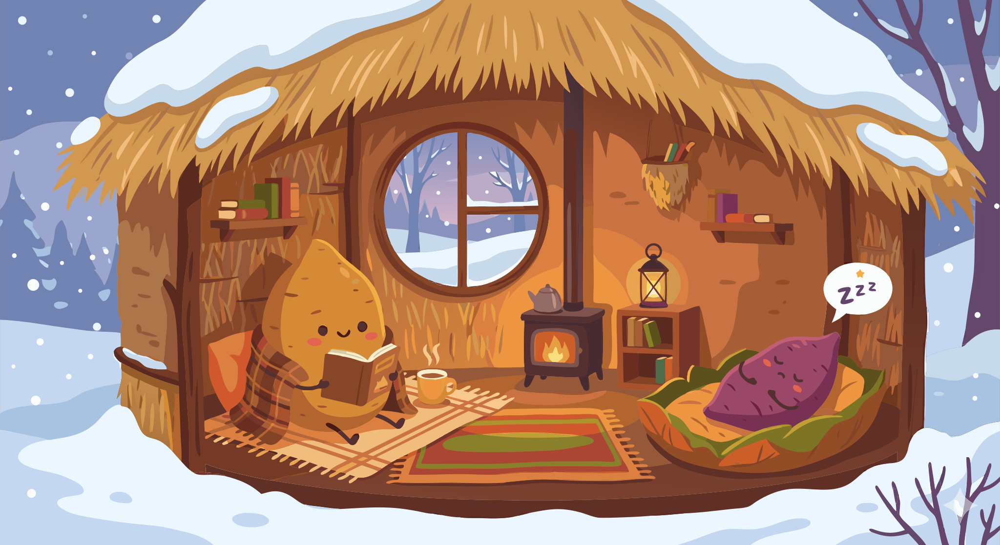

### Section 6.4: Long-Term Storage

{.img-med .img-centered}

Successful long-term storage is a whole-system problem. Temperature, airflow, dormancy, pest control, and storage structure all have to support the same goal: keep the tuber alive, dry, and quiet for as long as possible.

### Environmental Requirements

Temperature is the primary control for storage life. If it is too high, the yam will sprout prematurely; if it is too low, the tissue will suffer damage and rot. The correct range keeps the tuber dormant without chilling it.

> **Key Information:** The optimal temperature range for long-term yam storage is 59-64°F (15-18°C). 

Air movement supports that temperature strategy by carrying away moisture and respiratory gases from the still-living tubers.

> **Key Information:** Proper ventilation is critical for long-term yam storage to prevent CO2 buildup and rot. 

### Storage Life Cycle

Even under good conditions, storage life is limited. How long a yam lasts depends on both the storage environment and the natural dormancy pattern of the species.

> **Key Information:**
> - Properly cured and stored yams typically have a maximum storage duration of 4-6 months. 
> - The dormancy period characteristic of each species is a key factor affecting the storage life of different yam varieties. 

Throughout this time, the tubers remain biologically active.

> **Key Information:** Respiration and dormancy are physiological processes that continue during yam storage and affect storage duration. 

### Prohibited Practices

The same storage logic explains what to avoid. Anything that pushes the tuber out of dormancy or encourages decay shortens storage life.

> **Key Information:** Yams should NOT be stored with fruits like apples and bananas because the ethylene produced by the fruits accelerates yam sprouting. 

Light exposure should also be minimized to prevent the development of chlorophyll and green discoloration.

> **Key Information:** Exposure to light and the development of chlorophyll causes the green discoloration that sometimes develops in stored yams. 

### Physical Protection

Storage losses are not only physiological. Once the climate is under control, the next problem is protecting the tubers from animals and handling damage.

> **Key Information:** Hanging individual tubers or using raised platforms with rat guards are storage techniques used to prevent rodent damage. 

Commercial operations apply the same principles more tightly, especially when the stored yam is future planting material rather than food.

> **Key Information:** Commercial long-term storage of seed yams uses temperature-controlled storage with careful monitoring. 

### The Traditional Yam Barn

The traditional yam barn matters because it combines several of these principles in one design. Shade, airflow, elevation, and physical separation all help extend storage without mechanical refrigeration.

> **Key Information:** A yam barn with a thatched roof and open sides is the traditional yam storage structure used in West Africa. 
