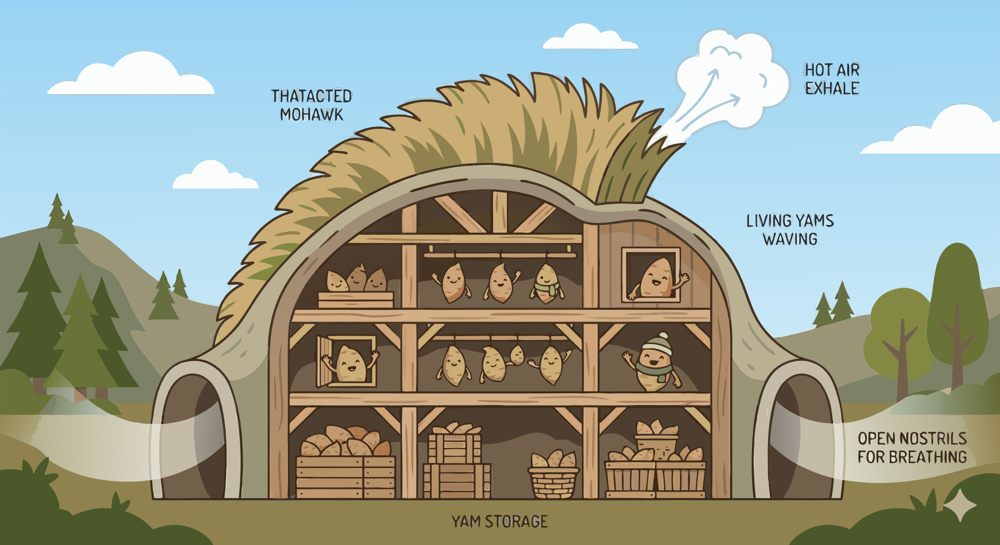

### Section 6.5: Storage Facility Design

{.img-xlarge .img-centered}

A successful storage facility excludes rain and pests while allowing constant air exchange. A completely sealed structure will trap heat and moisture, accelerating decay.

### Essential Design Features

Ventilation is the most critical aspect of any yam storage design. The facility must function like a lung, removing heat and CO2 while keeping the tubers dry.

> **Key Information:** Good ventilation and protection from rain are the most important design features of a yam storage facility. 

In traditional West African barns, a thatched roof and open sides create a natural chimney effect. Rising warm air pulls in cooler air from the sides, maintaining a stable internal climate.

> **Key Information:** A thatched roof and raised, slatted shelves help regulate temperature in traditional yam barns. 

### Internal Layout

How yams are arranged is as important as the structure itself. To prevent the spread of rot, tubers should be kept in single layers rather than in heaps. Piling yams together traps moisture and heat, creating an ideal environment for fungi.

> **Key Information:**
> - Yams should be tied or placed on shelves in single layers in traditional storage structures. 
> - Yams should be arranged to allow air circulation between tubers to ensure storage success in traditional yam barns. 

Other cultures use different methods for environmental management. In some regions, underground pits provide thermal stability and protection from surface pests.

> **Key Information:** In parts of Southeast Asia, yams are stored in underground pits lined with rice straw. 

### Protection and Modern Adaptation

Facilities must also be hardened against local threats. In termite-prone areas, this involves using resistant materials or treated wooden components.

> **Key Information:** Treatment of wooden structures or the use of termite-resistant materials is an adaptation made to yam storage facilities in termite-prone areas. 

Traditional pest management often incorporates natural repellents, such as smoke or specific plant materials, to deter insects and rodents.

> **Key Information:** Using smoke or plant materials with pest-repellent properties is a traditional practice that improves pest management in yam storage structures. 

Commercial facilities require additional design considerations for large-scale operations, including space for frequent inspection. In humid tropical regions, passive ventilation is often supplemented with mechanical systems to ensure adequate airflow.

> **Key Information:**
> - A commercial yam storage facility must be designed to accommodate inspection, sorting, and rotation of stock. 
> - A forced air ventilation system is recommended for modern yam storage facilities in humid tropical regions. 
