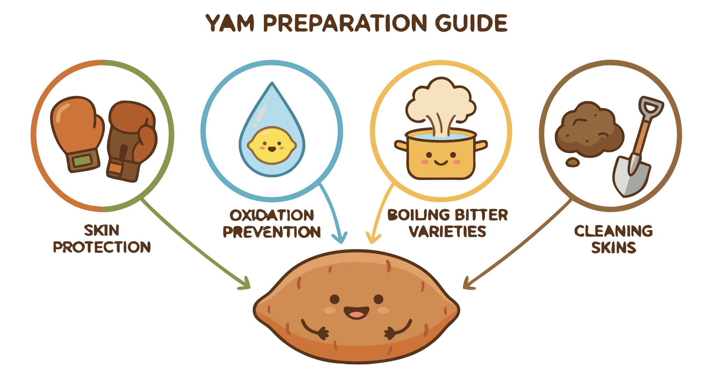

### Section 7.1: Working Safely with Yams

{.img-xlarge .img-centered}

Proper preparation makes yams safe to eat and visually appealing. Correct handling addresses cleaning, skin protection, oxidation control, and toxin removal.

> **Key Information:** Peeling and cleaning is the first step in preparing most yam dishes. 

### Protecting Your Skin

Certain yam varieties contain calcium oxalate crystals. These microscopic, needle-shaped structures can cause significant skin irritation.

> **Key Information:** Gloves should be worn when peeling some varieties of yams because they may cause skin irritation due to calcium oxalate crystals.  

### Preventing Oxidation

Once peeled, yam flesh reacts quickly with the air. This enzymatic browning or oxidation can discolor the tuber within minutes.

> **Key Information:** After peeling but before cooking, yams should be stored in cool water with lemon juice or vinegar to prevent browning. 

Adding a small amount of acid, like lemon juice, slows the enzyme activity while you finish preparation.

### Handling Bitter Varieties

Some species, such as *Dioscorea dumetorum*, contain toxic compounds that must be neutralized.

> **Key Information:**
> - Bitter varieties of yam require special processing to remove toxic compounds and make them safe for consumption. 
> - A common precaution when preparing bitter varieties is extended boiling with multiple water changes to leach out the toxins. 

Changing the boiling water several times gradually removes these water-soluble toxins.

### Cleaning the Skins

When cooking yams with the skin intact—common for roasting—thorough cleaning is essential.

> **Key Information:** When preparing yams with their skins, the skins should be thoroughly cleaned to remove soil contaminants. 
