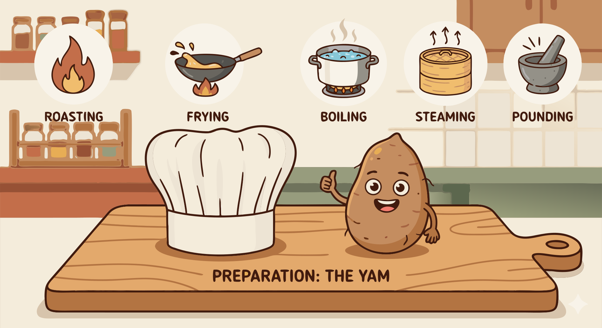

### Section 7.3: Essential Cooking Techniques

{.img-xlarge .img-centered}

The choice of technique determines a yam's final texture and flavor. Selecting the right method is key to a successful dish.

### Boiling and Steaming

Boiling is a common preparation method, but it can leach nutrients into the water. For maximum nutrient retention, steaming is preferred.

> **Key Information:**
> - Boiling is the most common basic cooking method for yams worldwide. 
> - Steaming best preserves the nutritional content of yams compared to other cooking methods. 

Cutting yams into 1-inch (2.5 cm) cubes ensures they cook through quickly.

> **Key Information:** The approximate boiling time for 1-inch (2.5 cm) cubes of yam is 15-20 minutes. 

### Managing Texture and Appearance

Cut yams begin to brown quickly. Immersion in water with lemon juice or vinegar helps prevent this oxidation.

> **Key Information:** Immersion in water with lemon juice or vinegar helps prevent oxidation of cut yams. 

Texture can also be adjusted. For slimy varieties, a salt-water soak helps, while grating creates a prized stretchy texture.

> **Key Information:**
> - To reduce the sliminess of certain yam varieties, you can soak them in salt water before cooking. 
> - Grating the raw yam is the technique used to achieve the gluey, stretchy texture desired in some Asian yam dishes. 

### Frying and Roasting

For a crispy finish, yams must be completely dry before they hit the oil.

> **Key Information:**
> - To create a crispy exterior in fried yam dishes, pat them dry before frying and use the proper oil temperature. 
> - Thinly slicing and deep frying or baking is the technique used to make yam chips or crisps. 

To develop natural sweetness, roasting or baking is the most effective method.

> **Key Information:** Roasting or baking best develops the natural sweetness of yams. 

### Culinary Adjustments

In soups and stews, timing determines whether the yam maintains its shape or acts as a thickener.

> **Key Information:** Adding yam pieces later in the cooking process best preserves their shape in soups and stews. 

Specialized recipes use a "twice-cooked" approach to achieve unique textures.

> **Key Information:** Twice-cooked yam dishes involve cooking once, cooling, then cooking again with a different method. 
