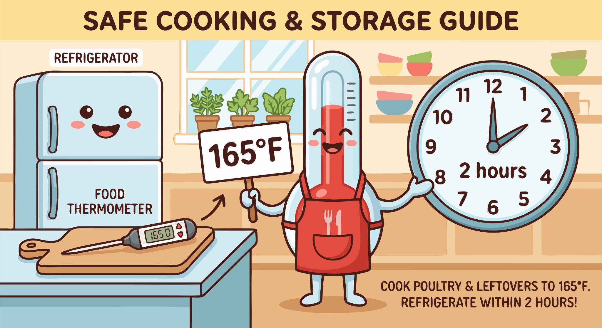

### Section 7.4: Safe Temperatures and Time

{.img-xlarge .img-centered}

Food safety relies on managing temperature and time. Dense, moist yams can support bacterial growth if mishandled. Simple habits during preparation, cooking, and storage ensure your dish is safe.

Thorough cleaning is the first line of defense.

> **Key Information:** Yams should be cleaned under running water and scrubbed with a brush to remove soil and surface contaminants. 

### The Two-Hour Rule

Once peeled, yams should not sit at room temperature for long. Bacterial growth accelerates in warm environments; move prepared yams to the refrigerator if not cooking immediately.

> **Key Information:** The maximum safe time to leave peeled yams at room temperature is **2 hours (or 1 hour if above 90°F/32°C)**. 

### Cooking and Reheating Temperatures

Cooking destroys pathogens. When yams are part of a mixed dish—like a meat stew—ensure the whole pot reaches a safe internal temperature.

> **Key Information:**
> - The safe minimum internal cooking temperature for dishes containing yams is **165°F (74°C) for mixed dishes**. 
> - When reheating leftover yam dishes, they must be reheated to an internal temperature of **165°F (74°C)**. 

This is particularly important for dense stews where the center heats slowly.

### Safe Storage and Sanitation

Prompt refrigeration is essential for leftovers.

> **Key Information:** Cooked yam dishes should be **refrigerated within 2 hours of cooking**. 

Surfaces and tools must be cleaned between different foods to prevent cross-contamination.

> **Key Information:**
> - Cutting boards and tools should be **cleaned and sanitized properly between different foods**. 
> - Proper sanitation helps prevent cross-contamination during food preparation. 
> - In a commercial kitchen, maintain separate preparation areas for raw and ready-to-eat foods to prevent cross-contamination. 

### Verifying Success

Visual cues like steam aren't always reliable indicators of internal temperature. Use a thermometer to be certain.

> **Key Information:** The proper way to verify a cooked yam dish has reached a safe temperature is **using a food thermometer inserted into the thickest part**. 

### Kitchen Safety

Cutting dense yams requires stable equipment. A sharp knife and secure cutting board reduce the force needed and the likelihood of a slip.

> **Key Information:** When cutting yams, always use a **stable cutting board and a properly sharpened knife**. 
