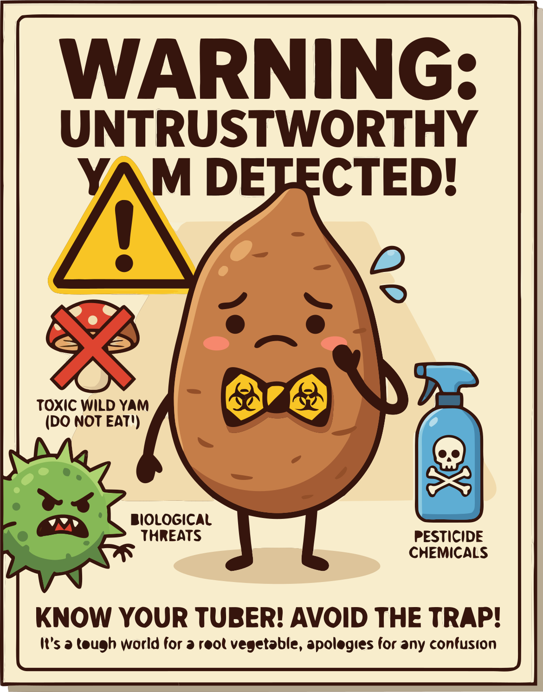

### Section 7.5: Toxicity and Contamination Prevention

{.img-pgcap .float-right}

The safest way to think about yam hazards is in layers. First, use the right species. Next, process any natural toxins correctly. Finally, prevent spoilage and contamination after harvest.

### Toxic Yam Species

Species choice is the first safety gate. While common cultivated varieties are generally safe, some species—notably the air potato—require special care.

> **Key Information:** The yam species that requires special processing due to toxic compounds is ***Dioscorea bulbifera* (air potato)**. 

*Dioscorea bulbifera* is identified by the bulbils produced on its vines. Because toxicity varies, these should not be consumed without expert knowledge.

### Understanding Plant Toxins

Once you know the species, the next question is which natural compounds need to be managed.

> **Key Information:** The toxic compounds found in certain bitter or wild yam varieties are **alkaloids and saponins**. 

These compounds are water-soluble rather than heat-sensitive. Simply cooking at high temperatures is insufficient; toxins must be leached out with water.

### Traditional Detoxification

Traditional detoxification works by removing or diluting the problem compounds rather than simply cooking around them.

> **Key Information:** The traditional method for removing toxins from bitter yam varieties is **prolonged soaking and/or repeated boiling with water changes**. 

A typical protocol involves soaking and performing multiple water changes during boiling to reduce the toxin load.

### Foraging and Identification

Wild harvesting raises the stakes because species identification and preparation knowledge have to be correct at the same time.

> **Key Information:**
> - Wild yams should never be consumed **without positive identification and knowledge of proper preparation**. 
> - Proper identification and understanding of preparation requirements is essential when collecting wild yams. 

### Managing Spoilage and Contamination

Even safe species can become unsafe later. Poor storage invites rot, mold, and other contamination problems that preparation cannot always reverse.

> **Key Information:** A yam that shows **significant soft spots, unusual odor, or visible mold should not be eaten**. 

Discard spoiled yams entirely; toxins may spread beyond the visible damage.

Prevention starts in the field by limiting exposure to pathogens and chemical contaminants before the yam even reaches storage.

> **Key Information:** Contamination risks in yam cultivation include **soil-borne pathogens and chemical contaminants**. 

Post-harvest, proper curing and regular inspection are the primary defenses against microbial growth.

> **Key Information:** Preventing microbial contamination during storage involves **proper curing, dry storage conditions, and regular inspection**. 

### Travel and Chemical Safety

The final layer is judgment about source and handling.

> **Key Information:** When eating unfamiliar yam dishes—especially while traveling—ensure they are **properly cooked and prepared by knowledgeable sources**. 

Chemical safety follows the same principle: residues are best prevented before harvest rather than guessed away afterward.

> **Key Information:** Pesticide contamination should be prevented by **following integrated pest management practices and approved chemical usage guidelines**. 
