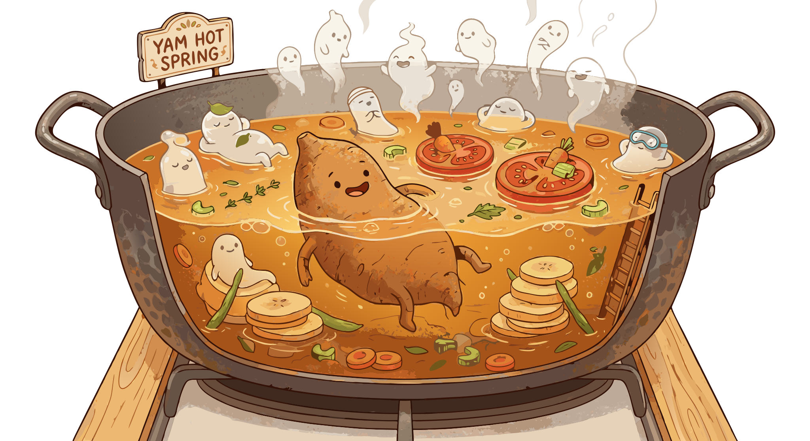

### Section 8.1: Soups, Stews, and Porridges

{.img-med .img-centered}

Yams show up in liquid-heavy dishes in a few recurring ways: they can be pounded into something served with soup, softened into porridge, grated into broth, or added in chunks to stews. The common thread is starch, which gives body, texture, and staying power.

### Fufu: The Heart of West Africa

Fufu belongs in this section because it is built for soups and stews, even if it is not a soup itself. Pounding transforms boiled yam into an elastic paste that can be dipped, shaped, and eaten alongside a broth-based meal.

> **Key Information:**
> - The traditional pounding technique for fufu uses a wooden mortar and pestle to transform boiled yams into a smooth, stretchy paste. 
> - Fufu is a pounded yam paste eaten with stews and soups.  In West Africa, fufu is made from boiled yam pounded into a smooth, stretchy dough . Boiled yam pounded into dough is called Iyan in Yoruba cuisine .

### Porridges and Soups

Other dishes take the yam directly into the pot. Porridges and soups stretch a single tuber into a fuller meal by combining starch, liquid, fat, and seasoning.

> **Key Information:**
> - Asaro is a Nigerian yam porridge cooked with palm oil and peppers. 
> - Mpotompoto is a Ghanaian dish that uses yam as the main ingredient in a savory porridge or soup.  

Dishes like Ikokore rely on grating rather than pounding, which gives them a different texture from other yam staples.

> **Key Information:** Ikokore is a West African dish where grated water yam is formed into balls and cooked in a soup. 

### Global Liquid Dishes

The same starch-thickening logic appears in other regional cuisines, even when the flavors change.

> **Key Information:** "Oil down" is a Caribbean dish that combines yams with other starchy vegetables and meat.  Caribbean yam chowder is a savory dish featuring yam cooked in coconut milk. 

In Southeast Asia, the purple yam (*Dioscorea alata*) highlights dishes like Vietnam’s pork-based "canh khoai mỡ" and the Philippines’ sweet ube halaya.

> **Key Information:** Vietnamese "canh khoai mỡ" is prepared by simmering purple yam in a soup with pork.  Ube halaya is a Filipino dessert that prominently features purple yam. 

### Starchy Staples

At the simplest end of the spectrum, yams can be cut into stews to add bulk and body without any special processing.

> **Key Information:** Yams are typically incorporated into stews by cutting them into chunks and adding them to cook with the other ingredients. 

Poi appears here as a useful comparison point: it fills a similar culinary niche, but it comes from taro rather than yam.

> **Key Information:** Poi is made from taro in Pacific Island cuisines by cooking and pounding it into a fermented paste. 
