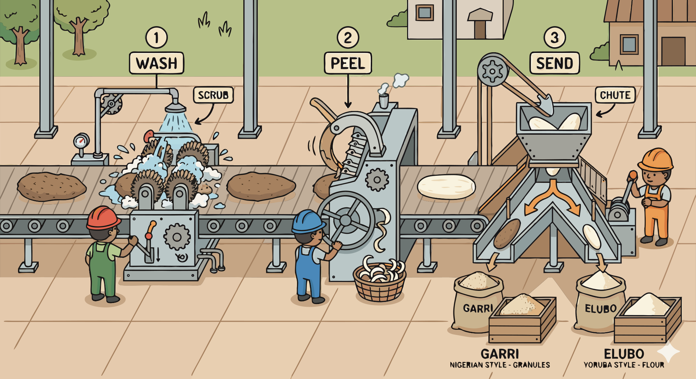

### Section 9.1: From Tuber to Product

{.img-xlarge .img-centered}

Commercial processing pursues two goals at once: shelf stability and consistent product quality. Every major step either removes water, reduces contamination risk, or standardizes how the finished product will behave.

The process starts with preparing the raw tuber for safe, even drying.

> **Key Information:** The first step in commercial yam flour production is peeling, washing, and slicing the fresh yams. 

Drying is where storage life is largely won or lost. Modern facilities use controlled systems so the slices lose water quickly without cooking unevenly or spoiling.

> **Key Information:** Industrial yam flour production most commonly uses mechanical dryers with controlled temperature and airflow. 

Once drying begins, quality control becomes continuous rather than occasional.

> **Key Information:** Quality control in commercial yam processing focuses on monitoring moisture content and microbial safety. 

Moisture and temperature matter most because they determine both safety and final flour quality.

> **Key Information:** Moisture content and drying temperature are the most critical parameters to control during commercial yam flour production. 

After the yam is safely dried, milling determines how uniform and usable the product will be.

> **Key Information:** Modern yam flour production uses hammer mills or roller mills with controlled particle size output. 

Automation helps hold those standards steady from batch to batch.

> **Key Information:** Automated process control and standardized equipment have most improved commercial yam flour consistency. 

Once the base process is controlled, manufacturers can branch into convenience products built around the same principles.

> **Key Information:** Instant yam flakes are created through a process of cooking, mashing, and drum drying. 

The same processing mindset also extends beyond flour.

> **Key Information:** Yam starch for industrial applications is produced through extraction by washing, filtering, and settling. 

Appearance matters too, so processors manage browning before it undermines product quality.

> **Key Information:** Blanching is used in commercial yam processing to inactivate enzymes that cause browning. 

In the end, good commercial products depend on both the quality of the harvested yam and the discipline of the process built around it.

> **Key Information:** The quality of commercially processed yam products is most affected by the initial quality of raw materials and the process controls used. 
