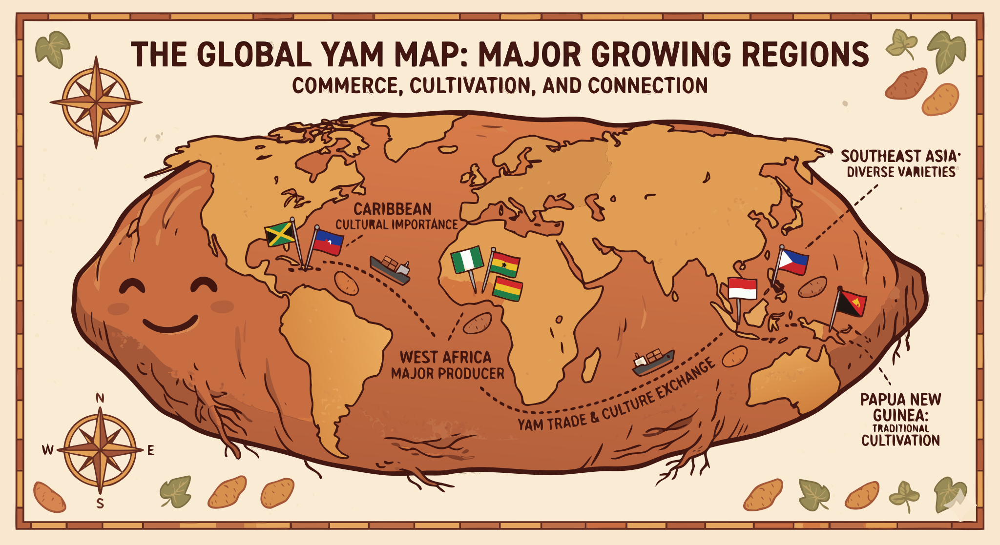

### Section 9.3: Global Production and Food Security

{.img-xlarge .img-centered}

Global yam production is characterized by extreme geographical concentration. Because the vast majority of the world's supply originates in a single region, local agricultural success is directly tied to international food stability.

West Africa remains the heart of the industry, accounting for nearly the entire global output.

> **Key Information:** Over 90% of global yam production comes from West Africa. 

Within this region, a single nation stands out as the primary engine.

> **Key Information:** Nigeria is the world's largest producer of yams. 

In traditional West African societies, the crop has historically served as a metric for individual and community prosperity.

> **Key Information:** In traditional West African societies, yams act as a staple food crop and sometimes a form of currency or wealth indicator. 

Monitoring these vital trends falls to international organizations that aggregate data on cultivation and distribution.

> **Key Information:** The Food and Agriculture Organization (FAO) of the United Nations collects and publishes global yam production statistics. 

Expanding the reach of fresh yams remains a logistical challenge. The weight, high water content, and susceptibility to bruising hinder seamless international trade.

> **Key Information:** Short shelf life and storage challenges most significantly limit international trade in fresh yams. 

Spoilage is an even more pressing issue at the local level. In developing nations, a substantial portion of the annual harvest is lost before it can be consumed.

> **Key Information:** It is estimated that 30-60% of harvested yams are lost to spoilage in developing countries. 

This volatility directly influences the economic landscape, as market prices often fluctuate in response to seasonal yields and environmental conditions.

> **Key Information:** Weather conditions and resulting harvest yields most significantly affect year-to-year market prices for yams. 

Despite these hurdles, the yam is a pillar of food security due to its inherent longevity. Unlike many tropical staples, it can be preserved for several months without cold storage.

> **Key Information:** Yams are important for food security because they can be stored for several months without refrigeration. 

This durability is especially critical during the "hunger gap"—the interval between seasonal harvests when other food sources may be depleted.

> **Key Information:** Yams contribute to household food security by providing storable food during seasonal hunger periods. 

Increasing production remains difficult. The manual labor required for cultivation, combined with the scarcity of viable planting material, places a cap on expansion.

> **Key Information:** Labor requirements and availability of planting material are the constraints that most limit yam production expansion by subsistence farmers. 

To sustain their operations, farmers traditionally recycle a portion of their harvest for the following year.

> **Key Information:** Subsistence farmers maintain yam planting material by setting aside small tubers or pieces from their harvest. 

Risk management strategies, such as intercropping and the cultivation of diverse varieties, help protect these communities from catastrophic failure.

> **Key Information:** Traditional farmers mitigate risk by intercropping yams with other crops and growing multiple varieties. 

Modern agriculture must now contend with shifting environmental patterns that threaten to desynchronize planting and harvesting cycles.

> **Key Information:** Changing climate patterns are disrupting traditional planting and harvest timing for yams. 

Furthermore, yams face increasing competition from starchy staples that offer lower barriers to production.

> **Key Information:** Competition from other starchy staples like cassava and rice is an economic trend affecting traditional yam production. 
