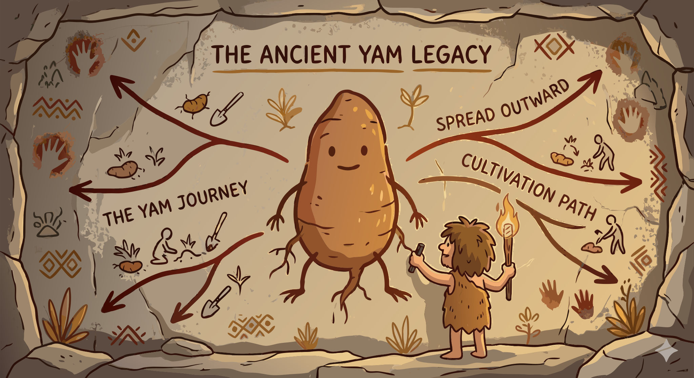

### Section 10.1: Origins and Spread

{.img-xlarge .img-centered}

The history of the yam is a narrative of survival, identity, and migration. Long before the rise of modern states, early agriculturalists were already domesticating wild vines.

> **Key Information:** Humans have been cultivating yams for at least 10,000 years. 

This transition was not a localized phenomenon. Societies across different continents independently recognized the potential of their native wild species.

> **Key Information:** The first domestication of yams likely occurred in West Africa and Southeast Asia as separate events. 

The contemporary diversity of the *Dioscorea* genus results from these distinct regional species being brought under human stewardship.

> **Key Information:** Different yam species found in Africa, Asia, and the Americas are the result of independent domestication on different continents. 

In West Africa, the tuber transcended its role as mere sustenance to become a profound cultural signifier.

> **Key Information:** Historically, yams played a vital role in traditional West African societies as both a staple food and a cultural symbol. 

Similarly, Pacific Island communities elevated the yam to a central position where it served as both a food source and a medium for ritual.

> **Key Information:** In traditional Pacific Island societies, yams served as both a staple food and a ceremonial crop. 

Global distribution was subsequently driven by exploration, commerce, and migration.

> **Key Information:** Yams spread from their centers of origin primarily through human migration, trade, and colonization. 

The Columbian Exchange accelerated that intercontinental transfer of crops, techniques, and food habits.

> **Key Information:** During the Columbian Exchange, various yam species were transported between Africa, the Americas, and Asia. 

The forced migration of the transatlantic slave trade also played a role. Enslaved Africans carried these familiar tubers as a vital link to their heritage, establishing the crop as a symbol of cultural resilience.

> **Key Information:** During the transatlantic slave trade, yams were brought as familiar food crops and became established in new regions. 

To safeguard these harvests, early societies developed specialized infrastructure, such as ventilated barns designed to mitigate spoilage.

> **Key Information:** Historically, yams in West Africa were stored in specially constructed yam barns. 

The 20th century introduced technological shifts as modern breeding began to supplement traditional knowledge.

> **Key Information:** The introduction of improved varieties and modern agricultural practices was a significant technological change for traditional yam cultivation in the 20th century. 

Across all of these movements, the yam remained both a food crop and a cultural constant.
