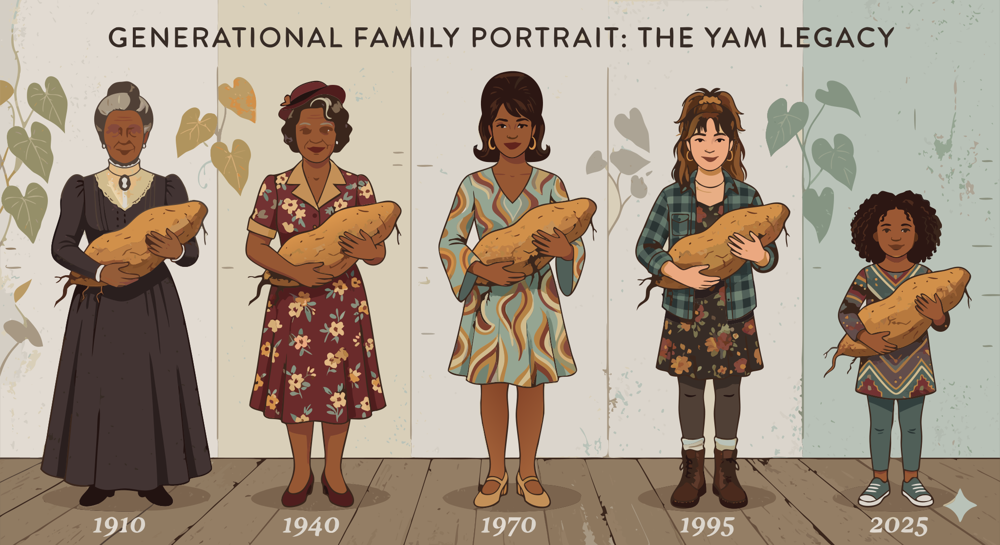

### Section 10.2: Living Traditions

{.img-xlarge .img-centered}

In many societies, the yam is more than a crop. It helps organize labor, food security, and social life, so traditional yam practices often carry cultural meaning alongside practical value.

The New Yam Festival in West Africa stands as the most prominent annual manifestation of this relationship.

> **Key Information:** The New Yam Festival is an annual celebration of the yam harvest and thanksgiving to deities in parts of West Africa.  Yam festivals function as community celebrations that reinforce cultural identity and agricultural cycles. 

Beyond the festivities, these events reaffirm shared ideas about harvest, continuity, and community.

> **Key Information:** Yam festivals celebrate the harvest and reinforce cultural values around food security and community identity. 

Cultivation is often punctuated by ritual markers. For instance, the harvest may only commence after symbolic offerings are made.

> **Key Information:** In some cultures, a ritual offering of the first harvested yams to ancestors or deities is performed before harvesting. 

That first tuber stands in for the whole season's outcome.

> **Key Information:** The "first yam" in traditional harvest ceremonies receives special ritual treatment as a symbol of the entire harvest. 

To oversee these complex interactions, certain cultures appoint a specialized authority—often termed a "yam king."

> **Key Information:** The traditional role of a "yam king" is to supervise the planting, harvesting, and storage of yams in certain West African cultures. 

This deep reservoir of practical knowledge is a vital intellectual heritage transmitted across generations.

> **Key Information:** Traditional knowledge passed down in yam-growing cultures includes cultivation techniques, storage methods, and preparation practices. 

Social organization also extends to the division of labor, with gender-specific roles often shaping who plants, harvests, prepares, and markets the crop.

> **Key Information:** Customary yam cultivation often involves gender-specific roles in planting, harvesting, and preparation. 

Women frequently occupy the most strategic positions in this value chain, managing the critical transition from field to table.

> **Key Information:** Women typically play significant roles in planting, harvesting, processing, and marketing yams in traditional cultivation systems. 

The yam’s importance is further woven into the milestones of life, appearing in matrimonial exchanges and the establishment of new families.

> **Key Information:** Yams are often used as traditional wedding gifts or as a part of bride wealth in some cultures. 

Cultural taboos can also regulate access and use.

> **Key Information:** Cultural taboos and restrictions in some societies regulate who can eat certain yam varieties or preparations. 

In the Pacific Islands, the crop also becomes a medium of public competition. Farmers use their largest specimens to signal status.

> **Key Information:** In Pacific Island cultures, yams are symbolic of wealth, prosperity, and social status. 

These displays turn agricultural success into visible social prestige.

> **Key Information:** Competitive yam displays in Pacific Island traditions are used as demonstrations of wealth, prestige, and agricultural prowess. 
