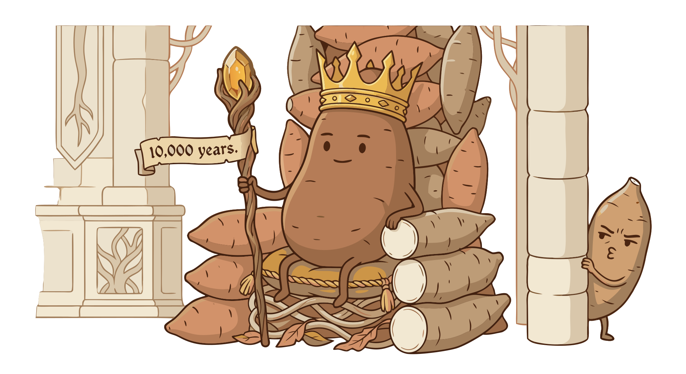

### Section 10.3: Yams in Story and Symbol

{.img-med .img-centered}

Because a failed harvest represents a direct threat to survival, agricultural practices are often shielded by a framework of moral significance. Over ten millennia, the yam has evolved from a simple food source into a central character in global mythology.

In West African traditions, the success of the crop is frequently attributed to the favor of specialized deities who oversee fertility.

> **Key Information:** In West African mythology, deities of fertility and agriculture are often associated with yams. 

This divine connection is a recurring theme. Many origin stories depict the first tubers as a direct endowment from higher powers.

> **Key Information:** In some traditional creation myths, yams are depicted as gifts from deities or ancestral beings. 

Some narratives suggest a literal ancestral transformation where the living are sustained by the very bodies of their predecessors. This cycle of perpetual obligation reinforces the community's commitment to careful cultivation.

> **Key Information:** In some Pacific Island cultures, yams are presented as ancestral gifts or beings in origin stories. 

The cultural importance of the yam is also distilled into proverbs—concise linguistic tools used to transmit essential social values across generations.

> **Key Information:** Yam-related proverbs in many African cultures are used to illustrate values like hard work, patience, and community. 

Folklore further serves to establish and enforce behavioral boundaries necessary for a successful harvest.

> **Key Information:** Folkloric taboos about yam cultivation often involve prohibitions against certain behaviors during planting or harvesting. 

Adhering to these established norms is viewed as a prerequisite for prosperity, signaling a harmonious relationship between the community and the spiritual forces governing the land.

> **Key Information:** A common theme in yam-related myths is the connection between agricultural success and proper relationships with spiritual forces. 

The profound symbolism of the yam is perhaps most famously explored in modern literature, where the crop serves as a powerful metaphor for character and cultural identity.

> **Key Information:** The literary work "Things Fall Apart" by Chinua Achebe features a yam farmer as its main character and explores the symbolism of yams in culture. 

These narratives continue to function as a means of reinforcing communal standards.

> **Key Information:** Folktales use yams in stories that reinforce proper behavior and community values. 

Ultimately, while the yam represents material abundance, its folkloric significance emphasizes that true success is found in the social contract that ensures the survival of the entire community.

> **Key Information:** In folklore, yams often symbolize abundance and reproductive success. 
